# 快速开始

## 介绍

魔方派 3 (RUBIK Pi 3) 基于高通 QCS6490 芯片，采用  Qualcomm® Kryo™ 670 CPU 和融合 AI 加速器架构的 Qualcomm® Hexagon™ 处理器，具备 12 TOPS 的卓越 AI 性能，适用于各种机器学习和人工智能应用场景。

RUBIK Pi 3 具有丰富的接口和功能设计，支持 USB、Camera、DP、HDMI、ETH、3.5mm 耳机、Wi-Fi、BT、M.2 连接器、FAN、RTC、40 pin 排针连接器等，满足多样化的开发需求，方便开发者快速开发和调试。

RUBIK Pi 3 同样也支持多种系统，如 Qualcomm Linux、Debian 13、Canonical Ubuntu for Qualcomm Platforms\*、Android 13 等，灵活满足开发者特定应用要求。

\*Canonical Ubuntu for Qualcomm Platforms：计划中


## 参数

|            | **RUBIK Pi 3**                                                                |
| ---------- | ----------------------------------------------------------------------------- |
| 芯片         | QCS6490                                                                       |
| 处理器        | <p>1 x Cortex-A78 2.7GHz</p><p>3 x Cortex-A78 2.4GHz</p><p>4 x Cortex-A55 1.9GHz</p>  |
| GPU        | Adreno 643 GPU @ up to 812 MHz                                                |
| VPU        | Adreno 633 VPU                                                                |
| NPU        | 12 TOPS                                                                       |
| ISP        | Spectra ISP，可以做端侧的机器学习和机器处理                                                   |
| 内存         | 8 GB LPDDR4x                                                                  |
| ROM        | 128 GB UFS 2.2                                                                |
| Wi-Fi & 蓝牙 | Wi-Fi 5 和蓝牙 5.2                                                               |
| 摄像头接口      | 2 x 4-lane MIPI CSI D-PHY                                                     |
| USB        | <p>1 x USB Type-C (USB 3.1 Gen1)</p><p>2 x USB Type-A (USB 3.0)</p><p>1 x USB Type-A (USB 2.0) </p>|
| GPIO       | 28个 GPIO 引脚                                                                   |
| 网口         | 1000M                                                                         |
| M.2 接口     | M.2 Key M  2280（2-lane PCIe 3.0）                                              |
| 音频接口       | 3.5mm 耳机接口                                                                    |

## 准备

* 装有 Windows 10 以上 或 Ubuntu18 - Ubuntu22 系统的电脑

* RUBIK Pi 3

* USB Type-A to Type-C 数据线

* USB Type-A to Micro USB 数据线

* 电源（12V 3A Type-C）

### 安装驱动

#### Windows 环境下驱动安装

##### 安装 QUD

1. [点击此处](https://thundercomm.s3.ap-northeast-1.amazonaws.com/uploads/web/rubik-pi-3/tools/qud/qud.win.1.1_installer_10061.1.zip)下载 QUD（Qualcomm USB driver ）。

2. 将 *qud.win.1.1\_installer\_10061.1.zip* 解压，运行 *setup.exe*，如下图，点击 **Next。**


3. 再次点击 **Next。**

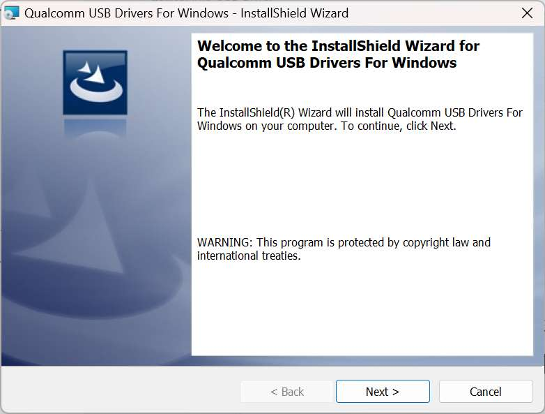

4. 选&#x62E9;**&#x20;I accept the terms in the license agreement&#x20;**（我接受协议内容）后，点击 **Next。**


5. 点击 **Install。**


6. 点&#x51FB;**&#x20;Finish**，完成驱动安装。


##### 安装 Tflash

1. [点击此处](https://thundercomm.s3.ap-northeast-1.amazonaws.com/uploads/web/rubik-pi-3/tools/tflash/windows/TflashSetup_v1.2.0.4.exe)下载 Tflash（镜像烧录工具）。

2. 打&#x5F00;*&#x20;TflashSetup\_v1.2.0.4.exe* 进行安装，选择需要的语言，点击 **OK。**


3. 选择要安装的位置，点击 **Next。**

  

4. 点击 **Next。**

  

5. 勾选 **Create a desktop shortcut&#x20;**（创建桌面快捷方式），点击 **Next。**

  

6. 点击 **Install** 进行安装。

  

7. 勾选 **Launch Tflash**，点&#x51FB;**&#x20;Finish** 完成安装。

  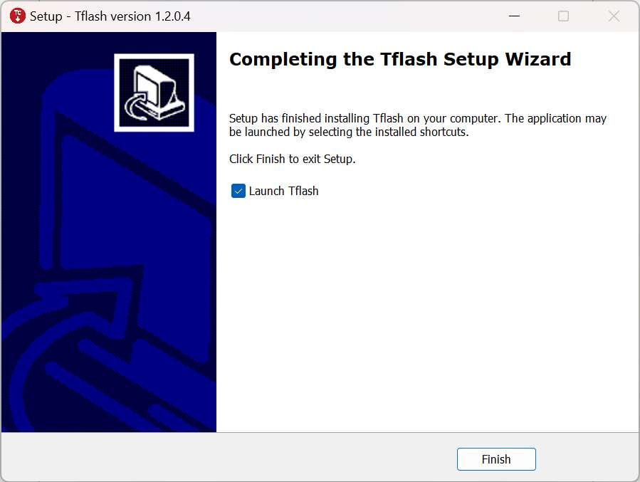

8. 如果出现下面报错，点击 **是(Y)**，进行跳转，按照提示下载需要的安装包。

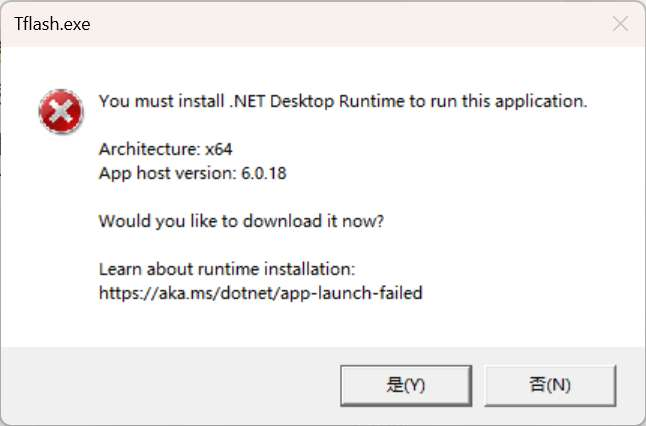

9. 双击下载的安装包， 点击 **安装。**

  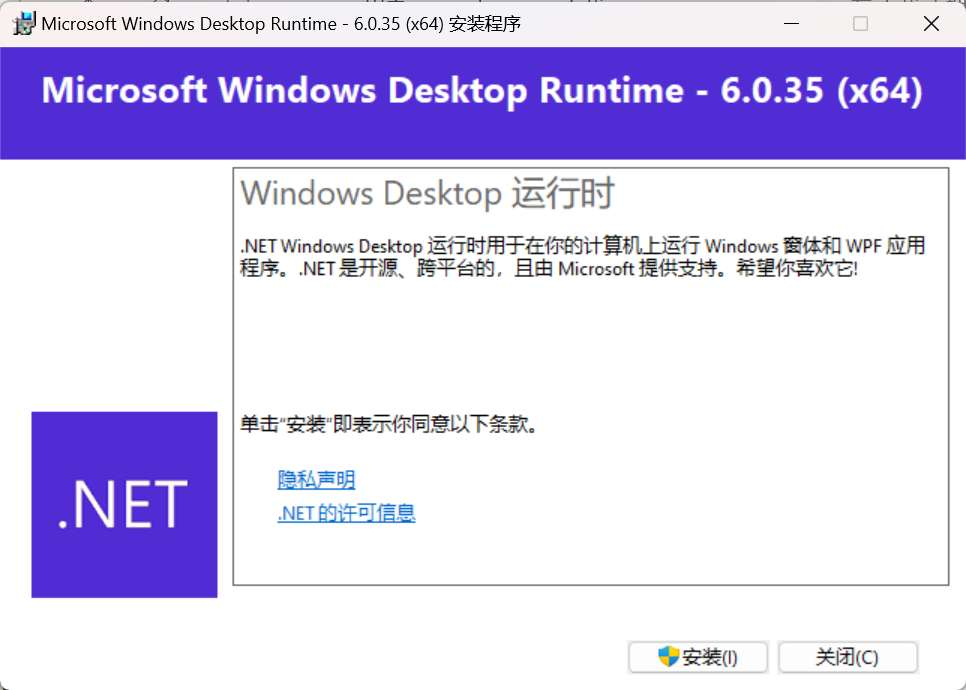

10. 点&#x51FB;**&#x20;关闭(C)**， 完成安装。

  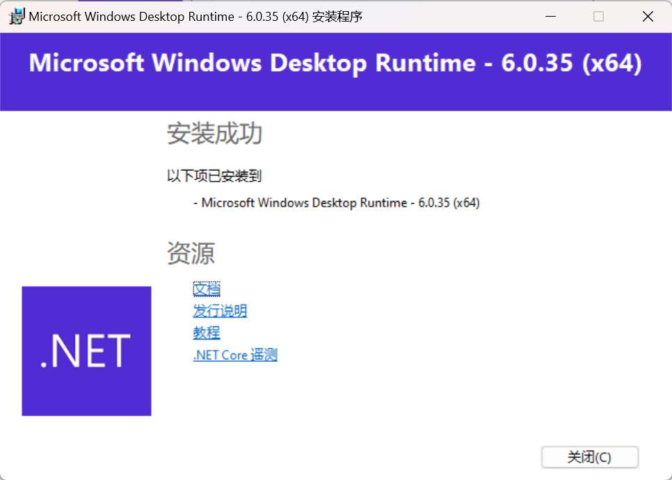

11. 安装完成后，可在桌面和“开始”菜单中看到 Tflash 图标，如下图所示：

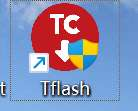

#### Ubuntu 环境下驱动安装

##### 安装Tflash

1. [点击此处](https://thundercomm.s3.ap-northeast-1.amazonaws.com/uploads/web/rubik-pi-3/tools/tflash/ubuntu/Thundercomm-tflash-v1.0.0.deb)下载 Tflash(镜像烧录工具)

2. 执行命令安装 Tflash。

   ```shell
   sudo dpkg -i Thundercomm-tflash-v1.0.0.deb
   ```

3. 安装完成后，请在终端中执行 `tflash` 命令。如出现以下界面，表明 Tflash 已安装成功：

   

### 镜像下载

RUBIK Pi 3 出厂预装 Linux 镜像供您快速进行开箱操作体验（非最新版本），如需体验最新版本的 Android 镜像，或其他操作系统镜像，请访问 [RUBIK Pi 3 官方网站](https://www.thundercomm.com/rubik-pi-3/cn/docs/image/) 进行下载。

* Qualcomm Linux ：基于weston的桌面系统，系统较为精简，适合具备 Linux 开发经验，追求深度开发体验的开发者。

  

* Debian 13：基于GNOME 48 桌面系统，系统功能完善，丰富的软件包资源，有更多的桌面应用，更好的使用体验，较多的开发资料，适合追求开发便捷的开发者。

  

* 安卓 13：基于谷歌 AOSP，系统完善，有更好的使用体验，适合想做安卓应用的开发者。

  RUBIK Pi 3 提供了 user 和 userdebug 两个版本的安卓镜像；在 Android 系统中，user 和 userdebug 是两种不同的构建类型，主要为不同使用场景设计。

  * user 版本是为最终用户打造的正式版本，注重安全性和稳定性。它关闭了调试功能，限制了 Root 权限和 ADB 高级命令，精简了日志输出，确保系统运行流畅并保护用户隐私，提供可靠的日常使用体验。

  * 相比之下，userdebug 版本是为开发者设计的测试版本，提供了强大的调试支持。它允许临时 Root 权限、完整的 ADB 功能和详细的日志记录，便于开发者修改系统文件、监控应用表现或定位问题。然而，由于开放了更多权限，安全性较低，可能会占用额外资源，因此仅适合开发和测试阶段。

  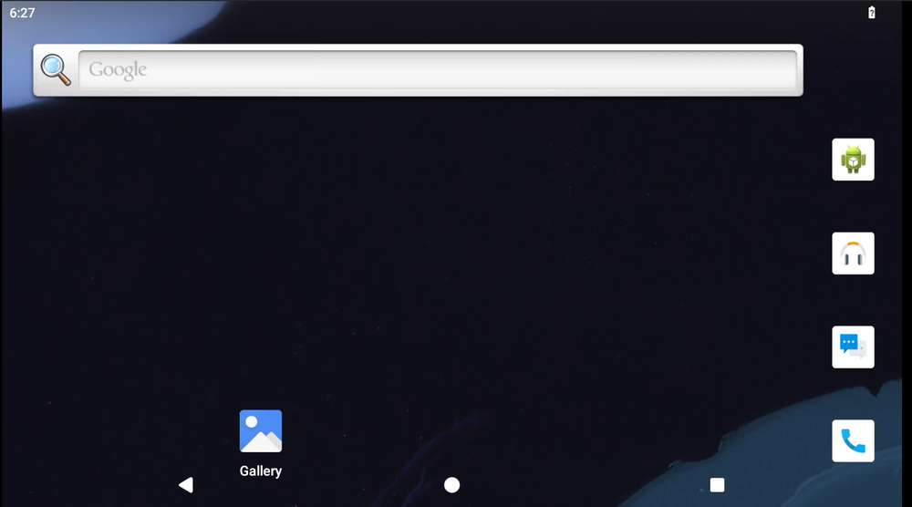

### 镜像烧录


镜像烧录前，首先进入烧录模式（9008 模式）：

方法1：

1. 按住上图 12 的 EDL 按钮。

   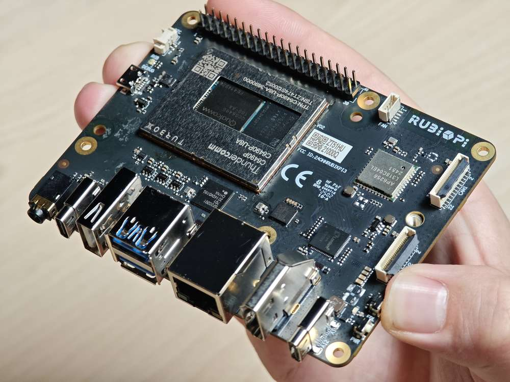

2. 将供电线接入到上图 10。

   

3. Type-C 数据线插入上图 5 等待 3 秒，进入 9008 模式。

   

方法2：

1. 将供电线接入到上图 10。

   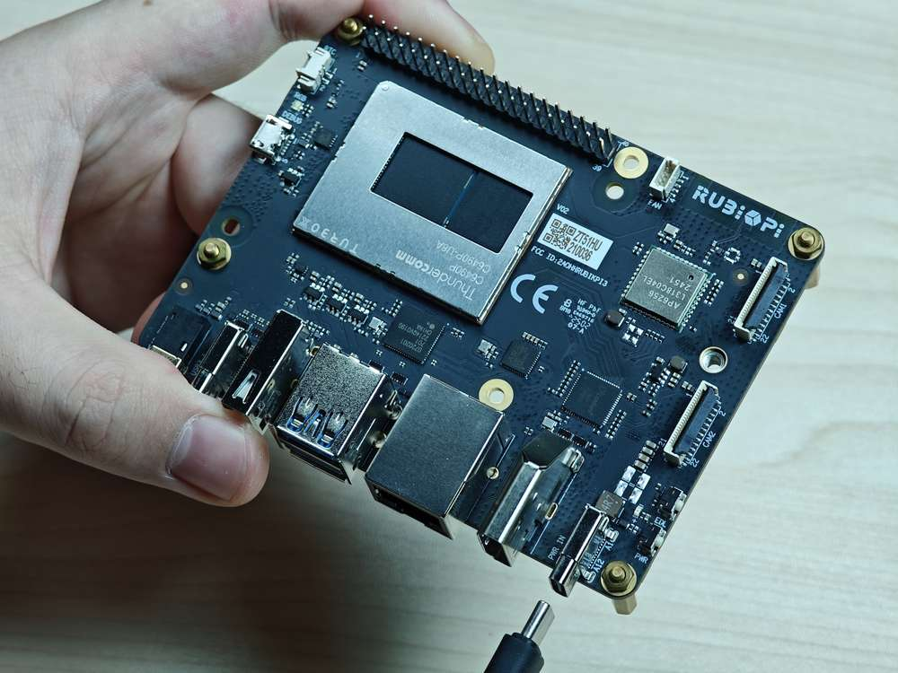

2. Type-C 数据线插入上图 5。

   

3. 在 RUBIK Pi 3 开机后，输入如下命令，进入 9008 模式。

   ```shell
   adb shell reboot edl
   ```

#### Windows 烧录方法

##### 操作流程

1. 打开 Tflash 软件， 如下图，确定设备进入 9008 模式：

   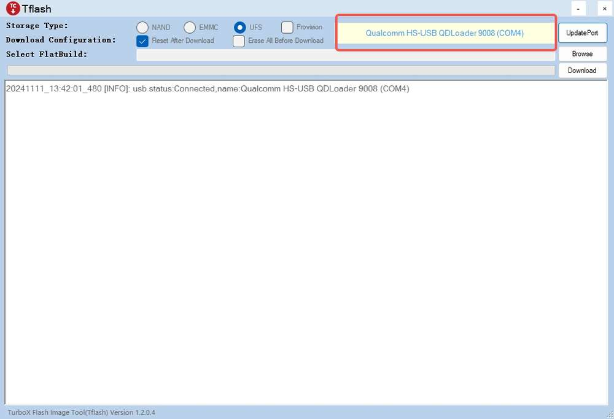

2. 根据需要烧写设备的存储类型，选择正确的 **Storage Type&#x20;**，RUBIK Pi 3 为 **UFS**。

   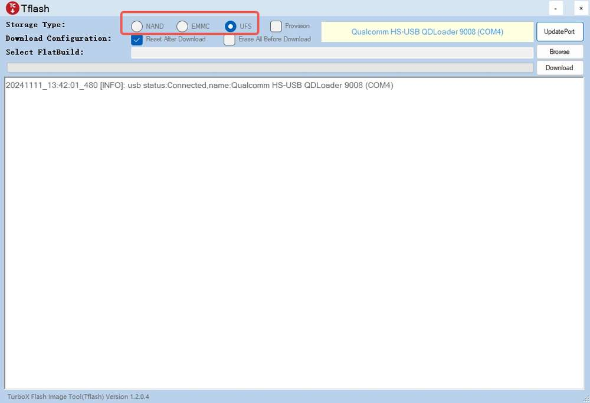

3) 按需选&#x62E9;**&#x20;Reset After Download&#x20;**&#x548C;**&#x20;Erase All Before Download**，请谨慎选&#x62E9;**&#x20;Erase All Before Download**。

   

   * Reset After Download：勾选后，烧写完成后设备将自动重启。

   * Erase All Before Download：勾选后，烧写前会对 RUBIK Pi 3 UFS 各分区中的数据进行擦除。

    :::note
      - Reset After Download 和 Erase All Before Download 并不是必选项，可以都不勾选。
      - 只有烧写前后的 UFS 分区一致，勾选 Erase all Before Download 才会擦除数据。
   :::

4) 烧写 FlatBuild Image：

   1. 点&#x51FB;**&#x20;Browse。**

      

   2. 进入 *FlatBuild* 目录，选择 *Programmer File*，并选择 *prog_firehose_ddr.elf*，点击**打开**。

      

   3. 选择所有名称以 “rawprogram” 开头的 xml 文件，点击**打开**。

      

   4. 选择所有名称以“patch”开头的 xml 文件，点击**打开**。

      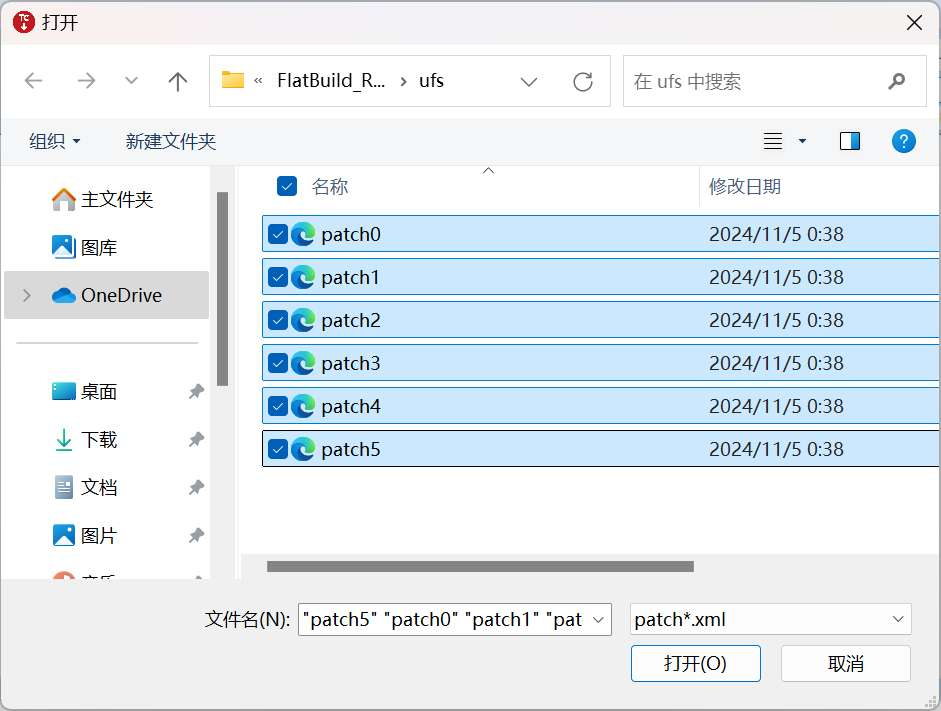

      设置完成后，可从 Tflash 界面获取相关设置。

      

   5. 点&#x51FB;**&#x20;Download&#x20;**&#x5F00;始刷机。

      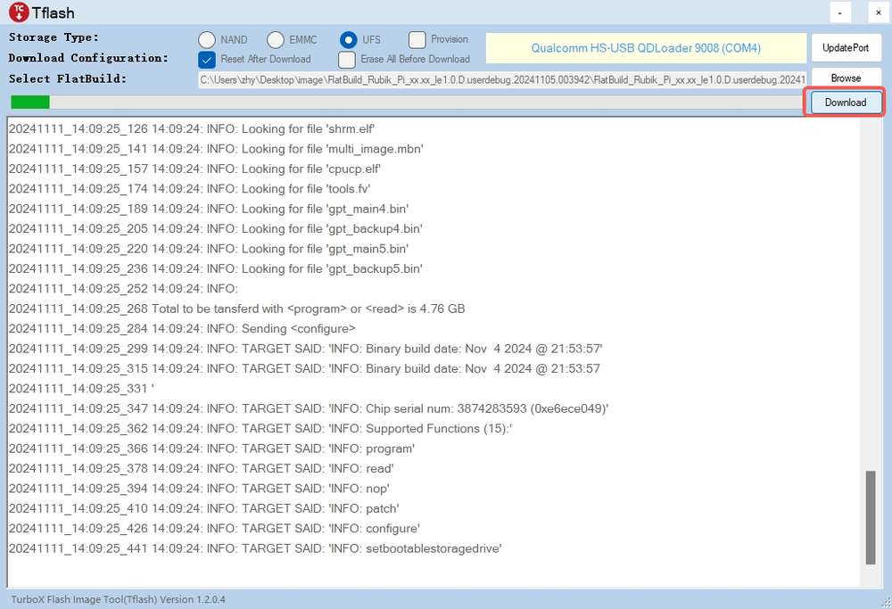

      :::note
      >
      > 烧写时间因个人电脑而异。在烧写过程中，可通过绿色进度条查看烧写进度。
      :::

      烧写成功后，界面会显示如下 log：

      

   * 如已勾&#x9009;**&#x20;Reset After Download**，则开发板将在烧写完成后自动重启；

   * 如未勾选 **Reset AfterDownload**，断开电源线和 USB 线，使 RUBIK Pi 3 断电，再重连电源并按下 PWR 按钮启动开发板。

     

##### 烧录后无法启动的解决方法

:::note

在安卓 Alpha 版本中，需要[下载此文件](https://thundercomm.s3.dualstack.ap-northeast-1.amazonaws.com/uploads/web/rubik-pi-3/tools/RUBIKPI_LA_CDT.zip)，并将其解压到镜像包的 *ufs* 目录下。

若烧录后如下图所示进入了恢复模式，请在烧录前勾选 **Erase All Before Download**。


:::

若烧录失败或烧录后无法启动（下图红色框中的心跳灯始终未闪烁），可尝试对 UFS 重新进行配置（provision）。


:::warning
>
> 进行 provision 后，UFS 中存储的一些信息会丢失，如 SN号、以太网 MAC 地址等。
:::

UFS 重新配置过程：

1. 进入 9008 模式。

   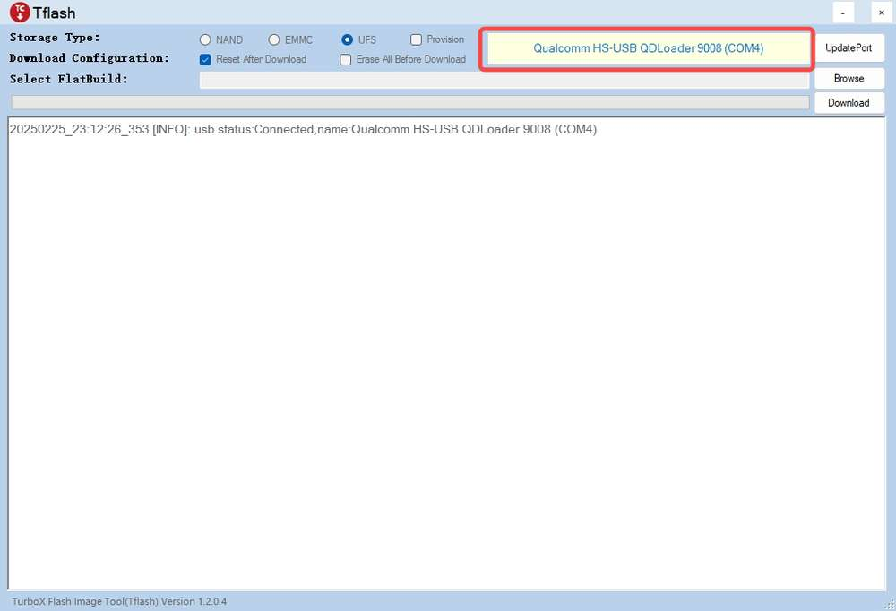

2. **Storage Type** 选择  **UFS** ，并勾选 **Provision**。

   

3. 烧写 Provision 文件。

   1. 点击 **Browse**。

      

   2. 进入镜像包中的 *provision* 目录，选择 *prog\_firehose\_ddr.elf*，并点击 **打开**。

      

   3. 选择 *provision\_ufs\_1\_3*  文件，并点击 **打开**。

      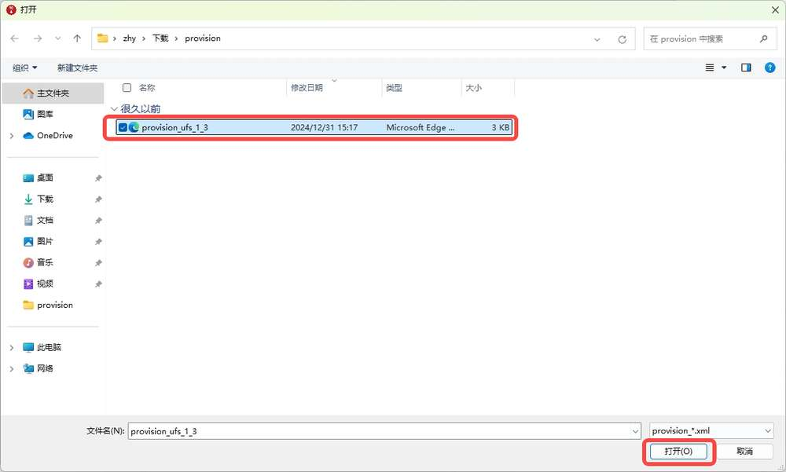

   4. Log 中显示 “Load Image PATCH Successfully!” 后，点击 **Download** ，开始 Provision 刷机。

      Provison 刷机完成后，界面会显示如下 log:

      

      :::warning
      >
      > Provison 刷机完成之后，需要手动插拔电源线和 USB 线重启设备。
      :::

#### Ubuntu 烧录方法

##### 操作流程

1. 进入 FlatBuild 包目录。

2. 执行 `tflash -r`。

   :::note
   >
   > 更多参数，可使用 `tflash -h` 命令查看。这里 `-r` 表示烧录完成后重启 RUBIK Pi 3。
   :::

3. 屏幕上出现提示“Stop the ModemManager on your host PC and press Enter on your keyboard to continue...”时，按 **Enter** 键进行刷机；

   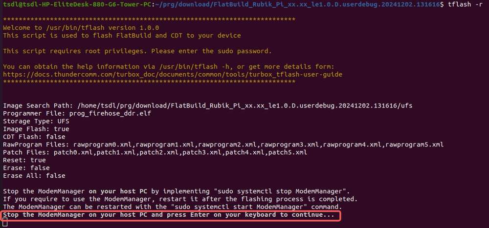

   tflash 运行结束后，如显示以下界面，则说明烧写成功。

   

:::note
>
> 在 PC 上执行 `tflash` 时，需根据提示输入个人电脑的登录密码。
:::

4. 使用`-r`参数烧写成功后，RUBIK Pi 3 自动重启。

##### 烧录后无法启动的解决方法

:::note

在安卓 Alpha 版本中，需要[下载此文件](https://thundercomm.s3.dualstack.ap-northeast-1.amazonaws.com/uploads/web/rubik-pi-3/tools/RUBIKPI_LA_CDT.zip)，并将其解压到镜像包的 *ufs* 目录下。

若烧录后如下图所示进入了恢复模式，请在烧录时加入 `-e` 参数，如 `tflash -r -e`。


:::

若烧录失败或烧录后无法启动（下图红色框中的心跳灯始终未闪烁），可尝试对 UFS 重新进行配置（provision）。


:::warning
>
> 进行 provision 后，UFS 中存储的一些信息会丢失，如 SN号、以太网MAC地址等。
:::

* UFS重新配置过程：

1. 进入9008模式。


2. 进入镜像包的 *provision* 目录，运行 `tflash -E` 命令，输入y，回车。

  

3. 屏幕上出现提示“Stop the ModemManager on your host PC and press Enter on your keyboard to continue...”时，按 **Enter** 键进行刷机；

  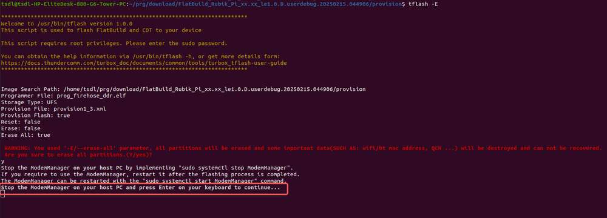

  tflash 运行结束后，如显示以下界面，则说明烧写成功。

  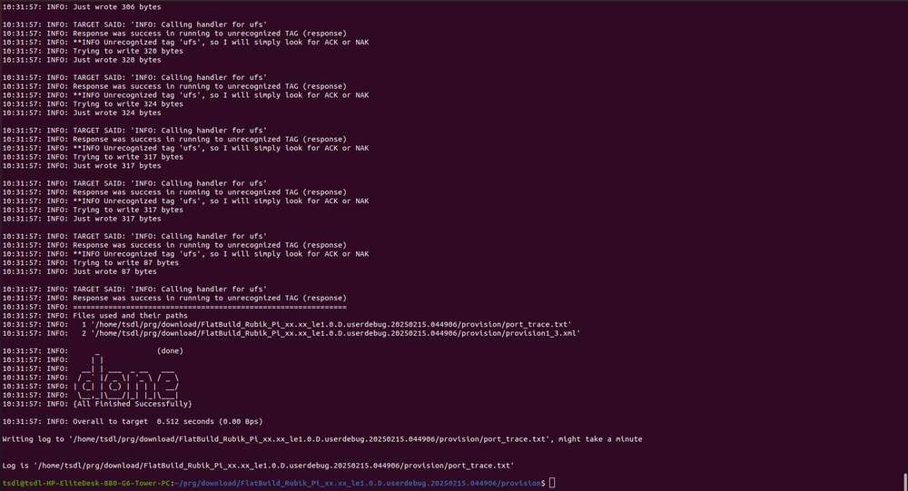

:::warning
>
> Provison 刷机完成之后，需要手动插拔电源线和 USB 线重启设备。
:::

## 开机

对于旧版本的 RUBIK Pi 3 开发板，接入电源并按下 PWR 按键开机。对于 V02 及后续版本的开发板，接入电源后自动触发开机。


## 关机

* 输入命令 `reboot -p` 关机。


## 重启

* 输入命令 `reboot` 重启。


* 长按 12 秒电源 PWR 按键重启。

  

## 串口登录

### Windows

1. 将下图 2 号接口使用串口线连接到电脑。

   

2. 打开电脑设置，查看设备管理器对应的 COM 口并记录下来。

   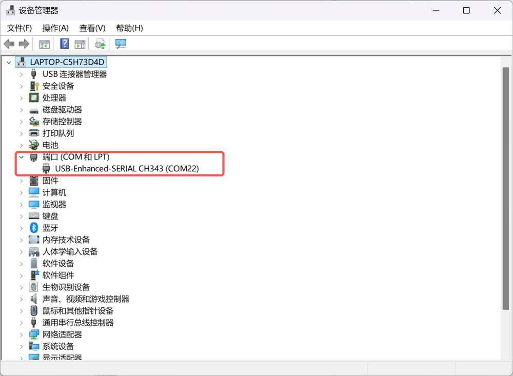

3. 访问 https://mobaxterm.mobatek.net/ 下载 MobaXterm ，解压后即可使用。

   

4. 打开 MobaXterm ，选择 **Session&#x20;**> **Serial**，设置串口的波特率为 115200。

   

   

5. 点击 **OK**，进入终端，按下回车，即可登录设备。

6. 使用`su`可以进入 root 权限。

   


### Ubuntu

1. 连接下图 2 中的串口线到电脑。

   

2. 执行命令安装 minicom。

   ```shell
   sudo apt update
   sudo apt install minicom
   ```

3. 输入以下命令检查 USB 端口。

   ```shell
   ls /dev/ttyACM*
   ```

   

* 输入下面命令打开 minicom， 按下回车，输入默认登录名和登录密码登录。

  ```shell
  sudo minicom -D /dev/ttyACM0 -b 115200
  ```

  随后直接就可以通过串口登录设备。

  

## ADB 登录

### Windows

#### 准备

1. 访问  https://developer.android.google.cn/tools/releases/platform-tools 下载 ADB 和 Fastboot 安装包并进行解压。

   

2. 右键 **我的电脑&#x20;**>**&#x20;属性&#x20;**> **高级系统设置&#x20;**> **环境变量**；或右键 **我的电脑&#x20;**>**&#x20;属性，** 在搜索栏中输入**高级系统设置&#x20;**> **环境变量**。

   

3. 选择**系统变量**中的 **Path**，点击**编辑。**

   

4. 点击 **新建**，将 platform-tools 工具在步骤 1 解压的路径填写进去，点击 **确定&#x20;**&#x4FDD;存环境变量。

   

#### ADB 登录

按下 **Win**+**R** 输入`cmd` 打开 Windows 终端，在终端输入如下登录到 RUBIK Pi 3：

```shell
adb devices # 查看是否有设备连接
adb root    # 以root用户登录
adb shell   # 打开adb终端
```

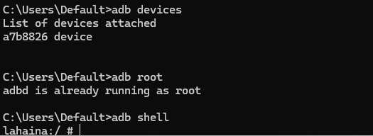

### Ubuntu

#### 准备

1. 输入如下命令安装 ADB 和 Fastboot 工具：

   ```shell
   sudo apt install git android-tools-adb android-tools-fastboot wget
   ```

2. 更新 udev rules 文件

   1. 使用如下命令打开并修改 *51-qcom-usb.rules* 文件。

      ```shell
      sudo vi /etc/udev/rules.d/51-qcom-usb.rules
      ```

   2. 将如下内容，添加到文件中；若如下内容已经存在，可忽略这一步骤。

      ```shell
      SUBSYSTEMS=="usb", ATTRS{idVendor}=="05c6", ATTRS{idProduct}=="9008", MODE="0666", GROUP="plugdev"
      ```

   3. 使用下面命令，重启 `udev`。

      ```shell
      sudo systemctl restart udev
      ```

   :::note
   >
   > 如果 RUBIK Pi 3 已经通过 USB 连接到个人电脑，请插拔 USB 线，重新连接，以使更新的规则生效。
   :::

#### ADB 登录

在终端输入如下命令登录到 RUBIK Pi 3：

```shell
adb devices # 查看是否有设备连接
adb root    # 设置为root用户
adb shell   # 打开adb终端
```


## 文件传输

### ADB

* 在PC终端中使用下面命令，上传文件 *test.txt&#x20;*&#x5230; /opt目录。

  ```shell
  adb push test.txt /opt
  ```

* 在 PC 终端中使用下面命令，下载文&#x4EF6;*&#x20;test.txt* 到 PC 当前目录。

  ```shell
  adb pull /opt/test.txt ./
  ```