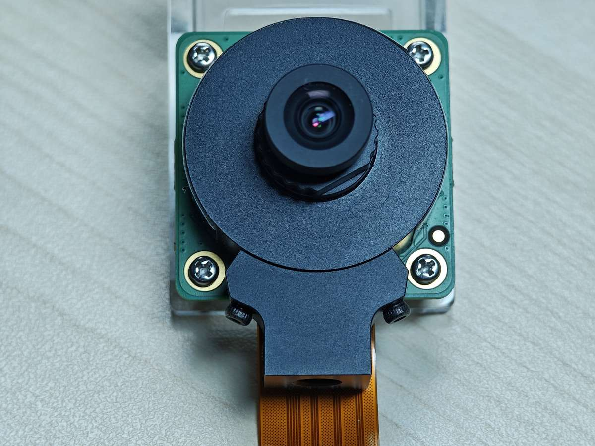
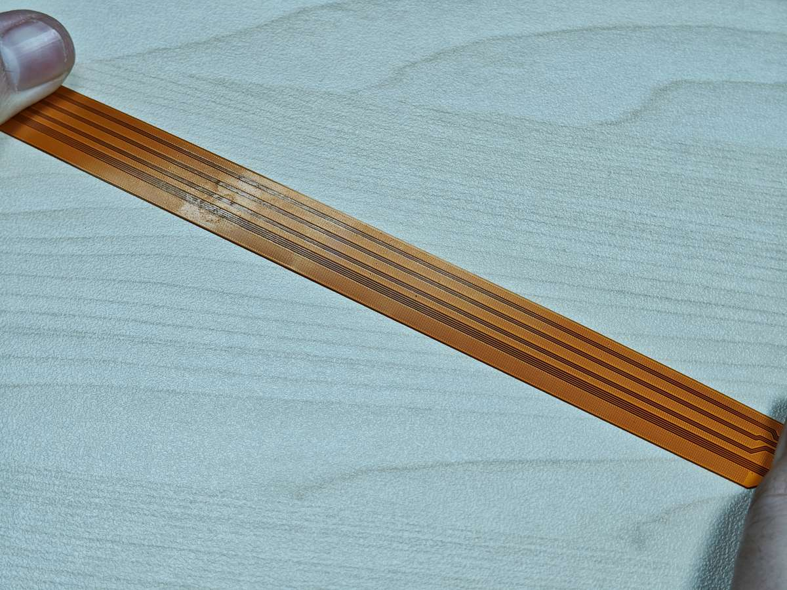
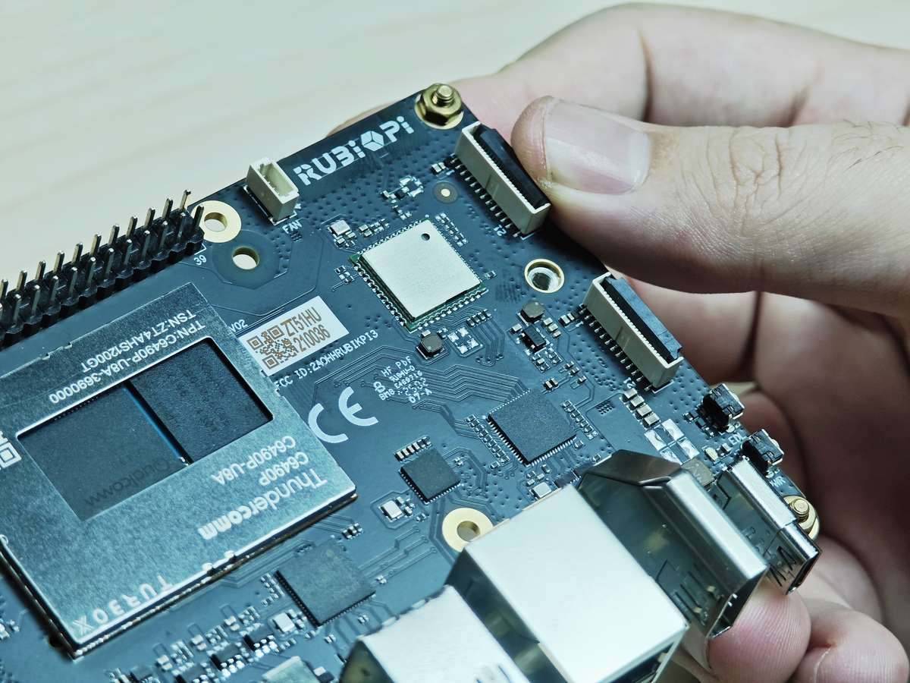
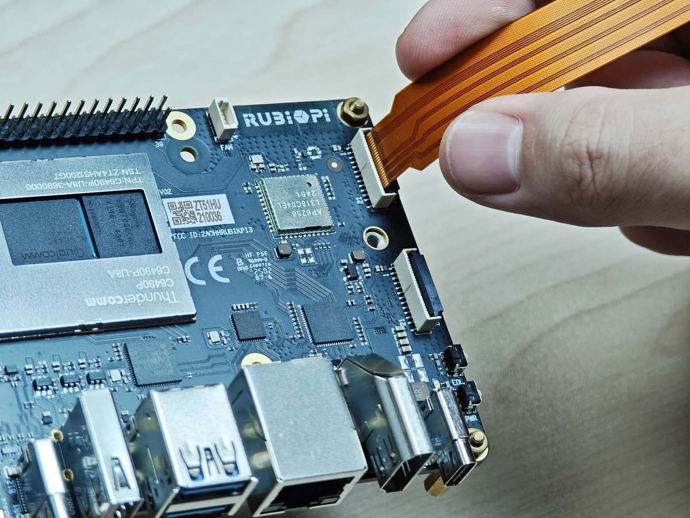

#摄像头串行接口（CSI）

目前 RUBIK Pi 3 兼容的摄像头详见[外设兼容列表](https://www.thundercomm.com/rubik-pi-3/cn/docs/peripheral-compatibility-list)。下表显示了每个摄像头模块支持的分辨率：

| 分辨率         | 宽高比  | IMX477 | IMX708 | IMX219 |
| ----------- | ---- | ------ | ------ | ------ |
| 4056 x 3040 | 4:3  | 是      | 否      | 否      |
| 4608 x 2592 | 16:9 | 否      | 是      | 否      |
| 3280 x 2464 | 4:3  | 否      | 否      | 是      |
| 1920 x 1080 | 16:9 | 是      | 否      | 否      |
| 1632 x 1224 | 4:3  | 否      | 否      | 是      |


* HQ Camera（IMX477/M12 Mount）

  

* Camera Module 2 (IMX219)
  :::note
  >
  > 目前 RUBIK Pi 3 暂时只支持标准版 Module 2 摄像头，不支持广角（Wide）、夜光（NoIR）版本。
  :::

* Camera Module 3 (IMX708)

  :::note

  目前 RUBIK Pi 3 暂时只支持标准版 Module 3 摄像头，不支持广角（Wide）、夜光（NoIR）版本。当前软件版本暂不支持 Module 3 摄像头的 AF 自动对焦功能。
  :::

## 摄像头排线安装
<a id="cameracable"></a>

RUBIK Pi 3 支持的摄像头 FPC 为 22 pin，0.5mm 间距，厚度 0.3±0.05mm。兼容配件详见[外设兼容列表](https://www.thundercomm.com/rubik-pi-3/cn/docs/peripheral-compatibility-list)。

:::danger
>
> 严禁在板子未断电的情况下插拔摄像头，否则非常容易烧坏摄像头模组。
:::



1. 向上拉开连接器的锁扣部分：

   

2. 插入 FPC，注意接触面朝向板内：

   

3. 按下锁扣，确认 FPC 稳定没有松动：

   

## 摄像头使用方法

将摄像头插入，下图 13 和 14 处


如下为实物连接图：


* 前提准备
    1. 将魔方派公共个人软件包档案 (PPA) 添加到您的魔方派 3 Ubuntu 软件源。
        ```shell
        sudo sed -i '$a deb http://apt.thundercomm.com/rubik-pi-3/noble ppa main' /etc/apt/sources.list
        ```
    2. 安装摄像头软件
        ```shell
        sudo apt update
        sudo apt install -y qcom-ib2c qcom-camera-server qcom-camx
        sudo apt install -y rubikpi3-cameras
        sudo apt install gstreamer1.0-qcom-sample-apps
        sudo chmod -R 777 /opt
        sudo mkdir -p /var/cache/camera/
        sudo touch /var/cache/camera/camxoverridesettings.txt
        echo  enableNCSService=FALSE >> /var/cache/camera/camxoverridesettings.txt
        ```
    3. 重启。
        ```shell
        sudo reboot
        ```
* 拍照测试
    ```shell
    # CAM1, 生成物为 /opt/img0_123.jpg
    gst-launch-1.0 -e qtiqmmfsrc camera=0 ! video/x-raw,format=NV12,width=1280,height=720,framerate=30/1 ! queue ! jpegenc ! queue ! multifilesink location=/opt/img0_%d.jpg max-files=5

    # CAM2, 生成物为 /opt/img1_123.jpg
    gst-launch-1.0 -e qtiqmmfsrc camera=1 ! video/x-raw,format=NV12,width=1280,height=720,framerate=30/1 ! queue ! jpegenc ! queue ! multifilesink location=/opt/img1_%d.jpg max-files=5
    ```


## 摄像头故障排除

如果摄像头无法显示或捕捉图像，请检查以下内容：

1. 检查摄像头模块连接

   请参阅 [摄像头排线安装](#cameracable)。

2. &#x20;使用以下命令收集日志

   ```shell
   journalctl -f > /opt/log.txt
   ```

   在日志中搜索 "probe success" 。Probe success 意味着摄像头模块已通电并响应 I2C 控制。如果特定传感器没有 "probe success" 日志，则可能是柔性电缆连接或摄像头模块的问题。

   以下日志指示探测到一个 IMX477：

   ```shell
   [   80.645992] CAM_INFO: CAM-SENSOR: cam_sensor_driver_cmd: 939: Probe success,slot:7,slave_addr:0x34,sensor_id:0x477, is always on: 0
   ```

3. 检查摄像头传感器驱动程序命令

   使用 `journalctl -f > /opt/log.txt`命令收集日志并搜索 "cam\_sensor\_driver\_cmd" 。"CAM\_START\_DEV Success" 表示摄像头传感器流式传输开始。"CAM\_STOP\_DEV Success" 表示摄像头传感器流式传输停止。例如：

   ```shell

   start:
   [   81.172814] CAM_INFO: CAM-SENSOR: cam_sensor_driver_cmd: 1129: CAM_START_DEV Success, sensor_id:0x477,sensor_slave_addr:0x34
   stop:
   [   88.905241] CAM_INFO: CAM-SENSOR: cam_sensor_driver_cmd: 1157: CAM_STOP_DEV Success, sensor_id:0x477,sensor_slave_addr:0x34
   ```

4. 检查传感器流式传输

   启用 CSID SOF/EOF IRQ 日志，随后执行摄像头出流命令

   ```shell
   mount -o rw,remount /usr
   mount -t debugfs none /sys/kernel/debug/
   echo 0x8 > /sys/module/camera/parameters/debug_mdl
   echo 3 >/sys/kernel/debug/camera_ife/ife_csid_debug
   echo 1 > /sys/kernel/tracing/tracing_on
   echo 1 > /sys/kernel/tracing/events/camera/cam_log_debug/enable
   echo 2 > /sys/module/camera/parameters/debug_type
   cat /sys/kernel/tracing/trace_pipe > trace.txt

   ```

   捕获的日志有助于提供有关 SOF 和 EOF 的详细信息。在日志 "trace.txt" 中搜索 "irq\_status\_ipp"。

   * BIT12(0x1000)表示 SOF 数据包

   * BIT9(0x200)表示 EOF 数据包。

   日志如下所示：

   ```shell
   <idle>-0       [000] d.h1. 19287.546764: cam_log_debug:
   CAM_DBG: CAM-ISP: cam_ife_csid_irq: 4996: irq_status_ipp = 0x1110 cam-server-25604     [000] dNH.. 19287.561705: cam_log_debug:
   CAM_DBG: CAM-ISP: cam_ife_csid_irq: 4996: irq_status_ipp = 0xee8
   ```
