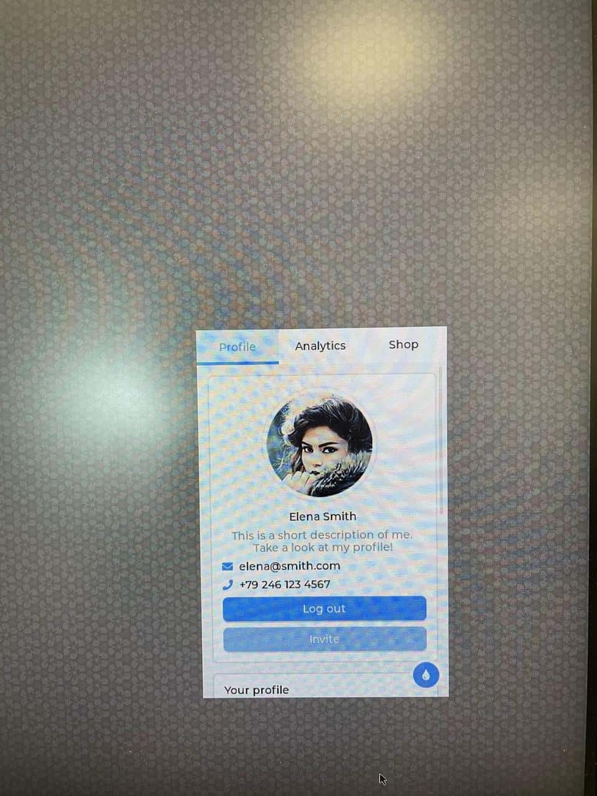

# 5. LVGL使用指南

LVGL 是一个开源的轻量级图形库，下面以 LVGL9.2 为例，说明一种将其移植到 Weston 桌面的方法。

完整工程，可访问 https://github.com/rubikpi-ai/lvgl 下载。

关于 LVGL 的更多信息，可访问 https://lvgl.io/ 查看。

1.克隆需要的代码库：

```shell showLineNumbers
git clone -b release/v9.2 https://github.com/lvgl/lvgl.git
git clone https://github.com/lvgl/lv_port_pc_vscode.git
```

2.将lvgl拷贝到l*v\_port\_pc\_vscode*的根目录下，替换*lv\_conf.h*配置文件，同时到 *main/src* 下创建软链接：

```shell showLineNumbers
cd lv_port_pc_vscode
cp ../lvgl . -r
cp lvgl/lv_conf_template.h lv_conf.h
cd main/src
ln -sf ../../lvgl
```

3.修改 *lv\_conf.h*

- 使能*lv\_conf.h*：

```C showLineNumbers
/* clang-format off */
#if 1 /*Set it to "1" to enable content*/
```

* 修改色深：

```C showLineNumbers
#define LV_COLOR_DEPTH 32
```

* 增加 LV\_MEM\_SIZE：

```C showLineNumbers
#define LV_MEM_SIZE (20U * 1024U * 1024U)
```

* 设置 LV\_USE\_WAYLAND：

```C showLineNumbers
#define LV_USE_WAYLAND          1
```

* 设置 LV\_WAYLAND\_WL\_SHELL:

```C showLineNumbers
#define LV_WAYLAND_WL_SHELL             1
```

* 设置 LV\_USE\_LINUX\_DRM:

```C showLineNumbers
#define LV_USE_LINUX_DRM        1
```

* 使能DEMO:

```C showLineNumbers
#define LV_USE_DEMO_WIDGETS 1
```


4.修改*CMakeLists.txt*

- 注释掉 SDL2库:

```CMake showLineNumbers
# Find and include SDL2 library
# find_package(SDL2 REQUIRED)
```

* 增加头文件路径，按实际情况对路径进行修改，如下 */home/zhy/QCOM/sdk* 为交叉编译工具的安装路径，具体可参考快速开始->Linux kernel->代码编译部分:

```CMake showLineNumbers
target_include_directories(lvgl PUBLIC /home/zhy/QCOM/sdk/sysroots/armv8-2a-qcom-linux/usr/include/drm)
```

* 注释掉如下内容:

```CMake showLineNumbers
# Remove ARM-specific compile and linker options
# set(CMAKE_C_FLAGS "${CMAKE_C_FLAGS} -march=native")
# set(CMAKE_CXX_FLAGS "${CMAKE_CXX_FLAGS} -march=native")
```

* 设置链接的库，如下将原 target\_link\_libraries 部分进行替换:

```CMake showLineNumbers
# Define LVGL configuration as a simple include
target_compile_definitions(main PRIVATE LV_CONF_INCLUDE_SIMPLE)
target_link_libraries(main lvgl lvgl::examples lvgl::demos lvgl::thorvg m pthread rt drmfs drm_etnaviv drm_nouveau drm_omap drmtime drm drmutils sdedrm xkbcommon wayland-client wayland-cursor wayland-egl EGL GLESv2)
```

5.设置交叉编译环境

- 具体可参考  1.11.2 安装交叉编译工具小节:

```shell showLineNumbers
source <your toolchains directory>/environment-setup-armv8-2a-qcom-linux
```

* 修改 *lv\_port\_pc\_vscode/main/src/main.c* 中的 hal\_init函数:

```C showLineNumbers
/**
 * Initialize the Hardware Abstraction Layer (HAL) for the LVGL graphics
 * library
 */
static lv_display_t * hal_init(int32_t w, int32_t h)
{
        lv_disp_t * disp;
        lv_group_set_default(lv_group_create());

        lv_group_set_default(lv_group_create());
        disp = lv_wayland_window_create(w, h, "Window Title", NULL);
    // lv_wayland_window_set_fullscreen(disp, false);

        lv_indev_t *kb = lv_wayland_get_keyboard(disp);
        lv_indev_set_display(kb, disp);
        lv_indev_set_group(kb, lv_group_get_default());

        lv_display_set_default(disp);

        return disp;
}
```

6.将 *lv\_port\_pc\_vscode/nvim main/src/main.c* 中main函数中while循环调用的lv\_timer\_handler改为lv\_wayland\_timer\_handler:

```C showLineNumbers
while(1) {
  /* Periodically call the lv_task handler.
   * It could be done in a timer interrupt or an OS task too.*/
  lv_wayland_timer_handler();
  usleep(5 * 1000);
}

```

7.开始编译:

```shell showLineNumbers
cd lv_port_pc_vscode
mkidr build
cd build
cmake ..
make
```

8.编译生成物传输到板子中，已 ADB 传输为例:

```shell showLineNumbers
cd lv_port_pc_vscode/bin
adb push main /opt
```

9.连接 HDMI 线和鼠标键盘，在 weston 终端中输入如下，运行 LVGL 程序，可用鼠标键盘控制 UI 界面:

```shell showLineNumbers
cd /opt
./main
```


