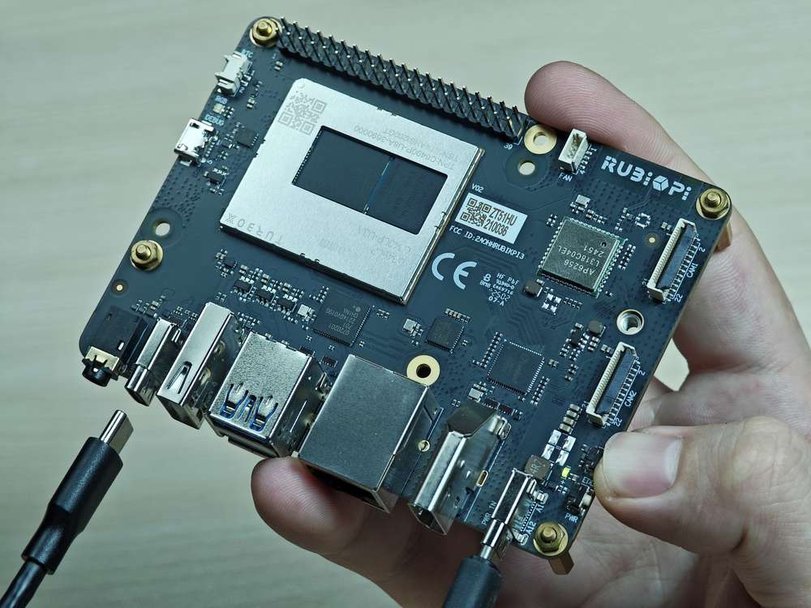
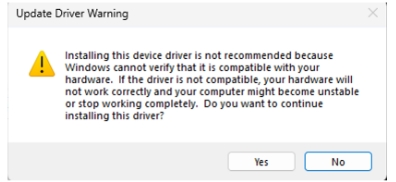
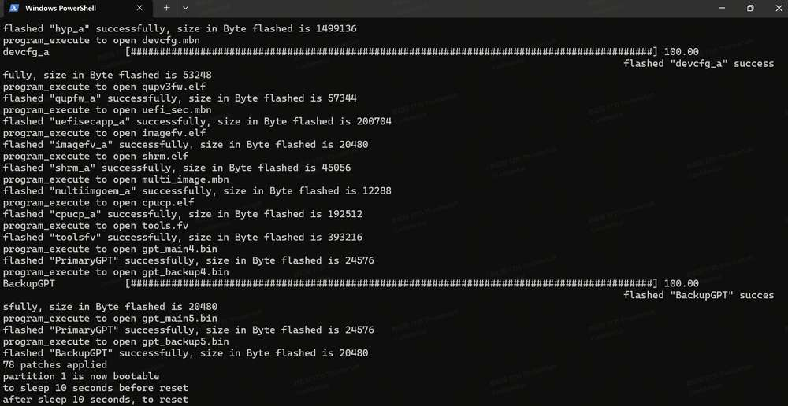
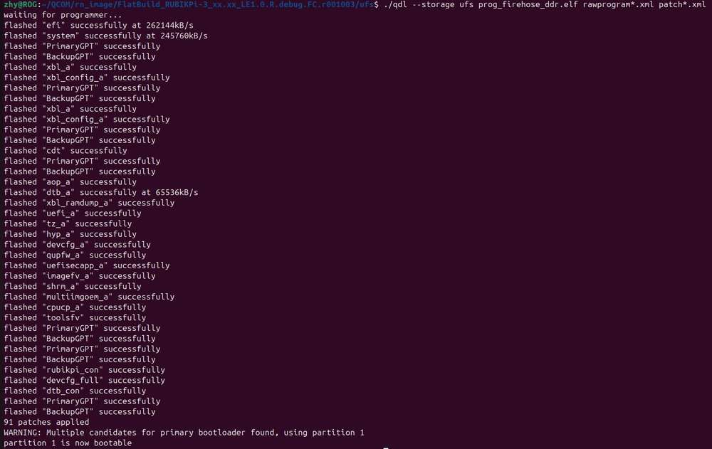
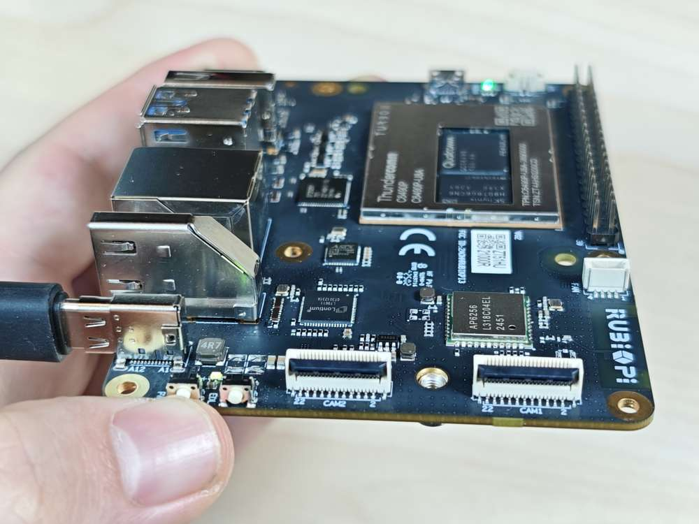

# 快速开始

## 介绍

魔方派 3 (RUBIK Pi 3) 基于高通 QCS6490 芯片，采用  Qualcomm® Kryo™ 670 CPU 和融合 AI 加速器架构的 Qualcomm® Hexagon™ 处理器，具备 12 TOPS 的卓越 AI 性能，适用于各种机器学习和人工智能应用场景。

RUBIK Pi 3 具有丰富的接口和功能设计，支持 USB、Camera、DP、HDMI、ETH、3.5mm 耳机、Wi-Fi、BT、M.2 连接器、FAN、RTC、40 pin 排针连接器等，满足多样化的开发需求，方便开发者快速开发和调试。

RUBIK Pi 3 同样也支持多种系统，如 Qualcomm Linux、Debian 13、Canonical Ubuntu for Qualcomm Platforms\*、Android 13 等，灵活满足开发者特定应用要求。

\*Canonical Ubuntu for Qualcomm Platforms：计划中


## 参数

|            | **RUBIK Pi 3**                                                                |
| ---------- | ----------------------------------------------------------------------------- |
| 芯片         | QCS6490                                                                       |
| 处理器        | <p>1 x Cortex-A78 2.7GHz</p><p>3 x Cortex-A78 2.4GHz</p><p>4 x Cortex-A55 1.9GHz</p>  |
| GPU        | Adreno 643 GPU @ up to 812 MHz                                                |
| VPU        | Adreno 633 VPU                                                                |
| NPU        | 12 TOPS                                                                       |
| ISP        | Spectra ISP，可以做端侧的机器学习和机器处理                                                   |
| 内存         | 8 GB LPDDR4x                                                                  |
| ROM        | 128 GB UFS 2.2                                                                |
| Wi-Fi & 蓝牙 | Wi-Fi 5 和蓝牙 5.2                                                               |
| 摄像头接口      | 2 x 4-lane MIPI CSI D-PHY                                                     |
| USB        | <p>1 x USB Type-C (USB 3.1 Gen1)</p><p>2 x USB Type-A (USB 3.0)</p><p>1 x USB Type-A (USB 2.0) </p>|
| GPIO       | 28个 GPIO 引脚                                                                   |
| 网口         | 1000M                                                                         |
| M.2 接口     | M.2 Key M  2280（2-lane PCIe 3.0）                                              |
| 音频接口       | 3.5mm 耳机接口                                                                    |

## 准备

* 装有 Windows 10 以上 或 Ubuntu18 - Ubuntu22 系统的电脑

* RUBIK Pi 3

* USB Type-A to Type-C 数据线

* USB Type-A to Micro USB 数据线

* 电源（12V 3A Type-C）

:::danger[警告：]

- 请勿使用台式机或笔记本电脑为 RUBIK Pi 3 供电。这样可能导致电脑和 RUBIK Pi 3 损坏。
- RUBIK Pi 使用的任何外置电源必须符合所在国家/地区的相关法律法规与标准。
- 使用**额定电流 ≥ 3 A 的 12 V 直流电源**。电源应具有过流、过压和浪涌保护功能。
:::

### 镜像下载

RUBIK Pi 3 出厂预装 Linux 镜像供您快速进行开箱操作体验（非最新版本），如需体验最新版本的 Android 镜像，或其他操作系统镜像，请访问 [RUBIK Pi 3 官方网站](https://www.thundercomm.com/rubik-pi-3/cn/docs/image/) 进行下载。

* Qualcomm Linux ：基于weston的桌面系统，系统较为精简，适合具备 Linux 开发经验，追求深度开发体验的开发者。

  

* Debian 13：基于GNOME 48 桌面系统，系统功能完善，丰富的软件包资源，有更多的桌面应用，更好的使用体验，较多的开发资料，适合追求开发便捷的开发者。

  

* 安卓 13：基于谷歌 AOSP，系统完善，有更好的使用体验，适合想做安卓应用的开发者。

  RUBIK Pi 3 提供了 user 和 userdebug 两个版本的安卓镜像；在 Android 系统中，user 和 userdebug 是两种不同的构建类型，主要为不同使用场景设计。

  * user 版本是为最终用户打造的正式版本，注重安全性和稳定性。它关闭了调试功能，限制了 Root 权限和 ADB 高级命令，精简了日志输出，确保系统运行流畅并保护用户隐私，提供可靠的日常使用体验。

  * 相比之下，userdebug 版本是为开发者设计的测试版本，提供了强大的调试支持。它允许临时 Root 权限、完整的 ADB 功能和详细的日志记录，便于开发者修改系统文件、监控应用表现或定位问题。然而，由于开放了更多权限，安全性较低，可能会占用额外资源，因此仅适合开发和测试阶段。

  


### 下载 QDL

QDL 是一款烧录工具，通过 QDL 可向魔方派中烧录镜像。

[点击此处下载](https://softwarecenter.qualcomm.com/api/download/software/tools/Qualcomm_Device_Loader/All/2.3.4/Qualcomm_Device_Loader.Core.2.3.4.All-AnyCPU-qdl_2.3.4.zip)
QDL，下载完成后解压，文件内容如下所示，QDL 支持多平台多架构，可通过查看 *QDL_User_Guide.pdf* 了解 QDL 的使用方法。


### 镜像烧录


镜像烧录前，首先进入烧录模式（9008模式）：

:::warning
>
> * 请勿徒手接触 PCB 板载元件及金属触点
>
> * 操作前需通过接地设备（如防静电工作台/腕带）释放静电
>
> * 禁止将电路板直接置于导电表面（金属台面/未接地机箱等）
:::

方法1：

1. 按住上图 12 的 EDL 按钮。

   

2. 将供电线接入到上图 10。

   

3. Type-C 数据线插入上图 5 等待 3 秒，进入 9008 模式。

   

方法2：

1. 将供电线接入到上图 10。

   

2. Type-C 数据线插入上图 5。

   

3. 在 RUBIK Pi 3 开机后，输入如下命令，进入 9008 模式。

   ```shell
   adb shell reboot edl
   ```

#### Windows 烧录方法
<a id="flashwin"></a>
1. 安装 WinUSB 驱动（若已经安装可忽略该步骤）
    1. 卸载该设备的其他驱动程序。确保未安装 Qualcomm USB 驱动程序等驱动程序。

        * 您不应该在设备管理器的 COM 端口下看到魔方派设备，如下所示，如果您在 COM 端口下看到该设备，请右键该设备，选择删除设备。

        

        * 确保已选中“删除此设备的驱动程序软件”。

        

    2. 设备断电，重新进入烧录模式，使用以下说明/屏幕截图安装 Microsoft WinUSB。

        * 在设备管理器中右键 RUBIK Pi 的 USB 端口，选择更新驱动程序。

        

        * 在弹出的窗口中选择下方的，浏览我的电脑以查找驱动程序。

        

        * 在通用串行总线设备中，选择 "WinUsb Device"。

        

        * 点 “是”，完成驱动更新。

        

2. 在终端中使用以下命令根据主机架构运行 *QDL_Win_x64* 或 *QDL_Win_ARM64* 目录中的 QDL 可执行文件, 进行镜像烧录,
烧录完成后会自动重启。

:::note
>
> 程序文件名不支持通配符。命令中必须列出每个镜像文件。
>
> 将 `<pathToQDL>` 更换为 *QDL_Win_x64* 或 *QDL_Win_ARM64* 目录的实际位置。
:::

```shell
<pathToQDL>\QDL.exe prog_firehose_ddr.elf rawprogram_unsparse0.xml rawprogram1.xml rawprogram2.xml rawprogram3.xml rawprogram4.xml rawprogram5.xml patch0.xml patch1.xml patch2.xml patch3.xml patch4.xml patch5.xml
```


3. 或烧录后无法启动，可尝试进入 FlatBuild 包中的 provision 目录执行下面命令重新对 UFS 进行配置（provision）。

    :::note

    在安卓 Alpha 版本中，需要[下载此文件](https://thundercomm.s3.dualstack.ap-northeast-1.amazonaws.com/uploads/web/rubik-pi-3/tools/RUBIKPI_LA_CDT.zip)，并将其解压到镜像包的 *ufs* 目录下。
    :::

    :::warning
    >
    > 进行 provision 后，UFS 中存储的一些信息会丢失，如 SN号、以太网MAC地址等。
    >
    > 将 `<pathToQDL>` 更换为 *QDL_Win_ARM64* 或 *QDL_Win_x64* 目录的实际位置。
    :::
    ```shell
    <pathToQDL>\QDL.exe prog_firehose_ddr.elf provision_ufs_1_3.xml
    ```
    

    :::warning
    >
    > Provision 刷机完成之后，需要手动插拔电源线和 USB 线重启设备重新进行镜像烧录。
    :::

#### Ubuntu 烧录方法

1. 执行下面命令安装 libusb 和 libxml2（若已经安装，可忽略该步骤）。

```shell
sudo apt-get install libxml2-dev libudev-dev libusb-1.0-0-dev
```

2. 进入 FlatBuild 包的 *ufs* 目录。

3. 根据主机架构将 *QDL_Linux_x64* 或 *QDL_Linux_ARM* 目录下的 qdl 拷贝到 *ufs* 目录。

4. 执行下面命令进行烧录。

```shell
./qdl --storage ufs prog_firehose_ddr.elf rawprogram*.xml patch*.xml
```



5. 或烧录后无法启动，可尝试进入 FlatBuild 包中的 provision 目录执行下面命令重新对 UFS 进行配置（provision）。

    :::note

    在安卓 Alpha 版本中，需要[下载此文件](https://thundercomm.s3.dualstack.ap-northeast-1.amazonaws.com/uploads/web/rubik-pi-3/tools/RUBIKPI_LA_CDT.zip)，并将其解压到镜像包的 *ufs* 目录下。
    :::

    :::warning
    >
    > 进行 provision 后，UFS 中存储的一些信息会丢失，如 SN号、以太网MAC地址等。
    >
    > 配置前根据主机架构将 *QDL_Linux_x64* 或 *QDL_Linux_ARM* 目录下的 qdl 拷贝到 *provision* 目录
    :::
    ```shell
    ./qdl prog_firehose_ddr.elf provision_ufs_1_3.xml
    ```
    

    :::warning
    >
    > Provision 刷机完成之后，需要手动插拔电源线和 USB 线重启设备重新进行镜像烧录。
    :::

#### Mac 烧录方法
1. 使用以下方式安装 homebrew (若已经安装，可忽略该步骤)。

```shell
/bin/bash -c "$(curl -fsSL https://raw.githubusercontent.com/Homebrew/install/HEAD/install.sh)"
```

2. 执行下面命令安装 libusb 和 libxml2。

```shell
brew install libusb
brew install libxml2
```

3. 进入 FlatBuild 包的 *ufs* 目录。

4. 根据主机的架构将 *QDL_Mac_x64* 或 *QDL_Mac_ARM* 目录下的内容拷贝到 *ufs* 目录。

5. 执行下面命令进行烧录。
```shell
./qdl --storage ufs prog_firehose_ddr.elf rawprogram*.xml patch*.xml
```


6. 或烧录后无法启动，可尝试进入 FlatBuild 包中的 provision 目录执行下面命令重新对 UFS 进行配置（provision）。

    :::note

    在安卓 Alpha 版本中，需要[下载此文件](https://thundercomm.s3.dualstack.ap-northeast-1.amazonaws.com/uploads/web/rubik-pi-3/tools/RUBIKPI_LA_CDT.zip)，并将其解压到镜像包的 *ufs* 目录下。
    :::

    :::warning
    >
    > 进行 provision 后，UFS 中存储的一些信息会丢失，如 SN号、以太网MAC地址等。
    >
    > 配置前根据主机架构将 *QDL_Mac_x64* 或 *QDL_Mac_ARM* 目录下的 qdl 拷贝到 *provision* 目录
    :::
    ```shell
    ./qdl prog_firehose_ddr.elf provision_ufs_1_3.xml
    ```
    

    :::warning
    >
    > Provision 刷机完成之后，需要手动插拔电源线和 USB 线重启设备重新进行镜像烧录。
    :::


## 开机

对于旧版本的 RUBIK Pi 3 开发板，接入电源并按下 PWR 按键开机。对于 V02 及后续版本的开发板，接入电源后自动触发开机。


## 关机

* 输入命令 `reboot -p` 关机。


## 重启

* 输入命令 `reboot` 重启。


* 长按 12 秒电源 PWR 按键重启。

  

## 串口登录

### Windows

1. 将下图 2 号接口使用串口线连接到电脑。

   

2. 打开电脑设置，查看设备管理器对应的 COM 口并记录下来。

   

3. 访问 https://mobaxterm.mobatek.net/ 下载 MobaXterm ，解压后即可使用。

   

4. 打开 MobaXterm ，选择 **Session&#x20;**> **Serial**，设置串口的波特率为 115200。

   

   

5. 点击 **OK**，进入终端，按下回车，即可登录设备。

6. 使用`su`可以进入 root 权限。

   


### Ubuntu

1. 连接下图 2 中的串口线到电脑。

   

2. 执行命令安装 minicom。

   ```shell
   sudo apt update
   sudo apt install minicom
   ```

3. 输入以下命令检查 USB 端口。

   ```shell
   ls /dev/ttyACM*
   ```

   

* 输入下面命令打开 minicom， 按下回车，输入默认登录名和登录密码登录。

  ```shell
  sudo minicom -D /dev/ttyACM0 -b 115200
  ```

  随后直接就可以通过串口登录设备。

  

## ADB 登录

### Windows

#### 准备

1. 访问  https://developer.android.google.cn/tools/releases/platform-tools 下载 ADB 和 Fastboot 安装包并进行解压。

   

2. 右键 **我的电脑&#x20;**>**&#x20;属性&#x20;**> **高级系统设置&#x20;**> **环境变量**；或右键 **我的电脑&#x20;**>**&#x20;属性，** 在搜索栏中输入**高级系统设置&#x20;**> **环境变量**。

   

3. 选择**系统变量**中的 **Path**，点击**编辑。**

   

4. 点击 **新建**，将 platform-tools 工具在步骤 1 解压的路径填写进去，点击 **确定&#x20;**&#x4FDD;存环境变量。

   

#### ADB 登录

按下 **Win**+**R** 输入`cmd` 打开 Windows 终端，在终端输入如下登录到 RUBIK Pi 3：

```shell
adb devices # 查看是否有设备连接
adb root    # 以root用户登录
adb shell   # 打开adb终端
```


### Ubuntu

#### 准备

1. 输入如下命令安装 ADB 和 Fastboot 工具：

   ```shell
   sudo apt install git android-tools-adb android-tools-fastboot wget
   ```

2. 更新 udev rules 文件

   1. 使用如下命令打开并修改 *51-qcom-usb.rules* 文件。

      ```shell
      sudo vi /etc/udev/rules.d/51-qcom-usb.rules
      ```

   2. 将如下内容，添加到文件中；若如下内容已经存在，可忽略这一步骤。

      ```shell
      SUBSYSTEMS=="usb", ATTRS{idVendor}=="05c6", ATTRS{idProduct}=="9008", MODE="0666", GROUP="plugdev"
      ```

   3. 使用下面命令，重启 `udev`。

      ```shell
      sudo systemctl restart udev
      ```

   :::note
   >
   > 如果 RUBIK Pi 3 已经通过 USB 连接到个人电脑，请插拔 USB 线，重新连接，以使更新的规则生效。
   :::

#### ADB 登录

在终端输入如下命令登录到 RUBIK Pi 3：

```shell
adb devices # 查看是否有设备连接
adb root    # 设置为root用户
adb shell   # 打开adb终端
```


## 文件传输

### ADB

* 在PC终端中使用下面命令，上传文件 *test.txt&#x20;*&#x5230; /opt目录。

  ```shell
  adb push test.txt /opt
  ```

* 在 PC 终端中使用下面命令，下载文&#x4EF6;*&#x20;test.txt* 到 PC 当前目录。

  ```shell
  adb pull /opt/test.txt ./
  ```
