# 快速开始

## 介绍

魔方派 3 （RUBIK Pi 3）基于高通 QCS6490 芯片，采用  Qualcomm® Kryo™ 670 CPU 和融合 AI 加速器架构的 Qualcomm® Hexagon™ 处理器，具备 12 TOPS 的卓越 AI 性能，适用于各种机器学习和人工智能应用场景。

RUBIK Pi 3 具有丰富的接口和功能设计，支持 USB、Camera、DP、HDMI、ETH、3.5mm 耳机、Wi-Fi、BT、M.2 连接器、FAN、RTC、40 pin 排针连接器等，满足多样化的开发需求，方便开发者快速开发和调试。

RUBIK Pi 3 同样也支持多种系统，如 Qualcomm Linux、Debian 13、Canonical Ubuntu for Qualcomm Platforms\*、Android 13 等，灵活满足开发者特定应用要求。

\*Canonical Ubuntu for Qualcomm Platforms：计划中

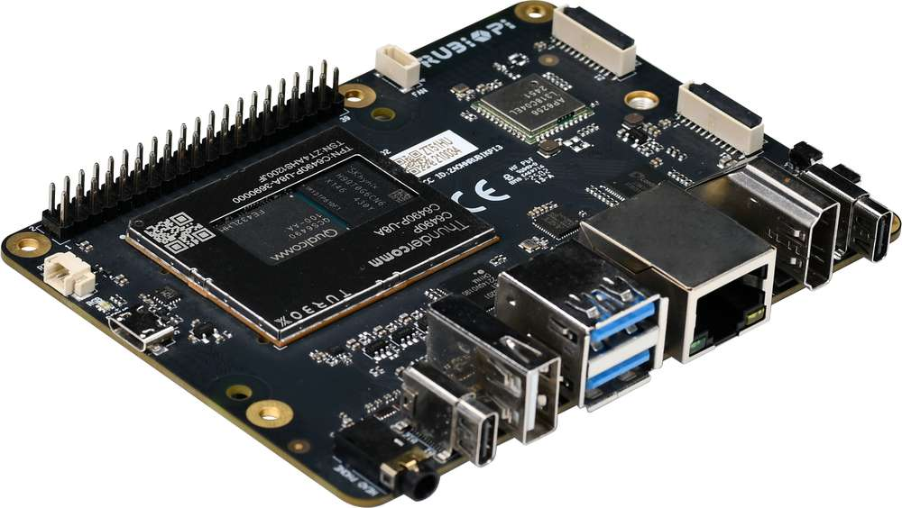


## 参数

|            | **RUBIK Pi 3**                                                                |
| ---------- | ----------------------------------------------------------------------------- |
| 芯片         | QCS6490                                                                       |
| 处理器        | <p>1 x Cortex-A78 2.7GHz</p><p>3 x Cortex-A78 2.4GHz</p><p>4 x Cortex-A55 1.9GHz</p>   |
| GPU        | Adreno 643 GPU @ Up to 812 MHz                                                |
| VPU        | Adreno 633 VPU                                                                |
| NPU        | 12 TOPS                                                                       |
| ISP        | Spectra ISP，可以做端侧的机器学习和机器处理                                                   |
| 内存         | 8 GB LPDDR4x                                                                  |
| ROM        | 128 GB UFS 2.2                                                                |
| Wi-Fi & 蓝牙 | Wi-Fi 5 和蓝牙 5.2                                                               |
| 摄像头接口      | 2 x 4-lane MIPI CSI D-PHY                                                     |
| USB        | <p>1 x USB Type-C (USB 3.1 Gen1)</p><p>2 x USB Type-A (USB 3.0)</p><p>1 x USB Type-A (USB 2.0)</p> |
| GPIO       | 28个 GPIO 引脚                                                                   |
| 网口         | 1000M                                                                         |
| M.2 接口     | M.2 Key M  2280（2-lane PCIe 3.0）                                              |
| 音频接口       | 3.5mm 耳机接口                                                                    |

## 准备

* 装有 Windows 10 以上 或 Ubuntu18 - Ubuntu22 系统的电脑

* RUBIK Pi 3

* USB Type-A to Type-C 数据线

* USB Type-A to Micro USB 数据线

* 电源（12V 3A Type-C）


### 镜像下载

RUBIK Pi 3 出厂预装 Linux 镜像供您快速进行开箱操作体验（非最新版本），如需体验最新版本的 Linux 镜像，或其他操作系统镜像，请访问 [RUBIK Pi 3 官方网站](https://www.thundercomm.com/rubik-pi-3/cn/docs/image/) 进行下载。

如您需要 Linux 源码，请访问 [GitHub](https://github.com/rubikpi-ai) 进行下载。

我们提供如下镜像：

* Qualcomm Linux ：基于 Weston 的桌面系统，系统较为精简，适合具备 Linux 开发经验，追求深度开发体验的开发者。

  

* Debian 13：基于 GNOME 48 桌面系统，系统功能完善，丰富的软件包资源，有更多的桌面应用，更好的使用体验，较多的开发资料，适合追求开发便捷的开发者。

  

* 安卓 13：基于谷歌 AOSP，系统完善，有更好的使用体验，适合想做安卓应用的开发者。

  

### 下载 QDL

QDL 是一款烧录工具，通过 QDL 可向魔方派中烧录镜像。

[点击此处下载](https://softwarecenter.qualcomm.com/api/download/software/tools/Qualcomm_Device_Loader/All/2.3.4/Qualcomm_Device_Loader.Core.2.3.4.All-AnyCPU-qdl_2.3.4.zip)
QDL，下载完成后解压，文件内容如下所示，QDL 支持多平台多架构，可通过查看 *QDL_User_Guide.pdf* 了解 QDL 的使用方法。


### 镜像烧录
<a id="flashimages"></a>


镜像烧录前，首先进入烧录模式（9008模式）：

:::warning
>
> * 请勿徒手接触 PCB 板载元件及金属触点
>
> * 操作前需通过接地设备（如防静电工作台/腕带）释放静电
>
> * 禁止将电路板直接置于导电表面（金属台面/未接地机箱等）
:::

方法1：

1. 按住上图 12 的 EDL 按钮。

   

2. 将供电线接入到上图 10。

   

3. Type-C 数据线插入上图 5 等待 3 秒，进入 9008 模式。

   

方法2：

1. 将供电线接入到上图 10。

   

2. Type-C 数据线插入上图 5。

   

3. 在 RUBIK Pi 3 开机后，输入如下命令，进入 9008 模式。

   ```shell
   adb shell reboot edl
   ```

#### Windows 烧录方法
<a id="flashwin"></a>

1. 安装 WinUSB 驱动（若已经安装可忽略该步骤）

   1. 卸载该设备的其他驱动程序。确保未安装 Qualcomm USB 驱动程序等驱动程序。

      * 您不应该在设备管理器的 COM 端口下看到魔方派设备，如下所示，如果您在 COM 端口下看到该设备，请右键该设备，选择删除设备。

      

      * 确保已选中“删除此设备的驱动程序软件”。

      
   2. 设备断电，重新进入烧录模式，使用以下说明/屏幕截图安装 Microsoft WinUSB。

      * 在设备管理器中右键 RUBIK Pi 的 USB 端口，选择更新驱动程序。

      

      * 在弹出的窗口中选择下方的，浏览我的电脑以查找驱动程序。

      

      * 在通用串行总线设备中，选择 "WinUsb Device"。

      

      * 点 “是”，完成驱动更新。

      
2. 在终端中使用以下命令根据主机架构运行 *QDL_Win_x64* 或 *QDL_Win_ARM64* 目录中的 QDL 可执行文件, 进行镜像烧录,
   烧录完成后会自动重启。

:::note

> 程序文件名不支持通配符。命令中必须列出每个镜像文件。
>
> 将 `<pathToQDL>` 更换为 *QDL_Win_x64* 或 *QDL_Win_ARM64* 目录的实际位置。
:::

```shell
<pathToQDL>\QDL.exe prog_firehose_ddr.elf rawprogram0.xml rawprogram1.xml rawprogram2.xml rawprogram3.xml rawprogram4.xml rawprogram5.xml rawprogram6.xml patch0.xml patch1.xml patch2.xml patch3.xml patch4.xml patch5.xml patch6.xml
```


3. 或烧录后无法启动，可尝试进入 FlatBuild 包中的 provision 目录执行下面命令重新对 UFS 进行配置（provision）。

:::warning

> 进行 provision 后，UFS 中存储的一些信息会丢失，如 SN号、以太网MAC地址等。
>
> 将 `<pathToQDL>` 更换为 *QDL_Win_ARM64* 或 *QDL_Win_x64* 目录的实际位置。
:::

```shell
<pathToQDL>\QDL.exe prog_firehose_ddr.elf provision_ufs_1_3.xml
```


:::warning

> Provison 刷机完成之后，需要手动插拔电源线和 USB 线重启设备重新进行镜像烧录。
:::

#### Ubuntu 烧录方法

1. 执行下面命令安装 libusb 和 libxml2（若已经安装，可忽略该步骤）。

```shell
sudo apt-get install libxml2-dev libudev-dev libusb-1.0-0-dev
```

2. 进入 FlatBuild 包的 *ufs* 目录。
3. 根据主机架构将 *QDL_Linux_x64* 或 *QDL_Linux_ARM* 目录下的 qdl 拷贝到 *ufs* 目录。
4. 执行下面命令进行烧录。

```shell
./qdl --storage ufs prog_firehose_ddr.elf rawprogram*.xml patch*.xml
```


5. 或烧录后无法启动，可尝试进入 FlatBuild 包中的 provision 目录执行下面命令重新对 UFS 进行配置（provision）。
   
:::warning

> 进行 provision 后，UFS 中存储的一些信息会丢失，如 SN号、以太网MAC地址等。
>
> 配置前，根据主机架构将 *QDL_Linux_x64* 或 *QDL_Linux_ARM* 目录下的 qdl 拷贝到 *provision* 目录
:::

```shell
./qdl prog_firehose_ddr.elf provision_ufs_1_3.xml
```


:::warning

> Provison 刷机完成之后，需要手动插拔电源线和 USB 线重启设备重新进行镜像烧录。
:::

#### Mac 烧录方法

1. 使用以下方式安装 homebrew (若已经安装，可忽略该步骤)。

```shell
/bin/bash -c "$(curl -fsSL https://raw.githubusercontent.com/Homebrew/install/HEAD/install.sh)"
```

2. 执行下面命令安装 libusb 和 libxml2。

```shell
brew install libusb
brew install libxml2
```

3. 进入 FlatBuild 包的 *ufs* 目录。
4. 根据主机的架构将 *QDL_Mac_x64* 或 *QDL_Mac_ARM* 目录下的内容拷贝到 *ufs* 目录。
5. 执行下面命令进行烧录。

```shell
./qdl --storage ufs prog_firehose_ddr.elf rawprogram*.xml patch*.xml
```


6. 或烧录后无法启动，可尝试进入 FlatBuild 包中的 provision 目录执行下面命令重新对 UFS 进行配置（provision）。
   
:::warning

> 进行 provision 后，UFS 中存储的一些信息会丢失，如 SN 号、以太网 MAC 地址等。
>
> 配置前，根据主机架构将 *QDL_Mac_x64* 或 *QDL_Mac_ARM* 目录下的 qdl 拷贝到 *provision* 目录
:::

```shell
./qdl prog_firehose_ddr.elf provision_ufs_1_3.xml
```


:::warning

> Provison 刷机完成之后，需要手动插拔电源线和 USB 线重启设备重新进行镜像烧录。
:::

## 开机

对于旧版本的 RUBIK Pi 3 开发板，接入电源并按下 PWR 按键开机。对于 V02 及后续版本的开发板，接入电源后自动触发开机。


## 关机

输入命令 `poweroff` 关机。


## 重启

* 输入命令 `reboot` 重启。


* 长按 12 秒电源 PWR 按键重启。

  

## 串口登录

### Windows

1. 将下图 2 号接口使用串口线连接到电脑。

   

2. 打开电脑设置，查看设备管理器对应的 COM 口并记录下来。

   

3. 访问 https://mobaxterm.mobatek.net/ 下载 MobaXterm ，解压后即可使用。

   

4. 打开 MobaXterm ，选择 **Session&#x20;**> **Serial**，设置串口的波特率为 115200。

   

   

5. 点击 **OK**，按下回车，输入登录名和默认登录密码登录：

   * 登录帐号： root

   * 登录密码： rubikpi

   :::note
   
    可通过 `passwd` 命令修改默认的密码，如：`passwd root`。
   ::: 

    

### Ubuntu

1. 连接下图 2 中的串口线到电脑。

   

2. 执行命令安装 minicom。

   ```shell
   sudo apt update
   sudo apt install minicom
   ```

3. 输入以下命令检查 USB 端口。

   ```shell
   ls /dev/ttyACM*
   ```

    

4. 输入下面命令打开 minicom， 按下回车，输入默认登录名和登录密码登录。

  ```shell
  sudo minicom -D /dev/ttyACM0 -b 115200
  ```

  登录帐号： root
  登录密码： rubikpi

  :::note
  
   可通过 `passwd` 命令修改默认的密码，如：`passwd root`。
  :::


## ADB 登录

### Windows

#### 准备

1. 访问  https://developer.android.google.cn/tools/releases/platform-tools 下载 ADB 和 Fastboot 安装包并进行解压。

   

2. 右键 **我的电脑&#x20;**>**&#x20;属性&#x20;**> **高级系统设置&#x20;**> **环境变量**；或右键 **我的电脑&#x20;**>**&#x20;属性，** 在搜索栏中输入**高级系统设置&#x20;**> **环境变量**。

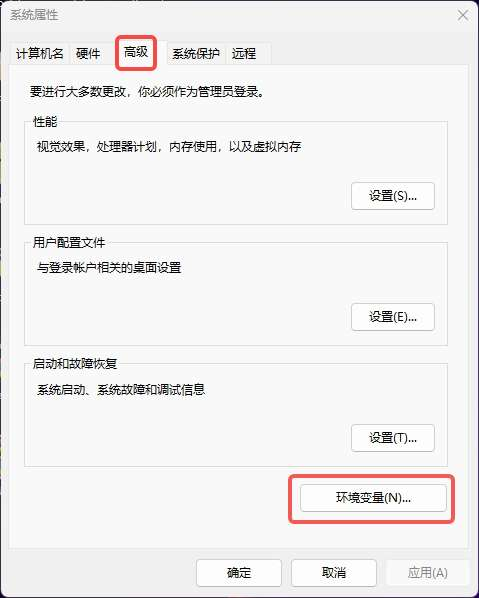

3. 选择**系统变量**中的 **Path**，点击**编辑。**


4. 点击 **新建**，将 platform-tools 工具在步骤 1 解压的路径填写进去，点击 **确定&#x20;**&#x4FDD;存环境变量。


#### ADB 登录

按下 **Win**+**R，** 输入`cmd`，打开 Windows 终端，在终端输入如下登录到 RUBIK Pi 3：

```shell
adb devices # 查看是否有设备连接
adb root    # 以root用户登录
adb shell   # 打开adb终端
```


### Ubuntu

#### 准备

1. 输入如下命令安装 ADB 和 Fastboot 工具：

   ```shell
   sudo apt install git android-tools-adb android-tools-fastboot wget
   ```

2. 更新 udev rules 文件

   1. 使用如下命令打开并修改 *51-qcom-usb.rules* 文件。

      ```shell
      sudo vi /etc/udev/rules.d/51-qcom-usb.rules
      ```

   2. 将如下内容，添加到文件中；若如下内容已经存在，可忽略这一步骤。

      ```shell
      SUBSYSTEMS=="usb", ATTRS{idVendor}=="05c6", ATTRS{idProduct}=="9008", MODE="0666", GROUP="plugdev"
      ```

   3. 使用下面命令，重启 `udev`。

      ```shell
      sudo systemctl restart udev
      ```

   :::note
   
   如果 RUBIK Pi 3 已经通过 USB 连接到个人电脑，请插拔 USB 线，重新连接，以使更新的规则生效。
   :::

#### ADB 登录

在终端输入如下命令登录到 RUBIK Pi 3：

```shell
adb devices # 查看是否有设备连接
adb root    # 设置为root用户
adb shell   # 打开adb终端
```

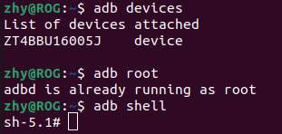

## SSH 登录

### Windows

1. Ping 通 RUBIK Pi 3 的 IP 地址。

   1. 获取 IP 地址。

      * 登录路由器后台或使用其他 IP 扫描软件获取 RUBIK Pi 3 的 IP 地址。

      * &#x20;ADB 登录到 RUBIK Pi 3 ，使用 `ifconfig` 命令获取 IP 地址。

   :::warning
   >
   > IP 地址会随网络环境变化而改变，RUBIK Pi 3 设备名称为 rubikpi。
   :::
   >
   >

   2. 按下 **Win**+**R** 按键，在弹出的窗口中输入 cmd，点击 **确定。**

     

   3. Run the `ping <IP>` command in the terminal. For example, the IP address of RUBIK Pi 3 is 10.9.5.59, run the following command and view the execution result.
   ```
    ping 10.9.5.59
   ```
   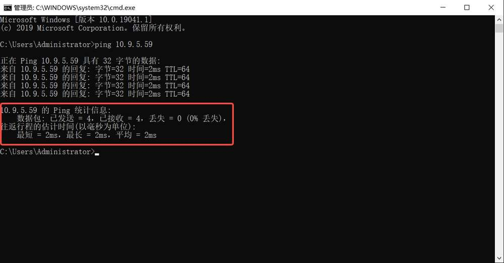


2. 进行 SSH 登录。

    1. 打开 MobaXterm 软件。

    

    2. 点击 **Session**，在弹出的界面中选择 **SSH**。
    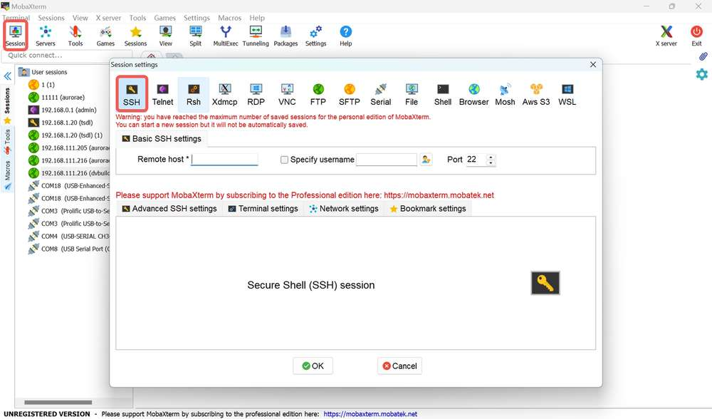

    3. 输入要登录 RUBIK Pi 3 的 IP，点击 **OK**。
    
    
    4. 输入要登录的用户名回车后，再输入密码，再次回车登录 RUBIK Pi 3。

    

    5. 成功登录。

    


### Ubuntu

1. 确定连接状态

   1. 获取 RUBIK Pi 3 的 IP 地址。

      * 登录路由器后台或使用其他 IP 扫描软件获取 RUBIK Pi 3 的 IP 地址。

      * ADB 登录到 RUBIK Pi 3 ，使用 `ifconfig` 命令获取 IP 地址。

        :::note
        >
        > IP 地址会随网络环境变化而改变，RUBIK Pi 3 设备名称为 rubikpi。
        :::
        >
        >

   2. 在 Ubuntu 终端中输入 `ping <IP>` 命令，例如， RUBIK Pi 3 的 IP 为 10.9.5.59，执行如下命令，查看执行结果。

      ```shell
      ping 10.9.5.59
      ```

    

2. 进行 SSH 登录

    1. 在 Ubuntu 终端中输入`ssh <user>@<IP>`命令后回车，如下所示，其中 `root` 表示要登录的用户，`10.9.5.59` 表示 RUBIK Pi 3 的 IP。

     ```shell
     ssh root@10.9.5.59
     ```

    2. 输入密码后回车，成功登录。

    

## 文件传输

### ADB

* 在 PC 终端中使用下面命令，上传文件 *test.txt&#x20;*&#x5230; /opt目录。

  ```shell
  adb push test.txt /opt
  ```

* 在 PC 终端中使用下面命令，下载文&#x4EF6;*&#x20;test.txt* 到 PC 当前目录。

  ```shell
  adb pull /opt/test.txt ./
  ```

### SCP

SCP 传输需要 RUBIK Pi 3 正常联网，若 RUBIK Pi 3 的 IP 为 10.9.5.59， 在终端可输入下面命令：

:::note

RUBIK Pi 3 的 IP 可通过在 RUBIK Pi 3 中输入`ifconfig`命令获取。
:::


* 在 PC 终端中使用下面命令，上传文&#x4EF6;*&#x20;test.txt* 到 /opt目录。

  ```shell
  scp test.txt root@10.9.5.59:/opt
  ```

* 在 PC 终端中使用下面命令，下载文件到 PC 当前目录。

  ```shell
  scp root@10.9.5.59:/opt/test.txt ./
  ```

## Ubuntu 开发环境搭建

### 软件安装

1. 在 Ubuntu 终端中使用下面命令，安装如下软件包，准备好开发所需的主机环境。

   ```shell
   sudo apt update
   sudo apt install repo gawk wget git diffstat unzip texinfo gcc build-essential chrpath socat cpio python3 python3-pip python3-pexpect xz-utils debianutils iputils-ping python3-git python3-jinja2 libegl1-mesa libsdl1.2-dev pylint xterm python3-subunit mesa-common-dev zstd liblz4-tool locales tar python-is-python3 file libxml-opml-simplegen-perl vim whiptail bc
   sudo apt install lib32stdc++6 libncurses5 checkinstall libreadline-dev libncursesw5-dev libssl-dev libsqlite3-dev tk-dev libgdbm-dev libc6-dev libbz2-dev libffi-dev curl git-lfs libncurses5-dev libncursesw5-dev
   ```

2. 在 Ubuntu 终端中使用下面命令，安装 Python 3.10.2，在 [Linux kernel 的打包](1.get-started.md#Linuxkernelpack)过程中用到了`python3.10`命令，如果已经有 Python 3.10.2 或更高版本，请跳过这个步骤。

   ```shell
   python --version
   # Download it in a directory of your choice
   wget https://www.python.org/ftp/python/3.10.2/Python-3.10.2.tgz
   tar -xvf Python-3.10.2.tgz
   cd Python-3.10.2
   ./configure --enable-optimizations
   make
   sudo make install
   ```

3. 在 Ubuntu 终端中使用下面命令，安装 pefile。

   ```shell
   sudo pip3.10 install pefile
   ```

### 安装交叉编译工具
<a id="installcrosstool"></a>

1. 在 Ubuntu 主机上，访问 [RUBIK Pi 3 官方网站](https://www.thundercomm.com/rubik-pi-3/cn/docs/image)，下载 RUBIK Pi 3 的交叉编译工具链，下载完成后使用下面命令解压。

   ```shell
   unzip toolchains_V1.1.0.zip
   ```

   :::note
   
   交叉编译工具是使用 Yocto 工程编译的 eSDK，eSDK 是从 Qualcomm Linux 镜像生成的软件包。它安装在 Ubuntu 主机上并提供基于 Yocto 的环境，可用于应用程序的开发。
   
   关于 eSDK 的编译可参考 [Yocto 工程编译指南](./10.yocto-project-user-guide.md#yocto)章节。
   :::

2. 在 Ubuntu 终端中使用下面命令，安装交叉编译工具链。

   ```shell
   cd toolchains
   chmod 755 qcom-wayland-x86_64-qcom-multimedia-image-armv8-2a-qcm6490-idp-toolchain-ext-1.3-ver.1.1.sh
   sh qcom-wayland-x86_64-qcom-multimedia-image-armv8-2a-qcm6490-idp-toolchain-ext-1.3-ver.1.1.sh
   ```

3. 按照提示安装交叉编译环境，如下输入安装目录的绝对路径回车后，输入 "Y"**&#x20;**&#x8FDB;行安装。

   

4. 安装完成后，到安装目录执行如下命令，设置交叉编译环境。

   ```shell
   source environment-setup-armv8-2a-qcom-linux
   ```

   :::info
   >
   > 交叉编译环境只对当前终端有效。
   :::

   若出现如下错误，可按提示输入`unset LD_LIBRARY_PATH` 命令后，再次执行上面命令。

   

5. 在 Ubuntu 终端中使用下面命令，查看 gcc 工具链版本，若输出如下内容说明交叉编译环境设置成功。

   ```shell
   aarch64-qcom-linux-gcc -v
   ```

   

### 交叉编译工具使用方法
<a id="usecrosstool"></a>

在上一小节中，通过  `source environment-setup-armv8-2a-qcom-linux` 命令设置好交叉编译环境后，可以通过下面的方法，交叉编译 RUBIK Pi 3 的可执行程序。

#### 使用 Makefile 构建项目

交叉编译需要设置头文件路径（sysroot），可使用`--sysroot=dir `参数指定。

```shell
aarch64-qcom-linux-gcc --sysroot=/home/zhy/rubikpi/sdk/sysroots/armv8-2a-qcom-linux
```

:::note

 在上面命令中，交叉编译工具链安装在了 PC &#x673A;*&#x20;/home/zhy/rubikpi/sdk* 目录下，请按实际安装目录进行修改。
:::

#### 使用 CMake 构建项目

如下为使用 aarch64.cmake 设置编译工具链的简单示例:

```cmake
set(CMAKE_SYSTEM_NAME Linux)
set(CMAKE_SYSTEM_PROCESSOR arm64) #设置目标处理器架构

#设置sysroot
set(TOOLCHAIN_DIR /home/zhy/rubikpi/sdk/sysroots/armv8-2a-qcom-linux)
set(CMAKE_SYSROOT ${TOOLCHAIN_DIR}/sysroots/armv8-2a-qcom-linux)

#设置交叉编译器
SET(CMAKE_C_COMPILER ${TOOLCHAIN_DIR}/sysroots/x86_64-qcomsdk-linux/usr/bin/aarch64-qcom-linux/aarch64-qcom-linux-gcc)
SET(CMAKE_CXX_COMPILER ${TOOLCHAIN_DIR}/sysroots/x86_64-qcomsdk-linux/usr/bin/aarch64-qcom-linux/aarch64-qcom-linux-g++)

set(CMAKE_FIND_ROOT_PATH_MODE_PROGRAM NEVER)
set(CMAKE_FIND_ROOT_PATH_MODE_LIBRARY ONLY)
set(CMAKE_FIND_ROOT_PATH_MODE_INCLUDE ONLY)
```

在使用 Cmake 构建项目时，需要按项目情况创建 *CMakeLists.txt*，并执行如下命令，生成 Makefile 文件。

```shell
$ cmake -DCMAKE_TOOLCHAIN_FILE=aarch64.cmake 
```

## Windows 11 开发环境搭建
<a id="setwin"></a>

使用 WSL 在 Windows 11 上搭建 Ubuntu VM。

Windows Subsystem for Linux (WSL) 是一项 Windows 功能，允许您在不使用虚拟化软件的情况下在 Windows 上运行 Linux 分发版。在 Windows 11 上设置 WSL 涉及以下任务：


:::note
只能使用 WSL 编译 Qualcomm Linux 软件。要在 RUBIK Pi 3 上刷写软件，请参阅 [Windows 烧录方法](./1.get-started.md#flashwin)。
:::

### 主机要求

在使用 WSL 设置 Ubuntu VM 之前，请确保 Windows 11 主机满足以下系统要求：
|                      | 要求               |
|----------------------|---------------------------|
| 处理器架构            | x86 or Arm®              |
| CPU 核数量            | 8 or more                 |
| RAM                  | 8 GB or larger            |
| 存储                  | 300 GB available space    |
| 操作系统             | Windows 11                |

### 设置 WSL 的先决条件

要设置 WSL，您必须打开特定的 Windows 功能并设置默认的 WSL 版本。

* Windows Subsystem for Linux

* Virtual Machine Platform

请使用管理员权限在 Windows PowerShell 中运行以下命令，以便打开这些功能：

* Windows Subsystem for Linux

```sql
Enable-WindowsOptionalFeature -Online -FeatureName Microsoft-Windows-Subsystem-Linux
```

* Virtual Machine Platform

```sql
Enable-WindowsOptionalFeature -Online -FeatureName VirtualMachinePlatform
```

 :::note

 运行这些命令后，重启 Windows 11 主机。
 :::

### 设置默认 WSL 版本

要将 Windows Subsystem for Linux 2 设置为默认的 Linux 分发版，请使用管理员权限在 Windows PowerShell 中运行以下命令：

```sql
wsl --set-default-version 2
```

输出如下：

```sql
For information on key differences with WSL 2 please visit https://aka.ms/wsl2. The operation completed successfully.
```

### 安装 Ubuntu-22.04 Linux 分发版

Qualcomm Linux 使用 Ubuntu-22.04 Linux 分发版。在安装 Ubuntu-22.04 之前，请验证它是否可作为安装在 Windows 11 主机上的有效分发版之一。

1. 要列出可供安装的分发版，请在 Windows PowerShell 中运行以下命令：

```sql
wsl --list --online
```

2. 验证 Ubuntu-22.04 是否被列为分发版之一。

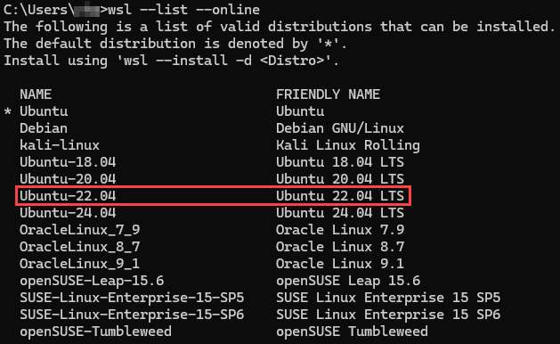

:::note

如果在列出的分发版中没有看到 Ubuntu-22.04，请联系 Microsoft 支持。
:::

3. 要更新 WSL，请运行以下命令：

```sql
wsl --update
```

4. 要安装 Ubuntu 22.04 LTS，请运行以下命令：

```sql
wsl --install -d Ubuntu-22.04
```

5. 安装完成后，设置您安装的 Ubuntu-22.04 Linux 分发版的用户名和密码。

### 为 WSL 创建 .wslconfig 文件

使用 *.wslconfig* 文件配置设置，例如在 WSL 上运行的 Linux 分发版的内存、处理器和交换存储空间。默认情况下 *.wslconfig* 文件不存在。因此，您必须在 *%UserProfile%* 目录中创建一个。

请执行以下操作，以便创建 *.wslconfig* 文件：

1. 在Windows PowerShell 中，运行 `cd ~` 命令进入 *%UserProfile%* 目录。例如，目录路径可以是 *C:\Users\ \<UserName>*。

2. 创建名为 *.wslconfig* 且包含以下内容的文件：

```shell
# Settings apply across all Linux distributions running on WSL 2
[wsl2]
# Limits VM memory to use no more than 4 GB, this can be set as whole numbers using GB or MB
memory=64GB
# Sets the VM to use two virtual processors
processors=16
# Sets amount of swap storage space to 8GB, default is 25% of available RAM
swap=64GB
# Sets swapfile path location, default is %USERPROFILE%\AppData\Local\Temp\swap.vhdx
swapfile=C:\\temp\\wsl-swap.vhdx
# Enable experimental features
[experimental]
# Automatically releases cached memory after detecting idle CPU usage. Set to gradual for slow release, and dropcache for instant release of cached memory.
autoMemoryReclaim=dropcache
```

:::note

设置内存、处理器和交换大小的值以与 Windows 主机的规格相匹配。
:::

3. 要关闭 WSL，请在 Windows PowerShell 中运行以下命令：

```shell
wsl --shutdown
```

4. 要重启 WSL，请在 Windows PowerShell 中运行以下命令：

```shell
wsl
```

### 设置 WSL 环境

要配置 WSL 的 DNS 设置，请使用 resolv.conf 文件。

要为您安装的 Ubuntu-22.04 Linux 分发版配置本地设置，请使用 wsl.conf 文件。每次运行 WSL 时都会自动应用 wsl.conf 文件中的设置。

### 配置 WSL 的 DNS 设置（resolv.conf 文件）

在 Linux 终端窗口中，使用 `sudo` 命令在 */etc/resolv.conf* 文件中添加以下内容：

```shell
sudo rm /etc/resolv.conf
sudo bash -c 'echo "nameserver 8.8.8.8" > /etc/resolv.conf'
```

当您关闭 Linux 终端窗口时，nameserver 会自动恢复为其默认 nameserver。要永久保存对 resolv.conf 文件所做的更改，请运行以下命令：

```powershell
sudo chattr -f +i /etc/resolv.conf
```

要更改写入权限并修改 resolv.conf 文件，请运行以下命令：

```powershell
sudo chattr -f -i /etc/resolv.conf
```

### 配置 Ubuntu-22.04 的本地设置（wsl.conf 文件）

在 Linux 终端窗口中，使用 `sudo` 命令在 */etc/wsl.conf* 文件中添加以下内容：

```shell
[network]
generateResolvConf = false
[automount]
options = "metadata"
[boot]
command = service docker start
```

在 Windows PowerShell 中，运行以下命令以重启 WSL:

```shell
wsl --shutdown
```

### 启动对 Git 的长路径支持

要启用对 Git 的长路径支持，请在 Linux 终端窗口中运行以下命令：

```shell
git config --global core.longpaths true
```

### 可选：更改 Ubuntu 安装驱动器

默认情况下，Ubuntu 安装在 C 盘。如果 Windows 主机上的 C 盘没有足够的空间进行编译，则可以将 Ubuntu 安装到另一个驱动器上。

要将 Ubuntu 安装更改到另一个驱动器上，请执行以下操作：

1. 打开 **Add or Remove Programs**，然后在列表中找到 Ubuntu 安装。

2. 在 **Control Panel** 中，选择 **Programs** > **Programs and Features**

3. 右键点击要更改驱动器的 Ubuntu 安装，然后选择 **Uninstall** 或 **Uninstall/Change**。

此时将显示以下对话框：


4. 点击 **Move**。

5. 选择要安装 Ubuntu 的驱动器，然后点击 **Move**。

:::note

要访问 WSL 工作区，请使用 Windows 文件资源管理转到以下路径：

 `\\wsl$`
:::

## Mac 开发环境搭建（Arm64）
<a id="setmac"></a>

使用 UTM 在 Arm64 Mac 上搭建 Ubuntu Server VM。

UTM 是适用于 macOS(®) 的开源 VM 主机，用于在 Mac 上运行其他操作系统，包括 Ubuntu。在 Arm64 Mac 上使用 UTM 搭建 Ubuntu Server VM 涉及以下任务：


### 主机要求

在使用 UTM 设置 Ubuntu Server VM 之前，请确保您的 Arm64 Mac 主机满足以下系统要求：
|       |要求                              |
|-----------------------|------------------------------------------|
| 处理器架构 | Arm64 <p>要验证 Mac 的架构是否为 Arm64，请在终端窗口中运行 `uname -a` 命令。</p> |
| CPU 核数量        | 8 个或更多                                |
| RAM                   | 8 GB 或更大                          |
| 存储            | UTM VM 需要 300 GB 可用空间         |
| 操作系统     | macOS 14                                 |

如果您的 Arm64 Mac 主机满足系统要求，请下载以下软件：
| 软件                     | 说明 |
|------------------------------|-------------|
| UTM 虚拟化软件  | 从 [UTM 网站](https://mac.getutm.app/)下载 UTM 虚拟化软件。 |
| Ubuntu 服务器 ISO            | 支持所有 Ubuntu 22.04 64 位 ARM (ARMv8/AArch64) 服务器 LTS 版本。建议用户从 [Ubuntu 网站](https://ubuntu.com/download/server/arm)下载最新的 Ubuntu Server 22.04 ISO（例如 ubuntu-22.04.5-live-server-arm64.iso）版本。 |

### 在 Arm64 Mac 上安装 UTM

1. 双击之前下载的 **UTM.dmg** 文件，然后将 **UTM** 图标拖到 **Applications** 图标。


2. 安装 UTM 时，如果出现以下对话框，点击 **Open**：


3. 打开 Launchpad，搜索 **UTM**，然后点击 **UTM**。

出现 UTM 主窗口。


### 在 UTM 中创建 VM

1. 在 UTM 主窗口中，点击 **Create a New Virtual Machine**。

2. 在 **Start** 界面上，点击 **Virtualize**。

3. 在 **Operating System** 界面上，选择 **Linux** OS。

4. 在 **Linux** 界面上，浏览并选择您下载的 Ubuntu ISO 映像，然后点击 **Continue**。

5. 在 **Hardware** 界面上，指定要分配给 Ubuntu VM 的内存和 CPU 核，然后点击 **Continue**。推荐值如下所示：

   * 内存：大约 70% 的可用内存

   * CPU 核：至少 50% 的可用核

   如果将 **CPU Cores** 字段留空或设置为 0，UTM 会将所有主机核心分配给 VM。将所有 CPU 核分配给 VM 可能会使主机运行缓慢或无响应。

:::note

要了解 Mac 主机的内存大小和 CPU 核数量，参见 [macOS User Guide](https://support.apple.com/en-in/guide/mac-help/syspr35536/mac) 中的说明。
:::

6. 在 **Storage** 界面上，指定 VM 的驱动器大小，然后单击 **Continue**。

:::note

建议为虚拟机分配至少 300 GB 的存储空间。
:::

7. 如果要在主机和虚拟机之间共享目录，请在 **Shared Directory** 界面上执行以下操作：

    1. 浏览并选择目录。

    2. 点击 **Continue**。

8. 在 **Summary** 界面上，执行以下操作：

    1. 查看正在创建的虚拟机的配置摘要。

    2. 为虚拟机提供名称。

    3. 点击 **Save**。新创建的虚拟机列在 UTM 主窗口中。

    

### 在 UTM 中安装 Ubuntu Server

1. 运行 UTM。

2. 在 UTM 主窗口中，点击 **Play** 图标，通过虚拟化运行 Ubuntu ISO 镜像。

3. 使用箭头键选择 **Try or Install Ubuntu Server**，然后按 **Enter**。

    

4. 选择一种语言，然后按 **Enter**。

5. 可选：可能会看到更新安装程序的界面。选择以下选项之一，然后按 **Enter**：

    * **Update to the new installer**

    * **Continue without updating**

6. 选择键盘布局，选择 **Done**，然后按 **Enter**。

7. 选择 **Ubuntu Server** 安装库，选择 **Done**，然后按 **Enter**。

8. 选择适当的网络接口，选择 **Done**，然后按 **Enter**。

9. 选择适当的代理配置，选择 **Done**，然后按 **Enter**。

10. 如果需要，可配置镜像地址，并等待镜像位置通过所有测试后，选择 **Done**，然后按 **Enter**。


11. 选择 **Use an entire disk** > **Set up this disk as an LVM group**，选择 **Done**，然后按 **Enter**。

    

12. 按如下方式配置存储空间：

    1. 在 **USED DEVICES** 部分，选择 **ubuntu-lv**，然后按 **Enter** 查看其他选项。

    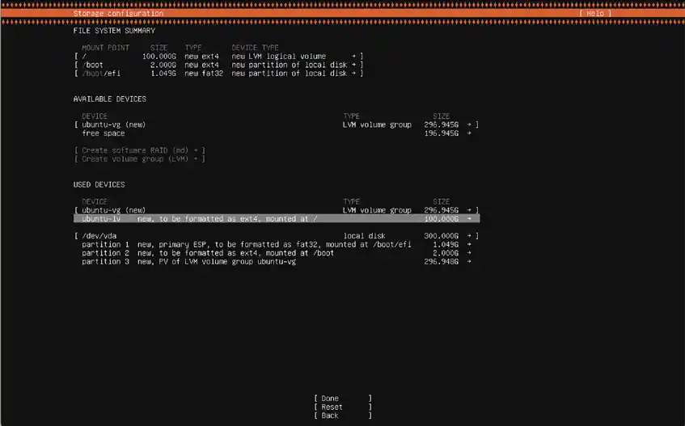

    2. 在对话框中，选择 **Edit**，然后按 **Enter**。

    

    3. 在 **Size** 字段中，输入 *296.000G*，选择 **Save**，然后按 **Enter**。更新后的大小现在应该体现在 ubuntu-lv 条目中。

    4. 选择 **Done**，然后按 **Enter**。

13. 要设置配置文件，请指定所需的详细信息，选择 **Save**，然后按 **Enter**。

14. 跳过 **Ubuntu Pro** 升级选项，选择 **Continue**，然后按 **Enter**。

15. 可选：选择 **Install OpenSSH Server** 以设置 SSH，选择 **Done**，然后按 **Enter**。

:::note

同步、编译和刷写 Qualcomm Linux 不需要 OpenSSH。只有在启用 Ubuntu VM 的安全远程访问时才需要安装 OpenSSH 服务器。
:::

16. 选择一个 **Docker** 快照，选择 **Done**，然后按 **Enter**。

等待安装过程完成。

:::note

安装过程可能会推荐多个 Docker 通道，例如 stable、candidate 等。选择合适的 Docker 通道以继续安装。
:::

17. 安装成功后，点击 **Power** 图标以关闭并停止 VM。


18. 在 **Confirmation** 对话框中，点击 **OK**。虚拟机停止后，关闭窗口。

19. 在 UTM 主窗口中，在 **CD/DVD** 下拉列表中，选择 **Clear**。

    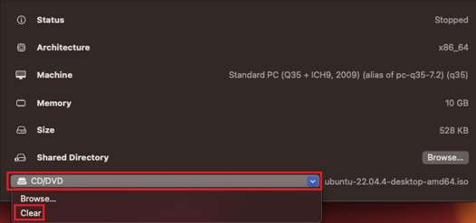

20. 确认 CD/DVD 选项中的 ISO 镜像关联已清除或清空。

    

21. 要运行 Ubuntu VM，请点击 **Play** 图标。

    

22. Ubuntu 操作系统成功启动后，输入凭据登录并访问 shell。


23. 运行以下命令更新 Ubuntu 操作系统并安装图形桌面环境，然后重新启动：

```shell
sudo apt update && sudo apt upgrade -y
sudo apt install ubuntu-desktop -y
reboot
```

24. 登录到您创建的 Ubuntu VM。

### 从 UTM VM 访问 RUBIK Pi 3

1. 将 RUBIK Pi 3 连接到主机。

UTM 软件可能会显示一个对话框，用于确认 Ubuntu 虚拟机操作系统是否应有权访问 RUBIK Pi 3。

    1. 如果看到如下对话框，请点击 **Confirm**：

    

    2. 点击 **Confirm** 后，如果出现以下 USB 断开连接错误，点击 **OK** 忽略它：
    
    


2. 要验证 Ubuntu VM 是否可以访问 RUBIK Pi 3，请在 Linux 终端窗口中运行 `lsusb` 命令。

  RUBIK Pi 3 在输出中显示如下：

  

如果在 Ubuntu VM 中未检测到 RUBIK Pi 3 ，请执行以下操作：
     1. 在 UTM VM 窗口的工具栏中，点击 **USB Devices**。
     2. 选择 **QCMXXXX_xxxxxxxx**。

:::note

如果 RUBIK Pi 3 未出现在 USB 设备列表中，请在 UTM settings 中点击左侧面板中的 **Input**，并将 **Maximum Shared USB Devices** 字段中的值设置为 10。
:::

### 配置 Mac 的睡眠和唤醒设置以及 Ubuntu 的电源设置

要确保 Mac 主机和 Ubuntu VM 不因不活动而进入睡眠状态，请执行以下操作：

* 要配置 Mac 主机的睡眠和唤醒设置，请参见 [macOS User Guide](https://support.apple.com/en-in/guide/mac-help/mchle41a6ccd/mac)。

* 要配置 Ubuntu 的电源设置，请执行以下操作：

  1. 在 Ubuntu 的 **System Settings** 中，点击 **Power**。

  2. 关闭 **Automatic Suspend**。

:::note

 要同步、编译和刷写 Qualcomm Linux，参见 [Yocto 工程编译指南](./10.yocto-project-user-guide.md#yocto)、[Linux kernel ](./1.get-started.md#linuxkernel)等章节
:::

## Mac 开发环境搭建（x86\_64）
<a id="set86"></a>

使用 UTM 在 x86\_64 Mac 上搭建 Ubuntu VM。

UTM 是适用于 macOS 的开源 VM 主机，用于在 Mac 上运行其他操作系统，包括 Ubuntu。在 x86\_64 的 Mac 上使用 UTM 搭建 Ubuntu VM 涉及以下任务：


### 主机要求

在使用 UTM 设置 Ubuntu VM 之前，请确保您的 x86\_64 Mac 主机满足以下系统要求：

|         | 要求                            |
|-----------------------|------------------------------------------|
| 处理器架构 | x86_64<p>请在终端窗口中运行 `uname -a` 命令，以便验证 Mac 的架构是否为 x86_64。</p>|
| CPU 核数量           | 8 个或更多                              |
| RAM                   | 8 GB 或更大                           |
| 存储              | UTM VM 需要 300 GB 可用空间        |
| 操作系统     | macOS 13 或更高版本                      |

如果您的 x86\_64 Mac 主机满足系统要求，请下载以下软件：

| 软件                     | 说明 |
|------------------------------|-------------|
| UTM 虚拟化软件  | 从 [UTM 网站](https://mac.getutm.app/)下载 UTM 虚拟化软件。 |
| Ubuntu ISO                   | 支持所有 Ubuntu 22.04 64 位 PC (AMD64) 桌面 LTS 版本。建议用户从 [Ubuntu 网站](https://www.releases.ubuntu.com/22.04/) 下载最新的 Ubuntu 22.04 ISO（例如 ubuntu-22.04.5-desktop-amd64.iso）版本。|

### 在 x86\_64 Mac 上安装 UTM

1. 双击之前下载的 **UTM.dmg** 文件，然后将 **UTM** 图标拖到 **Applications** 图标。

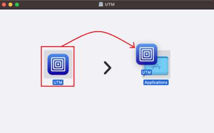

2. 安装 UTM 时，如果出现以下对话框，点击 **Open**：


3. 打开 Launchpad，搜索 **UTM**，然后点击 **UTM。**

  出现 UTM 主窗口。


### 在 UTM 中创建 VM

1. 在 UTM 主窗口中，点击 **Create a New Virtual Machine**。

2. 在 **Start** 界面上，点击 **Virtualize**。

3. 在 **Operating System** 界面上，选择 **Linux** OS。

4. 在 **Linux** 界面上，浏览并选择您下载的 Ubuntu ISO 镜像，然后点击 **Continue**。

5. 在 **Hardware** 界面上，指定要分配给 Ubuntu VM 的内存和 CPU 核心，然后点击 **Continue**。推荐值如下：

   * 内存：大约 70% 的可用内存

   * CPU 核：至少 50% 的可用核

如果将 **CPU Cores** 字段留空或设置为 0，UTM 会将所有主机核心分配给 VM。将所有 CPU 核分配给 VM 可能会使主机运行缓慢或无响应。

:::note

要了解 Mac 主机的内存大小和 CPU 核数量，参见 [macOS User Guide](https://support.apple.com/en-in/guide/mac-help/syspr35536/mac) 中的说明。
:::

6. 在 **Storage** 界面上，指定 VM 的驱动器大小，然后点击 **Continue**。

:::note

建议为虚拟机分配至少 300 GB。
:::

7. 如果要在主机和虚拟机之间共享目录，请在 **Shared Directory** 界面上执行以下操作：

    1. 浏览并选择目录。

    2. 点击 **Continue**。

8. 在 **Summary** 界面上，执行以下操作：

    1. 查看正在创建的虚拟机的配置摘要。

    2. 为虚拟机取名。

    3. 点击 **Save** 新创建的虚拟机列在 UTM 主窗口中。

    

### 在 UTM 中安装 Ubuntu

1. 在 UTM 主窗口中，点击 **Play** 图标，通过虚拟化运行 Ubuntu ISO 镜像。


2. 使用箭头键选择 **Try or Install Ubuntu**，然后按 **Enter**。

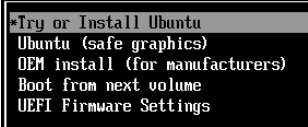

3. 在 **Welcome** 界面上，选择一种语言，然后点击 **Install Ubuntu**。

4. 在 **Keyboard Layout** 界面上，选择键盘布局，然后点击 **Continue**。

5. 在 **Updates and other software** 界面上，默认已选中 **Normal installation**。如果不需要安装所有 Ubuntu 操作系统功能，请选择 **Minimal installation** 选项按钮。

6. 在 **Installation type** 界面上，选择 **Erase disk and install Ubuntu** 选项按钮，然后点击 **Install Now**。

:::note

**Erase disk and install Ubuntu** 选项仅擦除分配给虚拟机的存储区域。它不会擦除主机上的任何其他数据或系统文件。
:::

7. 在 **Write the changes to disk?** 对话框中，点击 **Continue**。

8. 在 **Where are you?** 界面上，选择适当的时区。

9. 在 **Who are you?** 界面上，指定所需的详细信息，然后点击 **Continue** 开始安装。

10. 安装完成后，点击 **Restart Now**。

11. 要关闭并停止 VM，请点击 **Power** 图标。


12. 在 Confirmation 对话框中，点击 OK。虚拟机停止后，关闭窗口。

13. 在 UTM 主窗口中，在 **CD/DVD** 下拉列表中，选择 **Clear**。

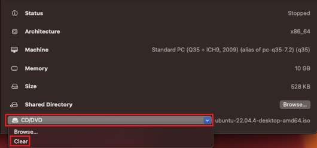

14. 确认 CD/DVD 选项中的 ISO 镜像关联已清除或清空。


15. 要运行 Ubuntu VM，请点击 **Play** 图标。


16. 登录到您创建的 Ubuntu VM。

### 从 UTM VM 访问 RUBIK Pi 3

1. 将 RUBIK Pi 3 连接到主机。

   UTM 软件可能会显示一个对话框，用于确认 Ubuntu 虚拟机操作系统是否应有权访问 RUBIK Pi 3。

   如果看到如下对话框，请点击 **Confirm**：

   

点击 **Confirm** 后，如果出现以下 USB 断开连接错误，点击 **OK** 忽略。


2. 要验证 Ubuntu VM 是否可以访问 RUBIK Pi 3，请在 Linux 终端窗口中运行 `lsusb` 命令。

RUBIK Pi 3 在输出中显示如下：


如果在 Ubuntu VM 中未检测到 RUBIK Pi 3，请执行以下操作：

    1. 在 UTM VM 窗口的工具栏中，点击 **USB Devices**。
    2. 选择 **QCMXXXX_xxxxxxxx**。


:::note

 如果 RUBIK Pi 3 未出现在 USB 设备列表中，请在 UTM settings 中点击左侧面板中的 **Input**，并将 **Maximum Shared USB Devices** 字段中的值设置为 10。
:::

### 配置 Mac 的睡眠和唤醒设置以及 Ubuntu 的电源设置

要确保 Mac 主机和 Ubuntu VM 不因不活动而进入睡眠状态，请执行以下操作：

* 要配置 Mac 主机的睡眠和唤醒设置，请参见 [macOS User Guide](https://support.apple.com/en-in/guide/mac-help/mchle41a6ccd/mac)。

* 要配置 Ubuntu 的电源设置，请执行以下操作：

  1. 在 Ubuntu 的 **System Settings** 中，点击 **Power**。

  2. 关闭 **Automatic Suspend**

  :::note
  
  要同步、编译和刷写 Qualcomm Linux，参见 [Yocto 工程编译指南](./10.yocto-project-user-guide.md#yocto)、[Linux kernel ](./1.get-started.md#linuxkernel)等章节。
  :::

## Linux kernel
<a id="linuxkernel"></a>

推荐在 Ubuntu18 - Ubuntu22 系统下进行 Linux kernel 相关的开发。

### 代码下载

```shell
git clone https://github.com/rubikpi-ai/linux.git
git submodule init
git submodule update
```

### 目录分析

在执行完 `git clone` 命令后，RUBIK Pi 3 Linux 代码仓库的目录如下：


其中重要的文件夹或文件的含义如下：

| **名字**        | **描述**         | **名字**            | **描述**                          |
| ------------- | -------------- | ----------------- | ------------------------------- |
| arch          | 架构相关的目录        | security          | 安全架构相关的目录                       |
| block         | 块设备相关的目录       | sound             | 音频系统相关的目录                       |
| certs         | 认证和签名相关的目录     | tools             | 内核交互工具的目录                       |
| crypto        | 加密相关的目录        | usr               | 与 initramfs 相关的目录，用于生成initramfs |
| documentation | 文档相关的目录        | virt              | 提供虚拟机技术（KVM）的目录                 |
| drivers       | 驱动相关的目录        | rust              | Rust相关的目录                       |
| firmware      | 固件相关的目录        | rubikpi           | RUBIK Pi 3 相关的目录，存放编译工具等        |
| fs            | 文件系统相关的目录      | techpack          | 高通平台相关的驱动                       |
| include       | 头文件相关目录        | .config           | 内核编译最终使用的配置文件                   |
| init          | 内核初始化相关的目录     | Makefile          | 编译内核的主要文件                       |
| ipc           | 进程间通信相关的目录     | Kbuild            | 配置内核设定的脚本                       |
| kernel        | 内核最核心部分代码的目录   | Kconfig           | 图形化配置界面的配置文件                    |
| lib           | 内核核心库代码的目录     | MAINTAINERS       | 维护者名单                           |
| mm            | 内存管理相关代码的目录    | CREDITS           | Linux 贡献者                       |
| net           | 网络协议相关的代码目录    | COPYING           | 版权声明                            |
| samples       | 内核编程范例相关的目录    | rubikpi\_build.sh | RUBIK Pi 3 提供的编译、打包脚本           |
| scripts       | 内核编译、配置相关脚本的目录 | rubikpi\_flash.sh | RUBIK Pi 3 提供的烧录脚本              |

#### 设备树

RUBIK Pi 3 的顶层设备树是 *rubikpi3.dts* ，可以在 *arch/arm64/boot/dts/qcom* 目录下找到，对于设备树的所有修改，推荐在此文件上进行。

除此之外，在开发过程中，同级目录的 *sc7280.dtsi* 也可能会高频查看。 *sc7280.dtsi&#x20;*&#x4E2D;拥有 GPIO、SPI、I2C、UART、CPU、GPU 等开发过程中较为常用的节点。

高通平台将显示、图形、摄像头、视频等相关的驱动和设备树从 linux kernel 源码中分离出来成独立的仓库，可根据 [Yocto 工程编译指南](./10.yocto-project-user-guide.md#yocto) 章节下载 Yocto 工程源码，通过查看 *layers/meta-qcom-hwe* 目录下的 *.bb* 文件提供的信息访问具体的代码仓库，以查看摄像头的设备树为例：

查看 *layers/meta-qcom-hwe/recipes-multimedia/cameradlkm/cameradlkm\_1.0.bb&#x20;*&#x6587;件，有如下内容：

```shell
SRCPROJECT = "git://git.codelinaro.org/clo/le/platform/vendor/opensource/camera-kernel.git;protocol=https"
SRCBRANCH  = "camera-kernel.qclinux.1.0.r1-rel"
SRCREV     = "0f2b11fac7f13f76a9e9f8e25ae2de5c97b23169"
```

* 表示仓库的地址是 https://git.codelinaro.org/clo/le/platform/vendor/opensource/camera-kernel.git

* 分支为 `camera-kernel.qclinux.1.0.r1-rel`

* 具体的提交是 `0f2b11fac7f13f76a9e9f8e25ae2de5c97b23169`

为了编译的设备树烧录到板子后，板子可正常运行，RUBIK Pi 3 将这些独立 linux kernel 源码外的设备树子仓库，放到了 *arch/arm64/boot/dts/qcom* 目录下：

* 显示：*arch/arm64/boot/dts/qcom/display-devicetree*

* 摄像头：*arch/arm64/boot/dts/qcom/camera-devicetree*

* 图形：*arch/arm64/boot/dts/qcom/*&#x67;raphics-devicetree

* 视频：*arch/arm64/boot/dts/qcom/video-devicetree*

在使用 `./rubikpi_build.sh -d` 命令编译设备树时，会先编译内核设备树 *rubikpi3.dtb* 作为基本设备树，再将各子仓库的设备树覆盖到基本设备树中，最后覆盖 *arch/arm64/boot/dts/thundercomm/rubikpi3/rubikpi3-overlay.dtso* 设备树，推荐将对子仓库设备树的修改加入到 *rubikpi3-overlay.dtso&#x20;*&#x4E2D;。

### 代码编译
<a id="codecompile"></a>

1. 运行下面的命令设置交叉编译环境，具体请参考 [安装交叉编译工具](./1.get-started.md#installcrosstool)。

   ```shell
   source <your toolchains directory>/environment-setup-armv8-2a-qcom-linux
   ```

   :::note
   
   交叉编译环境只对当前终端有效。
   :::

   若出现如下错误，可按提示输入`unset LD_LIBRARY_PATH` 命令后，再次执行上面命令。

   

2. 进入内核目录，整编内核。

   ```shell
   ./rubikpi_build.sh -a
   ```

     :::note
     - 第一次编译的时间会比较长，时间因个人电脑配置而异，普遍在 20 分钟之内，当编译成功后，后面对代码修改只会编译修改的部分；
     - 使用 `./rubikpi_build.sh -c` 命令可以清理内核目录，清理后所有的编译生成物和部分配置内容都会被删除掉。
     :::

3. 进入内核目录，打包内核、设备树镜像。
<a id="Linuxkernelpack"></a>

   ```shell
   ./rubikpi_build.sh -dp -ip
   ```

   

   如果打包镜像时报错：

   

    执行下面命令编辑 *.mtoolsrc* 文件，并在其中添加 `mtools_skip_check=1`，然后再重新打包镜像。
    
    ```
    vim ~/.mtoolsrc
    ```
   :::warning
    在 2025 年 3 月份的更新中，若烧录了非 RUBIK Pi 3 官方发布的镜像，则需将对应镜像包中的 efi.bin 拷贝到 rubikpi/tools/pack 目录下后再进行打包。
   :::

   :::note
    使用 `./rubikpi_build.sh` 命令时，将完成步骤 2 和步骤 3 的操作。
   :::

4. 进入内核目录，烧录内核、设备树镜像。

 ```
  ./rubikpi_flash.sh -d -i -r
 ```

:::note
   烧录前，RUBIK Pi 3 需要进入 fastboot 模式，有下面两种进入方法：
   - 在 RUBIK Pi 3 终端输入：`reboot bootloader`，进入 fastboot 模式后，RUBIK Pi 3 上的蓝灯会亮起来。
   - 按住电源按钮开机，直到 RUBIK Pi 3 上的蓝灯亮起。
:::

5. 关于 *rubikpi\_build.sh* 和 *rubikpi\_flash.sh* 的用法可使用 `-h` 参数进行查看。

使用 `./rubikpi_buils.sh -h` 命令查看编译脚本使用方法。

示例输出

```shell
Usage:
  bash ./rubikpi_build.sh [options]

Options:
  -h, --help              display this help message
  -dp, --dtb_package      generate a burnable device tree image
  -ip, --image_package    generate a burnable kernel image
  -a, --build_all         Complete compilation of kernel
  -d, --build_dts         Complete compilation of device tree
  -gc, --generate_config  Generate. config file
  -c, --clean             Clean up workspace

```

使用 `./rubikpi_flash.sh -h `命令查看烧录脚本使用方法。

示例输出

```shell
Usage:
  bash ./rubikpi_flash.sh [options]

Options:
  -h, --help     display this help message
  -r, --reboot   exit fastboot mode
  -d, --dtb      flash device tree image
  -i, --image    flash kernel image
```

### 单独编译 ko 驱动模块

1. 创建 *Makefile&#x20;*&#x6587;件如下，修改 `KDIR` 为实际 kernel 源码在个人电脑上的目录。

   ```makefile
   obj-m += hello.o
   KDIR:=/home/rubikpi/kernel-6.6
   PWD?=$(shell pwd)
   all:
           make -C $(KDIR) M=$(PWD) modules
           echo $(PWD)
   clean:
           rm -f *.ko *.o *.mod *.mod.o *.mod.c *.symvers *.order

   ```

2. 创建 *hello.c&#x20;*&#x6587;件如下：

   ```c
   #include <linux/module.h>
   #include <linux/init.h>

   static int hello_init(void)
   {
       printk("hello RUBIK Pi!\n");
       return 0;
   }

   static void hello_exit(void)
   {
       printk("bye RUBIK Pi!\n");
   }

   module_init(hello_init);
   module_exit(hello_exit);

   MODULE_LICENSE("GPL");
   MODULE_VERSION("V1.0");
   MODULE_AUTHOR("RUBIK Pi");
   ```

3. 执行命令编译 ko 模块：

   ```bash
   export ARCH=arm64
   export CROSS_COMPILE=aarch64-qcom-linux-
   make
   ```

4. 将 hello.ko 传到 RUBIK Pi 3 中，可以使用 ADB、SCP 等方式。

5. 在 RUBIK Pi 3 中执行如下命令，验证编译生成物有效：

   ```shell
   insmod hello.ko 
   rmmod hello.ko 
   dmesg | grep "RUBIK Pi"

   ```

    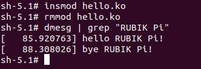

### 内核配置

使用 `menuconfig` 对 Linux 内核进行配置，执行如下命令：

```bash
cd linux
make ARCH=arm64 menuconfig
```

配置完成并执行如下命令将配置保存。

```shell
make ARCH=arm64 savedefconfig
cp defconfig ./arch/arm64/configs/rubik_pi3_defconfig
```
