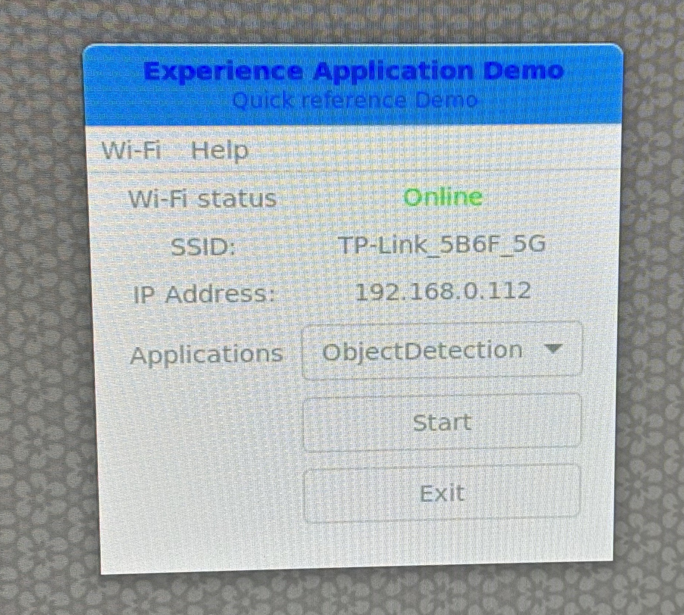

# Qualcomm® Qdemo 

The Qualcomm® Qdemo application provides a graphical interface to explore multimedia and AI sample applications powered by the Qualcomm Intelligent Multimedia Product (QIMP) SDK. Designed for developers working on Ubuntu-based Dragonwing boards, Qdemo enables rapid evaluation of AI pipelines and multimedia capabilities—without writing GStreamer code manually.  

## Pre-requisites
Before launching Qdemo, ensure the following setup on your Dragonwing SBC:  

* **[Canonical Ubuntu OS](../2.Update-Software/2.upgrade-ubuntu.md)** flashed and terminal access available.  
* **SBC mode** enabled with mouse, keyboard, HDMI monitor, and cable connected.  
* Run **install_ppa_pkgs.sh** to install required packages. 

## GUI-Based Experience with QIMP SDK
Qdemo is built to showcase the power of the QIMP SDK through a simple GUI. Instead of manually constructing GStreamer pipelines, developers can launch preconfigured sample applications with just a few clicks. These applications demonstrate real-time performance by leveraging GPU and NPU acceleration, thanks to QIMP’s zero-copy architecture.  
The SDK handles tasks like video capture, resizing, cropping, inference, and rendering—all orchestrated through GStreamer plugins such as:  

`qtivtransform`: Accelerates color conversion, cropping, and resizing on GPU.  
`qtimltflite`: Executes TensorFlow Lite models on NPU.  

This setup allows developers to focus on evaluating performance and capabilities, rather than low-level implementation.  

## Getting Started with Qdemo  
To begin exploring Qdemo, follow these step-by-step setup instructions to install dependencies, configure your device, and launch the graphical interface. 
This will allow you to run multimedia and AI sample applications with just a few clicks—no manual pipeline coding required.    

1: Install Dependencies  
Open the terminal from SBC and install following packages.  
```shell
sudo apt-get install libgstreamer1.0-dev gstreamer1.0-plugins-ugly gstreamer1.0-libav gstreamer1.0-alsa gstreamer1.0-gtk3
sudo apt-get install python3-gi-cairo gir1.2-gtk-3.0
```

2. Create media, labels and models folder and give full permission.  
```shell
sudo mkdir -p /etc/media
sudo mkdir -p /etc/labels
sudo mkdir -p /etc/models
sudo chown -R ubuntu:ubuntu media/
sudo chown -R ubuntu:ubuntu labels/
sudo chown -R ubuntu:ubuntu models/
wget -P /etc/media/ https://raw.githubusercontent.com/quic/sample-apps-for-qualcomm-linux/refs/heads/main/scripts/download_artifacts.sh 
wget -P /etc/media/ https://github.com/quic/sample-apps-for-qualcomm-linux/blob/main/artifacts/Qdemo/Qdemo.gif
wget -P /etc/media/ https://github.com/quic/sample-apps-for-qualcomm-linux/blob/main/artifacts/Qdemo/Qdemo.png
```

3. Get a video.mp5 and push onto /etc/media folder and give full permissions.  
```shell
sudo chmod 777 /etc/media/video.mp4
```

4. Launch the GUI
gst-gui-launcher-app.py

 

5. Select Wi-Fi to connect to a Wi-Fi network.

6. Run QDemo apps   

| Sample Apps                |  Details              |
|----------------------------|---------------------- |
| Record live video          | Records the camera feed and saves up to 30 seconds of video.|
| DashCamera                 | Multi-camera streaming |
| VideoWall                  | Performs concurrent video playback for MP4 AVC (H.264) videos and performs composition on a video wall display |
| ObjectDetection            | Object detection |
| Parallel AI Fusion         | Parallel inferencing |


