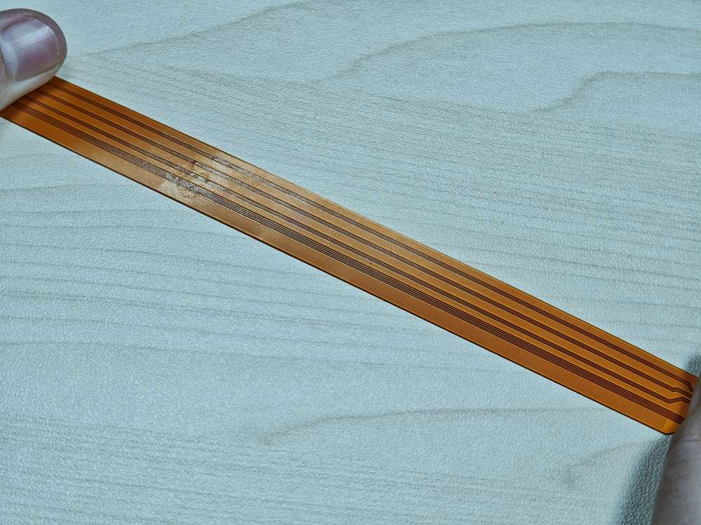
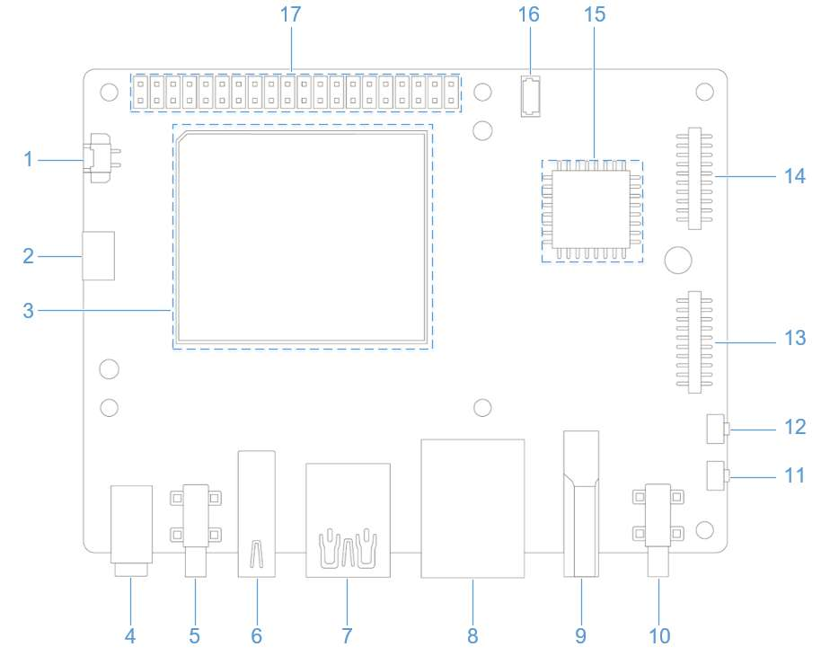

import Tabs from '@theme/Tabs';
import TabItem from '@theme/TabItem';


# Camera Serial Interface (CSI)

Currently, RUBIK Pi 3 is compatible with the two types of camera modules listed in [Peripheral Compatibility List](/peripheral-compatibility-list.md). The following table lists the supported resolutions for each camera module.

| Resolution  | Aspect Ratio  | IMX477 | IMX219 |
| ----------- | ----          | ------ | ------ |
| 4056 x 3040 | 4:3           | Yes    | No     |
| 4608 x 2592 | 16:9          | No     | No     |
| 3280 x 2464 | 4:3           | No     | Yes    |
| 1920 x 1080 | 16:9          | Yes    | No     |
| 1632 x 1224 | 4:3           | No     | Yes    |

* HQ Camera (IMX477/M12 Mount)

  

* Camera Module 2 (IMX219)

  :::note
  
  Currently, RUBIK Pi 3 only supports the standard Camera Module 2 and does not support the wide-angle or NoIR versions.
  :::

### Connect the camera cable
<a id="cameracable"></a>

RUBIK Pi 3 supports the 22-pin FPC with a 0.5mm pitch and a 0.3±0.05mm thickness. For the compatible accessory, refer to [Peripheral Compatibility List](/peripheral-compatibility-list.md).

:::danger

Never plug or unplug the camera module while the board is powered on, as this can easily damage the camera module.
:::



1. Pull up the lock of the connector.

   

2. Insert the FPC. Ensure that the contacts are toward the center of RUBIK Pi 3.

   

3. Press the lock down to ensure that the FPC is properly connected.

   

### Use cameras

Connect cameras to connectors 13 and 14 in the following figure.



The following picture shows the physical connection:


* Preparations
    1. Add the Qualcomm and RUBIK Pi public personal package archive (PPA) to your RUBIK Pi 3 Ubuntu software sources.
        ```shell
        sudo add-apt-repository ppa:ubuntu-qcom-iot/qcom-noble-ppa
        sudo sed -i '$a deb http://apt.rubikpi.ai ppa main' /etc/apt/sources.list
        ```
    2. Install camera software.
        ```shell
        sudo apt update
        sudo apt install -y qcom-ib2c qcom-camera-server qcom-camx
        sudo apt install -y rubikpi3-cameras
        sudo apt install gstreamer1.0-qcom-sample-apps
        sudo chmod -R 777 /opt
        sudo mkdir -p /var/cache/camera/
        sudo touch /var/cache/camera/camxoverridesettings.txt
        echo  enableNCSService=FALSE >> /var/cache/camera/camxoverridesettings.txt
        ```
    3. Reboot.
        ```shell
        sudo reboot
        ```
* Test taking photos
    ```shell
    # CAM1, output file /opt/img0_123.jpg
    gst-launch-1.0 -e qtiqmmfsrc camera=0 ! video/x-raw,format=NV12,width=1280,height=720,framerate=30/1 ! queue ! jpegenc ! queue ! multifilesink location=/opt/img0_%d.jpg max-files=5

    # CAM2, output file /opt/img1_123.jpg
    gst-launch-1.0 -e qtiqmmfsrc camera=1 ! video/x-raw,format=NV12,width=1280,height=720,framerate=30/1 ! queue ! jpegenc ! queue ! multifilesink location=/opt/img1_%d.jpg max-files=5
    ```


### Troubleshoot camera issues

If the camera fails to display or capture ../images, check the following contents:

1. Check the camera module connection.

   For details, refer to [Connect the camera cable](#cameracable).

2. Run the following command to collect logs.

   ```shell
   journalctl -f > /opt/log.txt
   ```

   Search for "probe success" in the logs. "probe success" indicates that the camera module is powered on and responding to I2C control. If the sensor does not have the "probe success" log, the possible cause is the flex cable connection or camera module issue.
   

   The following log indicates that an IMX477 is detected:

   ```shell
   [   80.645992] CAM_INFO: CAM-SENSOR: cam_sensor_driver_cmd: 939: Probe success,slot:7,slave_addr:0x34,sensor_id:0x477, is always on: 0
   ```

3. Check the camera sensor driver command.

   Collect logs using the `journalctl -f > /opt/log.txt` command and search for "cam_sensor_driver_cmd" in the logs. "CAM_START_DEV Success" indicates that the camera sensor streaming started. "CAM_STOP_DEV Success" indicates that the camera sensor streaming has stopped. For example:

   ```shell

   start:
   [   81.172814] CAM_INFO: CAM-SENSOR: cam_sensor_driver_cmd: 1129: CAM_START_DEV Success, sensor_id:0x477,sensor_slave_addr:0x34
   stop:
   [   88.905241] CAM_INFO: CAM-SENSOR: cam_sensor_driver_cmd: 1157: CAM_STOP_DEV Success, sensor_id:0x477,sensor_slave_addr:0x34
   ```

4. Check the sensor streaming.

   Enable the CSID SOF/EOF IRQ logs, then execute the camera streaming command.

   ```shell
   mount -o rw,remount /usr
   mount -t debugfs none /sys/kernel/debug/
   echo 0x8 > /sys/module/camera/parameters/debug_mdl
   echo 3 >/sys/kernel/debug/camera_ife/ife_csid_debug
   echo 1 > /sys/kernel/tracing/tracing_on
   echo 1 > /sys/kernel/tracing/events/camera/cam_log_debug/enable
   echo 2 > /sys/module/camera/parameters/debug_type
   cat /sys/kernel/tracing/trace_pipe > trace.txt

   ```

   The captured logs provide detailed information about the Start of Frame (SOF) and End of Frame (EOF). In the trace.txt log, search for "irq_status_ipp".

   * BIT12 (0x1000) represents the SOF packet.

   * BIT9 (0x200) represents the EOF packet.

   The log will appear as follows:

   ```shell
   <idle>-0       [000] d.h1. 19287.546764: cam_log_debug:
   CAM_DBG: CAM-ISP: cam_ife_csid_irq: 4996: irq_status_ipp = 0x1110 cam-server-25604     [000] dNH.. 19287.561705: cam_log_debug:
   CAM_DBG: CAM-ISP: cam_ife_csid_irq: 4996: irq_status_ipp = 0xee8
   ```
