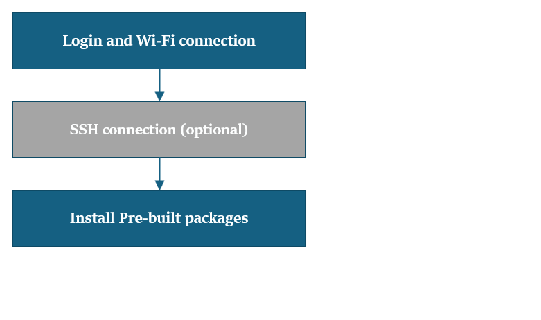

import Tabs from '@theme/Tabs';
import TabItem from '@theme/TabItem';

# Upgrade Canonical Ubuntu to Latest Build
 
	This guide walks you through a streamlined process to update your system using prebuilt packages, while maintaining your existing environment. Upgrading your Ubuntu build ensures your device stays current with the latest improvements in performance, security, and compatibility.   

	:::info 
		- **Before You Start** - Complete [**🔗setup**](../2.set-up-your-device.md#-lets-get-started) instructions.  
	:::
	
	### 🏁 Let’s Get Started!
	
    ### 1️⃣ Login & Wi-Fi Connection 
	1: Login and change password on the monitor UART console/SBC terminal.     
	2: Set up Wi-Fi connectivity. [🔗 Wi-Fi Setup Guide](../2.set-up-your-device.md#connect-to-the-network)  

	### 2️⃣ SSH Connection (Optional) 
	1: Get the IP address for RPi3.  
	2: On your host machine, use SSH to connect to the device.   
	```shell
	ssh ubuntu@<IP Address>
	```

	### 3️⃣ Upgrade Pre-built Packages 
	This command will upgrade to the latest pre-built packages on the device.  
	```shell
	sudo apt upgrade -y
	```
 If you haven’t previously installed the PPA packages, please run the following steps to install them:
	```shell
	git clone -b ubuntu_setup --single-branch https://github.com/rubikpi-ai/rubikpi-script.git 
	cd rubikpi-script  
	./install_ppa_pkgs.sh 
	```
	
	<details>
	The script installs the following   
	* Install AI samples application packages.  
	  (gstreamer1.0-plugins-base-apps, gstreamer1.0-qcom-python-examples, gstreamer1.0-qcom-sample-apps
	   gstreamer1.0-tools, libqnn-dev, libsnpe-dev, qcom-adreno1, qcom-fastcv-binaries-dev
	   qcom-libdmabufheap-dev, qcom-sensors-test-apps, qcom-video-firmware, qnn-tools, snpe-tools
	   tensorflow-lite-qcom-apps, weston-autostart, xwayland)  
	* Install Rubikpi3 Camera, wiringrp and wiringrp_python packages.  
	* Install generic developer tool related packages.  
	  (ffmpeg, net-tools, pulseaudio-utils, python3-pip, selinux-utils, unzip, v4l-utils)
	* Perform "sudo apt upgrade" operation.  
	</details>

	:::tip
	If you encounter package installation failures, run the following command: 'apt --fix-broken install'  
	If you encounter following error, rerun the install_ppa_pkgs.sh script.  
	GPG error: http://apt.thundercomm.com/rubik-pi-3/noble ppa InRelease: The following signatures couldn't be verified because the public key is not available:
	:::

	After successful running the install_ppa_pkgs.sh, you can observe the following screen on Display Monitor.  

	
 
	### 4️⃣ Verify the SW version 
		Run the following commands in the device shell to verify the version: 
			```shell
			cat /etc/os-release 
			```
		Output: 
			```json
		NAME="Ubuntu"
		VERSION_ID="24.04"
		VERSION="24.04.2 LTS (Noble Numbat)"
		VERSION_CODENAME=noble
		ID=ubuntu
		ID_LIKE=debian
		HOME_URL="https://www.ubuntu.com/"
		SUPPORT_URL="https://help.ubuntu.com/"
		BUG_REPORT_URL="https://bugs.launchpad.net/ubuntu/"
		PRIVACY_POLICY_URL="https://www.ubuntu.com/legal/terms-and-policies/privacy-policy"
		UBUNTU_CODENAME=noble
		LOGO=ubuntu-logo
		```
		Run the following command to check the Linux version:
			```shell
			uname -a
			```
		Output:
			```json
			Linux ubuntu 6.8.0-1055-qcom #55-Ubuntu SMP PREEMPT_DYNAMIC Wed Sep 17 02:03:34 UTC 2025 aarch64 aarch64 aarch64 GNU/Linux  
			```
 **🧭 Next Steps**  
 After successful software upgrade, refer to the [**Application Development and Execution Guide**](../7.Application%20Development%20and%20Execution%20Guide/index.md).  
