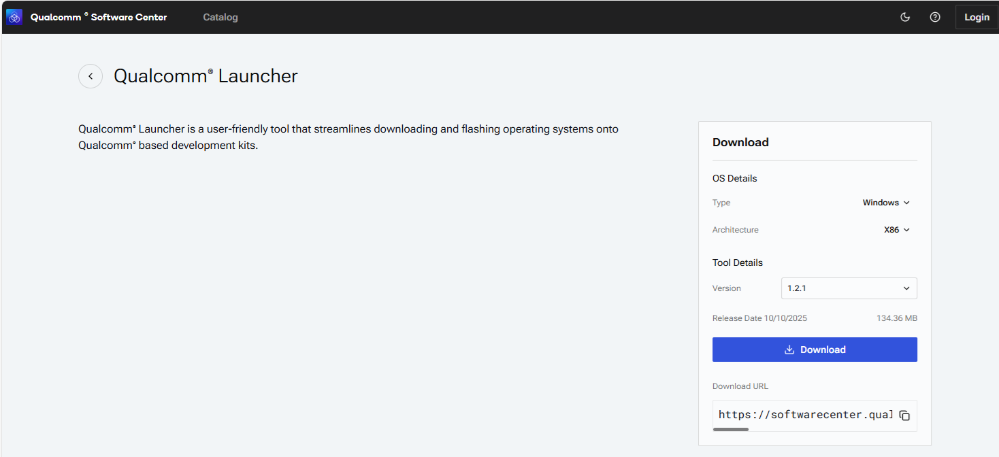
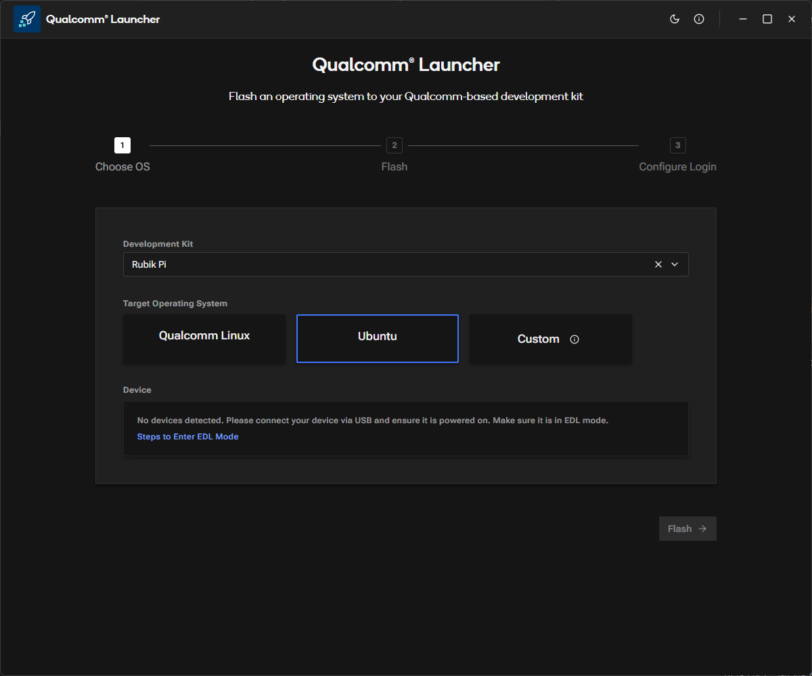
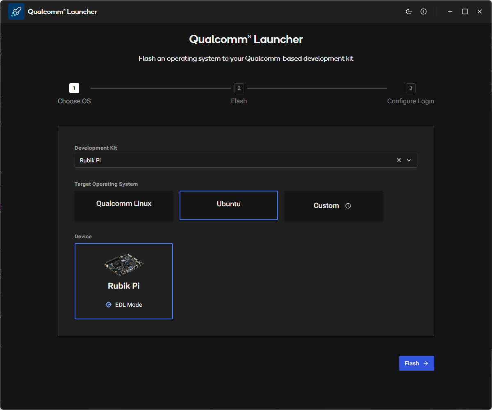
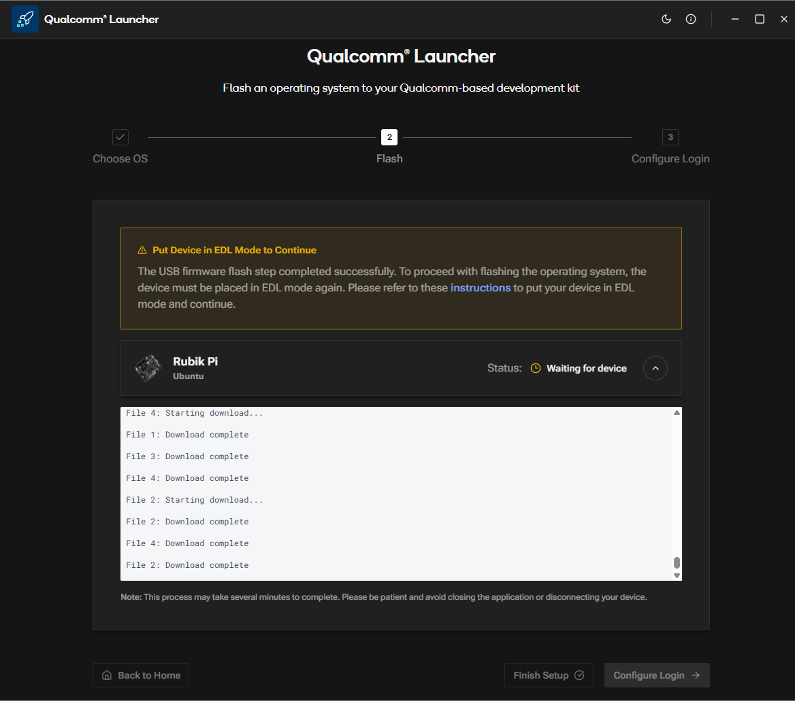
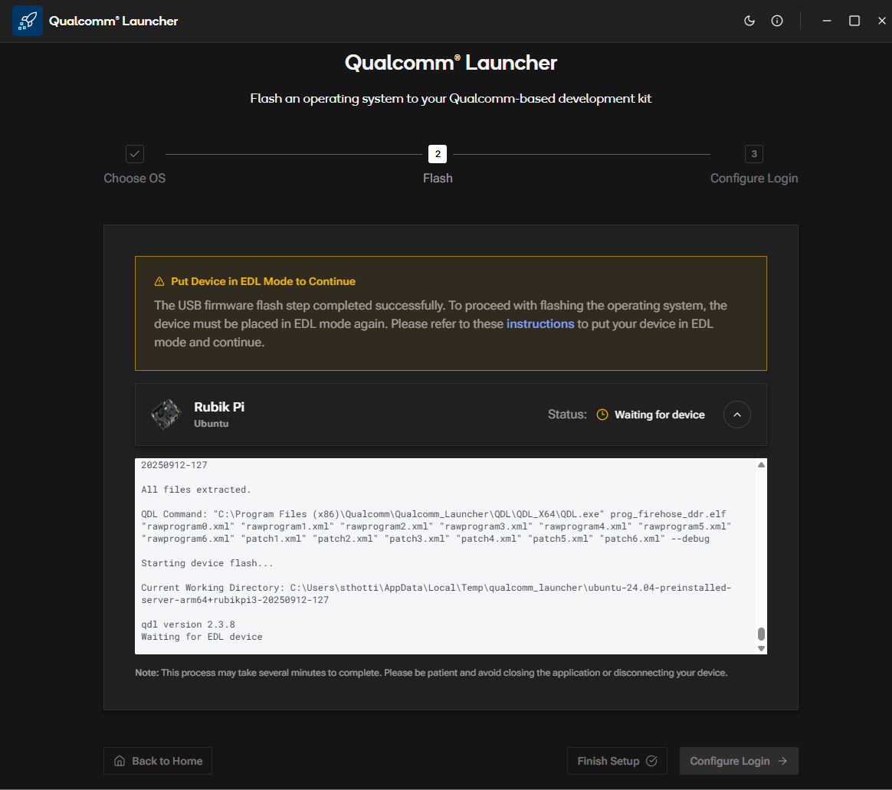
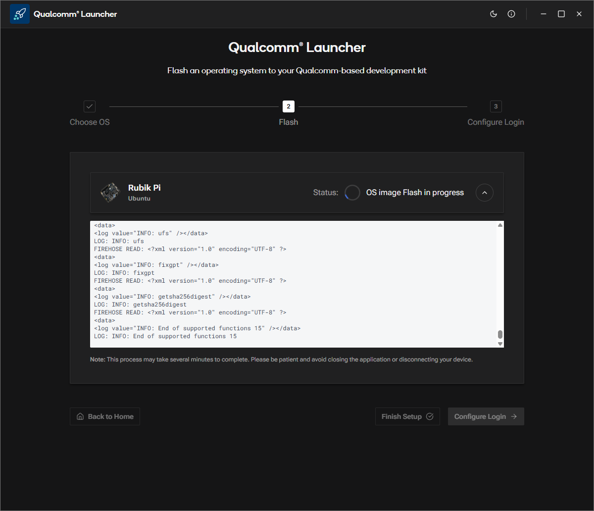
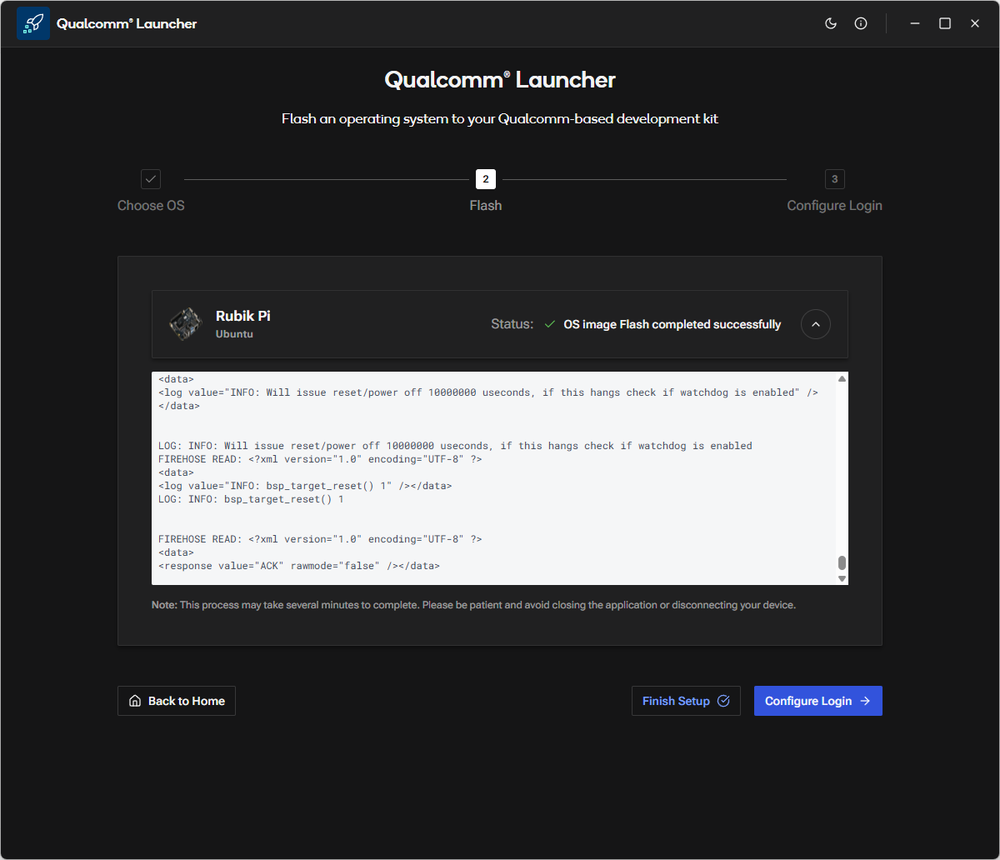
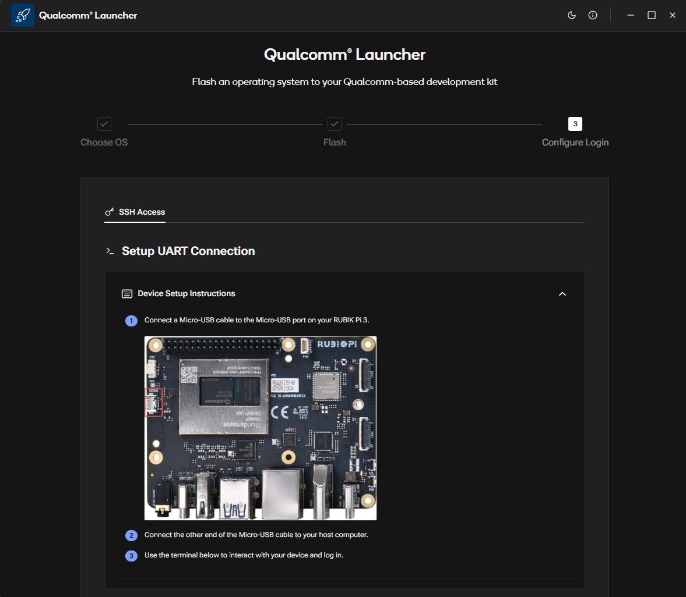
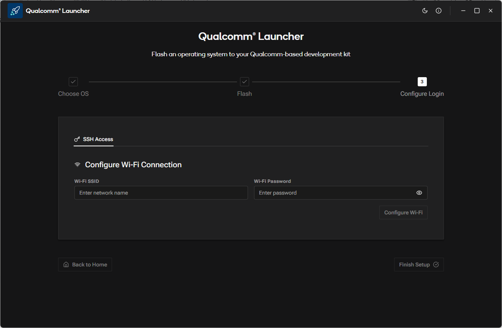

import Tabs from '@theme/Tabs';
import TabItem from '@theme/TabItem';

# Flash Canonical Ubuntu 24.04 using Qualcomm Launcher
 
	Qualcomm® Launcher is a user-friendly, GUI-based tool designed to simplify the process of downloading and flashing operating systems onto Qualcomm®-based development kits. This section provides step-by-step guidance to flash the **Renesas USB firmware** and replace the existing OS with a **certified Canonical Ubuntu 24.04 server** image.  
	
	## User steps:  

	### 1️⃣ Install Qualcomm Launcher
	a. Visit Qualcomm Software Center web portal: **https://softwarecenter.qualcomm.com/catalog/item/Qualcomm_Launcher**    
	b. Select the appropriate **OS type** and **architecture** based on your host machine.  
	c. Choose the latest version and click Download to get Qualcomm Launcher.   

	  

	d. Navigate to your download folder and run the Launcher: "Qualcomm_Launcher.x.x.x.Windows-AnyCPU.exe".  
	e. Once installed successfully, you will see the **Qualcomm Launcher** application interface.  

	  
	
	### 2️⃣ Flashing Operations  
	a. In the Launcher, select the **Development Kit** as Rubik Pi and the **Target Operating System** as Ubuntu.  
	b. Switch the device to EDL mode (you can find instructions within the app). Once in EDL mode, the Rubik Pi 3 will be automatically detected.    

	 
	c. Click Flash button to begin updating the Renesas USB firmware.    
	d. A progress screen will display the status of the USB firmware flashing process.  

	 

	e. After successful USB firmware flashing, the following confirmation screen will appear.  
	:::note
	In the log message section, you’ll see the platform image being downloaded and the flash build process running in the background.
	:::
	 
	f. Once the Launcher is waiting for user action to put the device into EDL mode, you will see the following screen.  

	 

	g. As soon as the device is placed into EDL mode, the flashing operation begins automatically. You will then see the following screen.

	 

	h. After the OS image is successfully flashed, the following confirmation screen will appear.

	 
	
	### 3️⃣ Configure the device
	a. After the OS image flashing is complete, the launcher will reboot Rubik Pi 3 device into the newly installed operating system. You can now proceed to configure the device.  
	b. Click Configure Login, and the following screen will be displayed.

	 
	 
	:::note
	If the MicroUSB COM port on the host system is currently in use by another tool (e.g., **PuTTY, Tera Term**), please close it before proceeding.
	:::
	c. Once the Micro-USB cable is connected (as shown in the screen above), the launcher will prompt you to configure the Wi-Fi.

	
	d. Configure the Wi-Fi by entering the SSID and password.

	
	e. Click Finish Setup and verify that the following screen appears.
	
	

	After successfully setting up Wi-Fi, the user can choose one of the following paths for application development:  

	**IDE Method**: 
	You can create AI and multimedia applications on the Qualcomm Dragonwing™ RB3 Gen 2 Development Kit using the Qualcomm® Visual Studio Code Extension. It’s an integrated application development environment for Qualcomm development kits. The extension runs in Ubuntu (or WSL with Ubuntu) and facilitates device configuration, software development including compilation, debugging, and binary flashing.
	
	For more information, see the [**Qualcomm Visual Studio Code Extension Reference Guide**](https://docs.qualcomm.com/bundle/publicresource/topics/80-79972-1/quick_start.html). 
	
	**Manual Method**: Follow the manual setup process as outlined below.  

	### 4️⃣ Manual method
		#### 1️⃣ SSH Connection
			a: Get the IP address for RPi3.  
			b: On your host machine, use SSH to connect to the device.   
			```shell
			ssh ubuntu@<IP Address>
			```

		#### 2️⃣ Install Pre-built Packages 
		Run the following commands to install pre-built packages on the device:
		```shell
		git clone -b ubuntu_setup --single-branch https://github.com/rubikpi-ai/rubikpi-script.git 
		cd rubikpi-script  
		./install_ppa_pkgs.sh 
		```
		
	<details>
	The script installs the following   
	* Install AI samples application packages.  
	  (gstreamer1.0-plugins-base-apps, gstreamer1.0-qcom-python-examples, gstreamer1.0-qcom-sample-apps
	   gstreamer1.0-tools, libqnn-dev, libsnpe-dev, qcom-adreno1, qcom-fastcv-binaries-dev
	   qcom-libdmabufheap-dev, qcom-sensors-test-apps, qcom-video-firmware, qnn-tools, snpe-tools
	   tensorflow-lite-qcom-apps, weston-autostart, xwayland)  
	* Install Rubikpi3 Camera, wiringrp and wiringrp_python packages.  
	* Install generic developer tool related packages.  
	  (ffmpeg, net-tools, pulseaudio-utils, python3-pip, selinux-utils, unzip, v4l-utils)
	* Perform "sudo apt upgrade" operation.  
	</details>

	:::tip
	If you encounter package installation failures, run the following command: 'apt --fix-broken install'  
	If you encounter following error, rerun the install_ppa_pkgs.sh script.  
	GPG error: http://apt.thundercomm.com/rubik-pi-3/noble ppa InRelease: The following signatures couldn't be verified because the public key is not available:
	:::

		After successful running the install_ppa_pkgs.sh, you can observe the following screen on Display Monitor.  

		
	
		#### 3️⃣ Verify the SW version 
			Run the following commands in the device shell to verify the version: 
				```shell
				cat /etc/os-release 
				```
			Output: 
				```json
			NAME="Ubuntu"
			VERSION_ID="24.04"
			VERSION="24.04.2 LTS (Noble Numbat)"
			VERSION_CODENAME=noble
			ID=ubuntu
			ID_LIKE=debian
			HOME_URL="https://www.ubuntu.com/"
			SUPPORT_URL="https://help.ubuntu.com/"
			BUG_REPORT_URL="https://bugs.launchpad.net/ubuntu/"
			PRIVACY_POLICY_URL="https://www.ubuntu.com/legal/terms-and-policies/privacy-policy"
			UBUNTU_CODENAME=noble
			LOGO=ubuntu-logo
			```
			Run the following command to check the Linux version:
				```shell
				uname -a
				```
			Output:
				```json
				Linux ubuntu 6.8.0-1055-qcom #55-Ubuntu SMP PREEMPT_DYNAMIC Wed Sep 17 02:03:34 UTC 2025 aarch64 aarch64 aarch64 GNU/Linux  
				```


:::tip Qualcomm Launcher Fails to Start or Crashes
- Confirm that you downloaded the correct version for your OS and architecture.  
- If you still see the issue follow the [**Manual Flash**](../11.Troubleshooting/11.1.flash-over-android.md) 
:::


> **🧭 Next Steps**  
> After the image is flashed, refer to the [**Application Development and Execution Guide**](../7.Application%20Development%20and%20Execution%20Guide/index.md).  