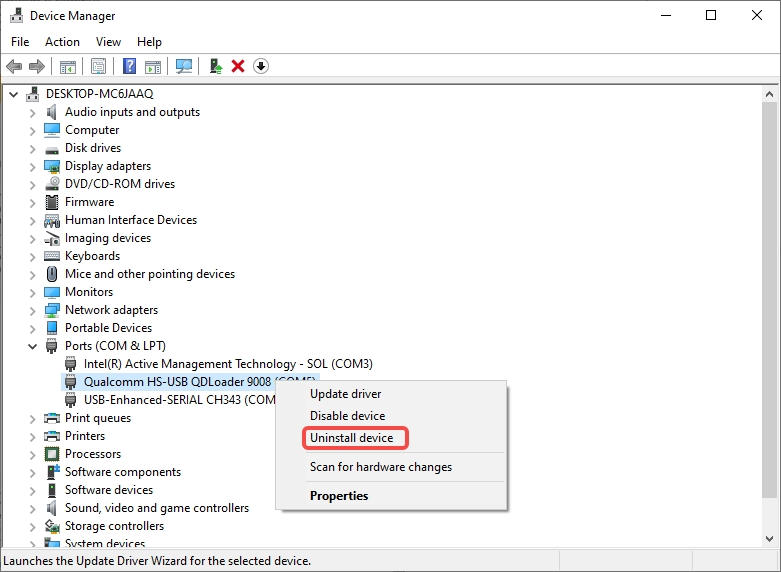
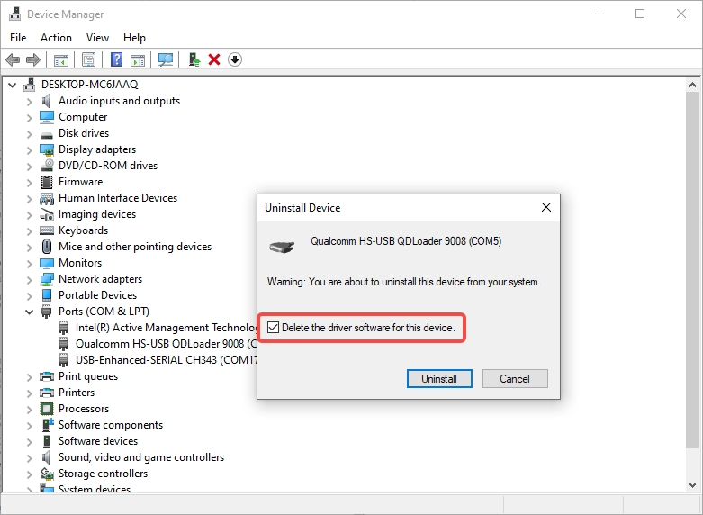
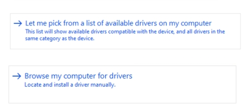
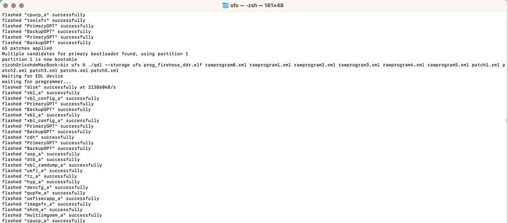
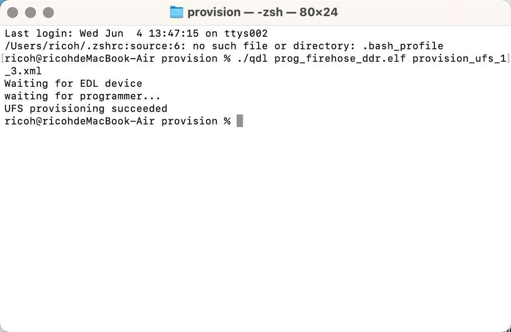
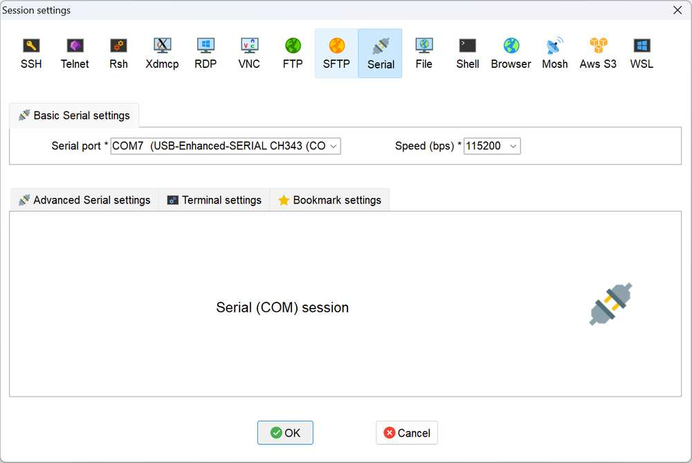
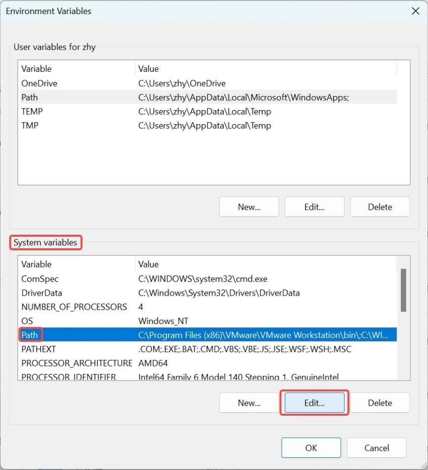

---
# Display h2 to h5 headings
toc_min_heading_level: 2
toc_max_heading_level: 4
---

# Get Started

## Introduction

RUBIK Pi 3 is developed based on the Qualcomm QCS6490 processor, which features the Qualcomm® Kryo™ 670 CPU and the Qualcomm® Hexagon™ Processor with fused AI-accelerator architecture. The processor provides exceptional AI performance of 12 TOPS and offers the capability for various machine learning and AI application scenarios.

RUBIK Pi 3 is designed with a wide range of interfaces and functions, such as USB, camera, DisplayPort, HDMI, Ethernet, 3.5mm headphone jack, Wi-Fi, Bluetooth, M.2 connector, fan, RTC, and 40-pin LS connector. These features cater to diverse development needs while facilitating rapid development and efficient debugging.&#x20;

RUBIK Pi 3 is compatible with various systems, such as Qualcomm Linux, Debian 13, Android 13, and Canonical Ubuntu for Qualcomm Platforms\*, providing developers with the flexibility to meet their specific application needs.

\*Canonical Ubuntu for Qualcomm Platforms is in the planning phase.


## Specifications

| **Category**      | **RUBIK Pi 3 Feature**                                                        |
| ----------------- | ----------------------------------------------------------------------------- |
| SoC               | QCS6490                                                                       |
| Processor         | <p>1 x Cortex-A78 2.7 GHz</p><p>3 x Cortex-A78 2.4 GHz</p><p>4 x Cortex-A55 1.9 GHz</p> |
| GPU               | Adreno 643 GPU @ up to 812 MHz                                                |
| VPU               | Adreno 633 VPU                                                                |
| NPU               | 12 TOPS                                                                       |
| ISP               | Spectra ISP capable of on-device machine learning and machine processing      |
| RAM               | 8 GB LPDDR4x                                                                  |
| ROM               | 128 GB UFS 2.2                                                                |
| Wi-Fi & Bluetooth | Wi-Fi 5 and Bluetooth 5.2                                                     |
| Camera            | 2 x 4-lane MIPI CSI D-PHY connector                                           |
| USB               | <p>1 x USB Type-C (USB 3.1 Gen1)</p><p>2 x USB Type-A (USB 3.0)</p><p>1 x USB Type-A (USB 2.0) </p>|
| GPIO              | 28 GPIO pins                                                                  |
| Ethernet          | 1000M                                                                         |
| M.2 connector     | M.2 Key M 2280 (2-lane PCIe 3.0)                                              |
| Audio             | 3.5mm headphone jack                                                          |

## Preparations

* Computer running Windows 10 and later, or Ubuntu 18 – Ubuntu 22

* RUBIK Pi 3

* USB Type-A to Type-C cable

* USB Type-A to Micro USB cable

* Power supply (12V 3A Type-C)

### Download images

RUBIK Pi 3 comes with a pre-installed Linux image (not the latest version) for a quick out-of-the-box experience. If you need the latest version of the Android image or other operating system images, visit the [RUBIK Pi 3 official website](https://www.thundercomm.com/rubik-pi-3/en/docs/image/).

* Qualcomm Linux is a simplified desktop system based on Weston. It is suitable for developers who have Linux development experience and seek an in-depth development experience.

  

* Debian 13: Based on GNOME 48, Debian 13 offers a complete set of system features, a rich software package library, more desktop applications, an enhanced user experience, and abundant development resources, making it ideal for developers who prioritize development convenience.

  

* Android 13 is an enhanced system based on Google AOSP, offering an improved experience for developers working on Android applications.

  RUBIK Pi 3 provides two Android image versions: user and userdebug. In the Android system, user and userdebug are different build types designed for distinct use cases.

  * The user version is a production build intended for end users, focusing on security and stability. It disables debugging features, restricts root access and advanced ADB commands, and minimizes log output to ensure smooth system performance and protect user privacy, delivering a reliable experience for daily use.

  * The userdebug version is a development build designed for developers and testers. It offers enhanced debugging support, including temporary root access, full ADB functionality, and detailed logging. This makes it ideal for tasks such as modifying system files, monitoring application behavior, or troubleshooting. However, due to its elevated permissions and additional resource usage, it is less secure and is recommended only for development and testing purposes.

  

### Flash images


Before flashing images, enter flash mode (9008 mode) using one of the following methods:

:::warning
>
> * Do not touch the PCB components and metal contacts with your bare hands.
>
> * Before operation, discharge static electricity using grounding equipment (e.g., anti-static workstation/wrist strap).
>
> * Do not place the circuit board directly on conductive surfaces (such as metal tables or ungrounded chassis).
:::

Method 1:

1. Press and hold the **\[EDL]** button (No. 12 in the figure above).

   

2. Connect the power supply into port 10, as shown in the figure below.&#x20;

   

3) Insert the Type-C cable into port 5 and wait three seconds to enter 9008 mode.

   

Method 2:

1. Connect the power supply into port 10.

   

2. Insert the Type-C cable into port 5.

   

3) After RUBIK Pi 3 boots up, run the following command to enter 9008 mode.

   ```shell
   adb shell reboot edl
   ```

#### Flash images on a Windows system

<a id="flashwin"></a>

1. Install the WinUSB driver. (If you have installed it, skip this step.)
 
   1. Uninstall other drivers for this device. Make sure that Qualcomm USB drivers and similar drivers are not installed. 

       * The device should not appear under the COM ports in Device Manager. If you see the device under the COM ports, follow the instructions to uninstall QUD.  

       

       * Ensure that **Delete the driver software for this device** is checked.

       

   2. Power off the device and re-enter the flashing mode. Follow the instructions below to install Microsoft WinUSB.

       * In Device Manager, right-click the USB port of RUBIK Pi 3 and select **Update driver.**

       

       * In the pop-up window, choose the **Browse my computer for driver software** option.

       

       * Under USB devices, select **WinUsb Device**.

       

       * Click **Yes** to update the driver.

       

2. In the terminal, use the following command to run the QDL executable from either the *QDL_Win_x64* or *QDL_Win_ARM64* directory based on your host architecture to flash the image. Once the flashing process is complete, the device will automatically reboot.

:::note
>
> The program file name does not support wildcards. Each image file must be listed in the command explicitly.

>
> Replace `<pathToQDL>` with the actual location of the *QDL_Win_x64* or *QDL_Win_ARM64* directory.
:::

```shell
<pathToQDL>\QDL.exe prog_firehose_ddr.elf rawprogram0.xml rawprogram1.xml rawprogram2.xml rawprogram3.xml rawprogram4.xml rawprogram5.xml patch0.xml patch1.xml patch2.xml patch3.xml patch4.xml patch5.xml
```


3. If your RUBIK Pi 3 fails to boot up after flashing, enter the *provision* directory in the FlatBuild package and run the following command to try provisioning UFS. 

:::note
In the Android Alpha version, [download this file](https://thundercomm.s3.dualstack.ap-northeast-1.amazonaws.com/uploads/web/rubik-pi-3/tools/RUBIKPI_LA_CDT.zip) and decompress it to the *ufs* directory of the image package.
:::

:::warning
>
> After provisioning, some information stored in the UFS, such as the SN and Ethernet MAC address, may be lost.
>
> Replace `<pathToQDL>` with the actual location of the *QDL_Win_ARM64* or *QDL_Win_x64* directory.
:::

```shell
<pathToQDL>\QDL.exe prog_firehose_ddr.elf provision_ufs_1_3.xml
```


:::warning
>
> After provisioning, remove and plug in the power supply and USB cable to restart your RUBIK Pi 3 and proceed with the image flashing again.
:::

#### Flash images on an Ubuntu system

1. Run the following command to install libusb, libxml2 (If you have installed them, skip this step.)

```shell
sudo apt-get install libxml2-dev libudev-dev libusb-1.0-0-dev
```

2. Go to the *ufs* directory of the FlatBuild package.

3. Copy the *qdl* file from the *QDL_Linux_x64* or *QDL_Linux_ARM* directory to the *ufs* directory, depending on your host architecture.

4. Run the following command to flash the image.

```shell
./qdl --storage ufs prog_firehose_ddr.elf rawprogram*.xml patch*.xml
```


5. If your RUBIK Pi 3 fails to boot up after flashing, enter the *provision* directory in the FlatBuild package and run the following command to try provisioning UFS.

:::note
In the Android Alpha version, [download this file](https://thundercomm.s3.dualstack.ap-northeast-1.amazonaws.com/uploads/web/rubik-pi-3/tools/RUBIKPI_LA_CDT.zip) and decompress it to the *ufs* directory of the image package.
:::

:::warning
>
> After provisioning, some information stored in the UFS, such as the SN and Ethernet MAC address, may be lost.
>
> Before running the following command, copy the *qdl* file from the *QDL_Linux_x64* or *QDL_Linux_ARM* directory to the *provision* directory, depending on your host architecture.
:::

```shell
./qdl prog_firehose_ddr.elf provision_ufs_1_3.xml
```


:::warning
>
> After provisioning, remove and plug in the power supply and USB cable to restart your RUBIK Pi 3 and proceed with the image flashing again.
:::

#### Flash images on a Mac system

1. Run the following command to install Homebrew (if you have installed it, skip this step).

```shell
/bin/bash -c "$(curl -fsSL https://raw.githubusercontent.com/Homebrew/install/HEAD/install.sh)"
```

2. Run the following commands to install libusb and libxml2.

```shell
brew install libusb
brew install libxml2
```

3. Go to the *ufs* directory of the FlatBuild package.

4. Copy the contents from the *QDL_Mac_x64* or *QDL_Mac_ARM* directory to the *ufs* directory, depending on your host architecture.

5. Run the following command to flash the image.
   
```shell
./qdl --storage ufs prog_firehose_ddr.elf rawprogram*.xml patch*.xml
```


6. If your RUBIK Pi 3 fails to boot up after flashing, enter the *provision* directory in the FlatBuild package and run the following command to try provisioning UFS.

:::note
In the Android Alpha version, [download this file](https://thundercomm.s3.dualstack.ap-northeast-1.amazonaws.com/uploads/web/rubik-pi-3/tools/RUBIKPI_LA_CDT.zip) and decompress it to the *ufs* directory of the image package.
:::

:::warning
>
> After provisioning, some information stored in the UFS, such as the SN and Ethernet MAC address, may be lost.
>
> Before running the following command, copy the *qdl* file from the *QDL_Linux_x64* or *QDL_Linux_ARM* directory to the *provision* directory, depending on your host architecture.
:::

```shell
./qdl prog_firehose_ddr.elf provision_ufs_1_3.xml
```


:::warning
>
> After provisioning, remove and plug in the power supply and USB cable to restart your RUBIK Pi 3 and proceed with the image flashing again.
:::

## Power-on

For older board versions, connect the power supply and press the **\[PWR]** button to power on your RUBIK Pi 3. Board versions v02 and later support automatic power-on.


## Power-off

Run the `reboot -p` command to power off your RUBIK Pi 3.


## Reboot

Run the `reboot` command to reboot your RUBIK Pi 3.


Press and hold the **\[PWR]** button for 12 seconds to reboot your RUBIK Pi 3.

  

## UART login

### Windows

1. Connect port 2 in the following figure to a computer.

   

2. Open the computer settings page, check the corresponding COM port in Device Manager, and record the port.

   

3) Download MobaXterm at https://mobaxterm.mobatek.net/ and decompress it.

   

4) Open MobaXterm, select **Session** > **Serial**, and set the baud rate of the serial port to 115200.

   

   

5) Click **OK&#x20;**&#x74;o enter the terminal. Press **Enter** to log in to the device.

6) &#x20;Run the `su` command to switch to the root user.

   

### Ubuntu

1. Connect port 2 in the following figure to a computer.

   

2. Run the following commands to install minicom:

   ```shell
   sudo apt update  
   sudo apt install minicom
   ```

3) Run the following command to check the USB port:

   ```shell
   ls /dev/ttyACM*
   ```

   

4. Run the following command to open minicom. Press **Enter** and type the default login name and login password to log in:

   ```shell
   sudo minicom -D /dev/ttyACM0 -b 115200
   ```

   After a successful login, you will be directly connected to the serial console.

   

## ADB login

### Windows

#### Preparations

1. Download the ADB and Fastboot installation package at https://developer.android.google.cn/tools/releases/platform-tools and decompress the package.


2. Right-click **This PC** and choose **Properties**. Click **Advanced** and click **Environment Variables**. Alternatively, right-click **This PC** and choose **Properties**. In the search bar, type **Advanced system settings** and click **Environment Variables**.


3. Under **System variables**, select **Path** and click **Edit**.

  

4. Click **New** and type the path of decompressed platform-tools in Step 1. Click **OK** to save the environment variable.


#### ADB login

Press **Win**+**R** and type "cmd" to open the Windows terminal. Run the following commands to log in to your RUBIK Pi 3:

```shell
adb devices # Check if devices are connected  
adb root    # Log in as root user  
adb shell   # Open the adb terminal
```


### Ubuntu

#### Preparations

1. Run the following command to install the ADB and Fastboot tools:

   ```shell
   sudo apt install git android-tools-adb android-tools-fastboot wget
   ```

2. Update the udev rules file.

   1. Run the following command to open and modify the *51-qcom-usb.rules* file.

      ```shell
      sudo vi /etc/udev/rules.d/51-qcom-usb.rules
      ```

   2. Add the following content to the file. If the following content already exists, skip this step.

      ```shell
      SUBSYSTEMS=="usb", ATTRS{idVendor}=="05c6", ATTRS{idProduct}=="9008", MODE="0666", GROUP="plugdev"
      ```

   3. Run the following command to restart `udev`.

      ```shell
      sudo systemctl restart udev
      ```

   :::note
   >
   > If your RUBIK Pi 3 is already connected to the PC via USB, unplug and replug the USB cable so that the updated rules can take effect.
   :::

#### ADB login

Run the following commands in the terminal to log in to your RUBIK Pi 3:

```shell
adb devices # Check if devices are connected  
adb root    # Log in as root user  
adb shell   # Open the adb terminal
```


## File transfer

### ADB

* In the PC terminal, run the following command to upload the *test.txt* file to the */opt* directory:

  ```shell
  adb push test.txt /opt
  ```

* In the PC terminal, run the following command to download the *test.txt* file to your current directory:

  ```shell
  adb pull /opt/test.txt ./
  ```
