---
# Display h2 to h5 headings
toc_min_heading_level: 2
toc_max_heading_level: 4
---

# Peripherals and Interfaces

## Hardware resource diagram


| **No.** | **Interface**                | **No.** | **Interface**              |
| --------- | ------------------------------ | --------- | ---------------------------- |
| **1**   | RTC battery connector        | **10**  | Power Delivery over Type-C |
| **2**   | Micro USB (UART debug)       | **11**  | PWR button                 |
| **3**   | TurboX C6490P SOM            | **12**  | EDL button                 |
| **4**   | 3.5mm headphone jack         | **13**  | Camera connector 2         |
| **5**   | USB Type-C with DP (USB 3.1) | **14**  | Camera connector 1         |
| **6**   | USB Type-A (USB 2.0)         | **15**  | Wi-Fi/BT module            |
| **7**   | 2 x USB Type-A (USB 3.0)     | **16**  | Fan connector              |
| **8**   | 1000M Ethernet               | **17**  | 40-pin LS connector        |
| **9**   | HDMI OUT                     | **18**  | M.2 Key M connector        |

## 40-pin LS connector

### GPIO

RUBIK Pi 3 is compatible with WiringRP (based on the high-performance GPIO programming library WiringPi). It is recommended to use WiringRP for controlling and programming GPIOs. For more details about WiringRP, visit https://github.com/rubikpi-ai/WiringRP.

#### Pinout

The figure below shows the default functions of the RUBIK Pi 3 40-pin LS connector, most of which are compatible with the default functions of the 40-pin connector of open-source development boards.


The following table lists all functions of the 40-pin LS connector. Blue bold functions are default functions.


#### Control GPIOs using shell commands

Run the following commands on RUBIK Pi 3 to control GPIOs.

:::note

> The following commands require root privileges:
>
> * Run the `su root` command to switch to the root user:
>
>   * Username: `root`
>   * Password: `root`
> * Alternatively, under a regular user account, prepend `sudo` to the command, for example: `sudo gpio readall`, and enter the user's login password when prompted.
:::

* Using WiringRP commands:

  * View the GPIO status

    ```shell
    gpio readall
    ```

    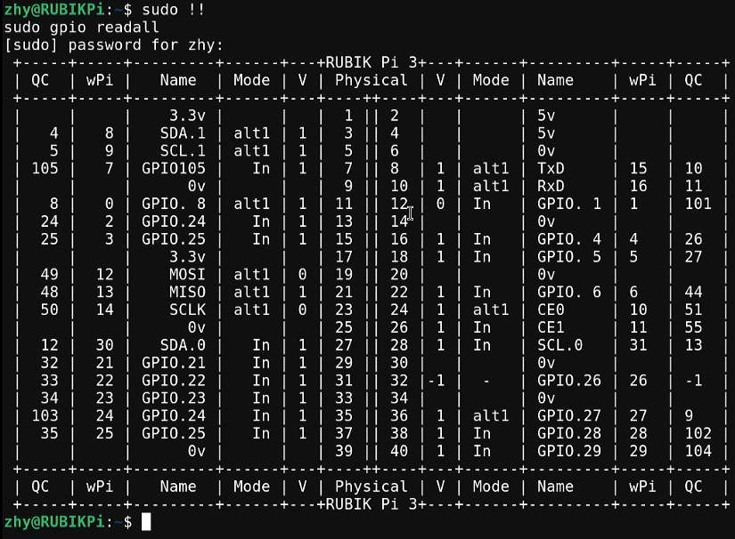
  * Set the GPIO mode

    ```shell
    gpio mode 15 in             # Set pin 15 to input mode
    gpio pins                   # Check the mode
    gpio mode 15 out            # Set pin 15 to output mode
    gpio pins                   # Check the mode
    ```
  * Set the pin level

    ```shell
    gpio write 15 1             # Set pin 15 to high level
    gpio read 15                # Check the pin level
    gpio write 15 0             # Set pin 15 to low level
    gpio read 15                # Check the pin level
    ```
* Operate nodes under */sys/class/gpio*

  The table below shows the GPIO subsystem numbering.

  

  * Go to the */sys/class/gpio* directory:

    ```shell
    cd /sys/class/gpio
    ```
  * Export the GPIO to be controlled. For example, pin 13 GPIO\_24:

    ```shell
    echo 559 > export
    ```
  * Go to the *gpio559* directory to set GPIO attributes:

    ```shell
    cd gpio559  
    ls
    ```

    

The attributes are described as follows:

- direction:
  - Input: in
  - Output: out
- value:
  - Low level: 0
  - High level: 1
- edge (interrupt edge):
  - Rising edge trigger: rising
  - Falling edge trigger: falling
  - Both-edge trigger: both
  - Disabling interrupts: none

For example, set pin 13 to output a high level:

```shell
echo out > direction  
echo 1 > value
```

Cancel the export of pin 13 to user space:

```shell
echo 559 > unexport
```

#### Control GPIOs using WiringRP (C)

The WiringRP library provides a set of API functions that enable control with minimal logic.

* The following code snippet sets pin 13 as output, pin 15 as input, and loops to check the level status of pin 15.

  ```c
  #include <stdio.h>
  #include <wiringPi.h>

  int main (void)
  {
    wiringPiSetup () ;
    pinMode (13, OUTPUT) ;
    pinMode (15, INPUT) ;

    for (;;)
    {
      digitalWrite (13, HIGH) ;        // On
      printf("%d\n", digitalRead (15));        // On
      delay (1000) ;                // mS
      digitalWrite (13, LOW) ;        // Off
      printf("%d\n", digitalRead (15));        // On
      delay (1900) ;
    }

    return 0 ;
  }
  ```
* Compile programs:

  * Compile on RUBIK Pi 3

    ```shell
    adb push gpio.c /opt
    adb shell
    su
    cd /opt
    gcc gpio.c -o gpio -lwiringPi
    ```

  :::note

  > If the `gcc` command is not available, run `apt install gcc` to install the gcc compiler.
  :::
  >
* Short pin 13 and pin 15 with a Dupont wire, as shown in the following figure, to test the GPIO level control and read the level.

  :::warning

  > Pay attention to the pin order. Do not short the power and ground pins, as this may cause damage to the board.
  :::
  >

  

  Run the following commands:

  ```shell
  cd /opt
  ./gpio
  ```

  The program execution result is as follows:

  

#### Control GPIOs using WiringRP-Python

The WiringRP library provides a set of API functions that enable control with minimal logic.

* The following code snippet is an example of controlling GPIOs using the WiringRP library: set pin 13 as output, pin 15 as input, and loops to check the level status of pin 15.

  ```python
  import wiringpi
  import time

  wiringpi.wiringPiSetup()
  wiringpi.pinMode(13, 1)
  wiringpi.pinMode(15, 0)
  wiringpi.digitalRead(15)

  while True:
      wiringpi.digitalWrite(13,1)
      pin_level = wiringpi.digitalRead(15)
      print(f"in_gpio level: {pin_level}")

      time.sleep(1)

      wiringpi.digitalWrite(13,0)
      pin_level = wiringpi.digitalRead(15)
      print(f"in_gpio level: {pin_level}")

      time.sleep(1)
  ```
* Transfer *gpio.py* to RUBIK Pi 3. For example, use the ADB method.

  ```shell
  adb push gpio.py /opt
  ```
* Short pin 13 and pin 15 with a Dupont wire, as shown in the following figure, to test the GPIO level control and read the level.

  :::warning

  > Pay attention to the pin order. Do not short the power and ground pins, as this may cause damage to the board.
  :::
  >

  

  Run the following commands:

  ```shell
  cd /opt
  python3 gpio.py 
  ```

  The program execution result is as follows:

  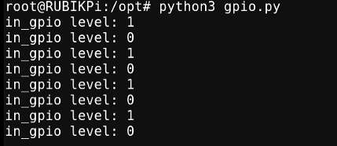

#### Control GPIOs using Python programs

* GPIOs can be controlled by using python-periphery. Run the following command to install python-periphery on RUBIK Pi 3:

  ```shell
  apt install python3-periphery
  ```
* The following code snippet uses python-periphery to operate GPIOs: set pin 13 as output, pin 15 as input, and loop to check the level status of pin 15.

  ```python
  from periphery import GPIO
  import time

  out_gpio = GPIO(559, "out")
  in_gpio = GPIO(560, "in")

  try:
      while True:
          try:
              out_gpio.write(True)
              pin_level = in_gpio.read()
              print(f"in_gpio level: {pin_level}")

              out_gpio.write(False)
              pin_level = in_gpio.read()
              print(f"in_gpio level: {pin_level}")

              time.sleep(1)

          except KeyboardInterrupt:
              out_gpio.write(False)
              break

  except IOError:
      print("Error")

  finally:
      out_gpio.close()
      in_gpio.close()
  ```
* Transfer *gpio.py* to RUBIK Pi 3. For example, use the ADB method.

  ```shell
  adb push gpio.py /opt
  ```
* Short pin 13 and pin 15 with a Dupont wire, as shown in the following figure, to test the GPIO level control and read the level.

  :::warning

  > Pay attention to the pin order. Do not short the power and ground pins, as this may cause damage to the board.
  :::
  >

  

  Run the following commands:

  ```shell
  cd /opt
  python3 gpio.py
  ```

  The program execution result is as follows:

  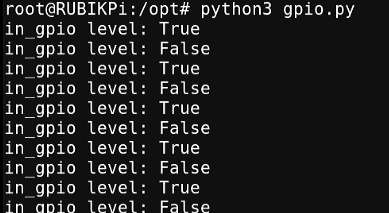

#### Control GPIOs using C programs

* The following code snippet sets pin 13 as output, pin 15 as input, and loops to check the level status of pin 15.

  ```c
  #include <stdio.h>
  #include <stdlib.h>
  #include <unistd.h>

  int out_gpio = 559;
  int in_gpio = 560;

  int main() {
      char export_path[50] = {};
      char export_command[100] = {};
      snprintf(export_path, sizeof(export_path), "/sys/class/gpio/export");
      snprintf(export_command, sizeof(export_command), "echo %d > %s ", out_gpio, export_path);
      system(export_command);
      snprintf(export_command, sizeof(export_command), "echo %d > %s ", in_gpio, export_path);
      system(export_command);

      char direction_path[50] = {};
      snprintf(direction_path, sizeof(direction_path), "/sys/class/gpio/gpio%d/direction", out_gpio);
      FILE *direction_file = fopen(direction_path, "w");
      if (direction_file == NULL) {
          perror("Failed to open GPIO direction file");
          return -1;
      }
      fprintf(direction_file, "out");
      fclose(direction_file);

      snprintf(direction_path, sizeof(direction_path), "/sys/class/gpio/gpio%d/direction", in_gpio);
      direction_file = fopen(direction_path, "w");
      if (direction_file == NULL) {
          perror("Failed to open GPIO direction file");
          return -1;
      }
      fprintf(direction_file, "in");
      fclose(direction_file);

      char value_in_path[50] = {};
      char value_out_path[50] = {};
      char cat_command[100] = {};
      snprintf(value_out_path, sizeof(value_out_path), "/sys/class/gpio/gpio%d/value", out_gpio);
      snprintf(value_in_path, sizeof(value_in_path), "/sys/class/gpio/gpio%d/value", in_gpio);
      snprintf(cat_command, sizeof(cat_command), "cat %s", value_in_path);

      FILE *value_out_file = fopen(value_out_path, "w");
      if (value_out_file == NULL) {
          perror("Failed to open GPIO value file");
          return -1;
      }

      for (int i = 0; i < 5; i++) {
          fprintf(value_out_file, "1");
          fflush(value_out_file);

          system(cat_command);
          sleep(1);

          fprintf(value_out_file, "0");
          fflush(value_out_file);

          system(cat_command);
          sleep(1);
      }

      fclose(value_out_file);

      char unexport_path[50] = {};
      char unexport_command[100] = {};
      snprintf(unexport_path, sizeof(unexport_path), "/sys/class/gpio/unexport");
      snprintf(unexport_command, sizeof(unexport_command), "echo %d > %s ", out_gpio, unexport_path);
      system(unexport_command);
      snprintf(unexport_command, sizeof(unexport_command), "echo %d > %s ", in_gpio, unexport_path);
      system(unexport_command);

      return 0;
  }
  ```
* Compile programs

  * Cross-compile the program. 

    ```shell
    aarch64-qcom-linux-gcc gpio.c -o gpio --sysroot=/home/zhy/qcom_sdk_meta/sysroots/armv8-2a-qcom-linux/
    ```
  * Compile on RUBIK Pi 3

    ```shell
    adb push gpio.c /opt
    adb shell
    su
    cd /opt
    gcc gpio.c -o gpio
    ```

    :::note

    > If the `gcc` command is not available, run `apt install gcc` to install the gcc compiler.
    :::
    >

    If you use cross-compilation, transfer *gpio* to RUBIK Pi 3. For example, use the ADB method.

    ```shell
    adb push gpio /opt
    ```
* Short pin 13 and pin 15 with a Dupont wire, as shown in the following figure, to test the GPIO level control and read the level.

  :::warning

  > Pay attention to the pin order. Do not short the power and ground pins, as this may cause damage to the board.
  :::
  >

  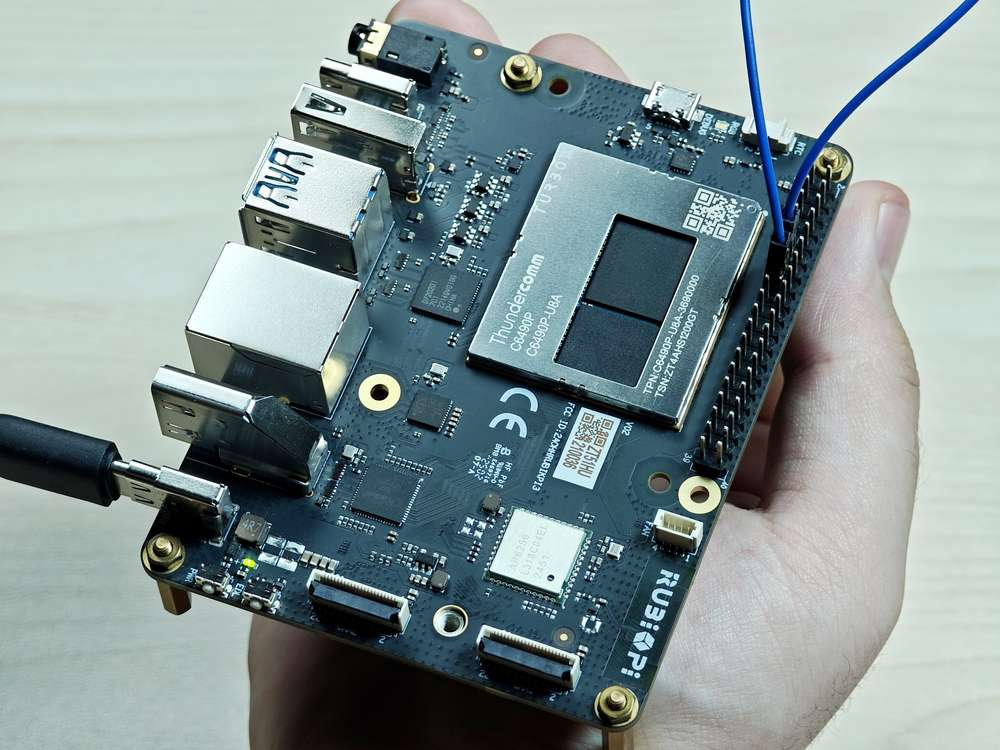

  Run the following commands:

  ```shell
  cd /opt
  ./gpio
  ```

  The program execution result is as follows:

  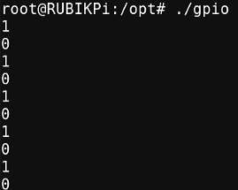

### I2C

Inter-Integrated circuit (I2C) is a bidirectional 2-wire bus for an efficient inter‑IC control bus developed by Philips in the 1980s. Every device on the bus has its own unique address (registered with the I2C general body headed by Philips). The I2C core supports a multicontroller mode and 10‑bit target address and 10‑bit extendable address. For more information on I2C, see https://www.i2c-bus.org/fileadmin/ftp/i2c_bus_specification_1995.pdf.

RUBIK Pi 3 is compatible with WiringRP (based on the high-performance GPIO programming library WiringPi). It is recommended to use WiringRP for controlling and programming I2C. For more details about WiringRP, visit [https://github.com/rubikpi-ai/WiringRP.](https://github.com/rubikpi-ai/WiringRP)

#### Pinout

The figure below shows the default functions of the RUBIK Pi 3 40-pin LS connector, most of which are compatible with the default functions of the 40-pin connector of open-source development boards.


:::note

> Pin 3 and pin 5 are set to I2C1 by default.
:::

The following table lists all functions of the 40-pin LS connector. Blue bold functions are default functions.


#### I2C communication using shell commands

Run the following commands on RUBIK Pi 3 to control the I2C bus.

* Use the WiringRP related command

  ```shell
  ./gpio -x ads1115:100:10 aread 100     #Read the analog signal value of the ADS1115 device via the I2C bus.
  ```
* Use the i2cdetect tool

  * View devices connected to the I2C1 interface:

    ```shell
    i2cdetect -a -y -r 1
    ```
  * Read all registers of the device whose address is 0x38:

    ```shell
    i2cdump -f -y 1 0x38
    ```
  * Write 0xaa to register 0x01 of the device whose address is 0x38:

    ```shell
    i2cset -f -y 1 0x38 0x01 0xaa
    ```
  * Read the value at register 0x01 of the device whose address is 0x38:

    ```shell
    i2cget -f -y 1 0x38 0x01
    ```

:::note

> If commands like `i2cdetect` are not available, run `apt install i2c-tools` to install the i2c-tools package.
:::

#### I2C communication using WiringRP (C)

The WiringRP library provides a set of API functions that enable control with minimal logic.

* The following code snippet uses the I2C1 bus to communicate with a device whose address is 0x38: write 0xaa to the 0x01 address of the device.

  ```c++
  #include <wiringPi.h>
  #include <wiringPiI2C.h>
  #include <stdio.h>
  #include <stdlib.h>
  #include <unistd.h>

  #define I2C_ADDRESS 0x38

  int main(void)
  {
      int fd;

      if (wiringPiSetup() == -1) {
          exit(1);
      }

      fd = wiringPiI2CSetup(1, I2C_ADDRESS);
      if (fd == -1) {
          exit(1);
      }

      unsigned char data[2];
      if (read(fd, data, 2) != 2) {
          exit(1);
      }

      wiringPiI2CWriteReg8(fd, 0x01, 0xaa) ;

      close(fd);
      return 0;
  }
  ```
* Compile programs

  * Compile on RUBIK Pi 3

    ```shell
    adb push gpio.c /opt
    adb shell
    su
    cd /opt
    gcc i2c.c -o i2c -lwiringPi
    ```

   :::note

   > If the gcc command is not available, run `apt install gcc` to install the gcc compiler.
   :::

* Connect pin 3 and pin 5 to the I2C sensor and test the I2C communication as shown in the following figure.

  :::warning

  > Pay attention to the pin order. Do not short the power and ground pins, as this may cause damage to the board.
  :::
  >

  

  Run the following commands:

  ```shell
  cd /opt
  ./i2c
  ```

#### I2C communication using WiringRP-Python

The WiringRP library provides a set of API functions that enable control with minimal logic.

* The following code snippet uses the I2C1 bus to communicate with a device whose address is 0x38: write 0xaa to the 0x01 address of the device.

  ```bash
  import wiringpi as wpi

  wpi.wiringPiSetup()
  fd=wpi.wiringPiI2CSetup(0x38, 1)
  wpi.wiringPiI2CWriteReg8 (fd, 0x01, 0xaa)

  ```
* Transfe&#x72;*&#x20;i2c.py* to RUBIK Pi 3. For example, use the ADB method.

  ```shell
  adb push i2c.py /opt
  ```
* Connect pin 3 and pin 5 to the I2C sensor and test the I2C communication as shown in the following figure.

  :::warning

  > Pay attention to the pin order. Do not short the power and ground pins, as this may cause damage to the board.
  :::
  >

  

  Run the following commands:

  ```shell
  cd /opt
  python3 i2c.py 
  ```

#### I2C communication using Python programs

* I2C can be controlled by using the Python smbus library. Run the following command on RUBIK Pi 3 to install the library.

  ```shell
  apt install python3-smbus
  ```
* The following code snippet uses the I2C1 bus to communicate with a device whose address is 0x38: write 0xaa to the 0x01 address of the device.

  ```python
  import smbus

  def main():
      data = [0x01, 0xaa]

      try:
          i2c_bus = smbus.SMBus(1)  

          print("i2cdetect addr : ", end="")
          for address in range(0x7F):
              try:
                  i2c_bus.write_i2c_block_data(address, 0, data)
                  print("0x{:02X},".format(address), end="")
              except OSError:
                  pass  

          print()

      except Exception as e:
          print(f"An error occurred: {e}")

      finally:
          if i2c_bus:
              i2c_bus.close()

  if __name__ == "__main__":
      main()
  ```
* Transfer *i2c.py* to RUBUK Pi 3. For example, use the ADB method.

  ```shell
  adb push i2c.py /opt
  ```
* Connect pin 3 and pin 5 to the I2C sensor and test the I2C communication as shown in the following figure.

  :::warning

  > Pay attention to the pin order. Do not short the power and ground pins, as this may cause damage to the board.
  :::
  >

  

  Run the following commands:

  ```shell
  cd /opt
  python3 i2c.py
  ```

  The execution result is as follows:

  

#### I2C communication using C programs

* The following code snippet uses the I2C1 bus to communicate with a device whose address is 0x38: write 0xaa to the 0x01 address of the device.

  ```c
  #include <stdio.h>
  #include <stdlib.h>
  #include <stdint.h>
  #include <fcntl.h>
  #include <unistd.h>
  #include <linux/i2c-dev.h>
  #include <sys/ioctl.h>

  #define I2C_DEVICE_PATH "/dev/i2c-1"

  int main() {
      uint8_t data[2] = {0x01,0xaa};

      const char *i2c_device = I2C_DEVICE_PATH;  
      int i2c_file;

      if ((i2c_file = open(i2c_device, O_RDWR)) < 0) {
          perror("Failed to open I2C device");
          return -1;
      }

      ioctl(i2c_file, I2C_TENBIT, 0);
      ioctl(i2c_file, I2C_RETRIES, 5);

      printf("i2cdetect addr : ");
      for (int x = 0; x < 0x7f; x++)
      {
          if (ioctl(i2c_file, I2C_SLAVE, x) < 0) {
              perror("Failed to set I2C slave address");
              close(i2c_file);
              return -1;
          }

          if (write(i2c_file, data, 2) == 2)
          {
              printf("0x%x,", x);
          }
      }

      close(i2c_file);
      printf("\r\n");

      return 0;
  }
  ```
* Compile programs:

  * Cross-compile the program.

    ```shell
    aarch64-qcom-linux-gcc i2c.c -o i2c --sysroot=/home/zhy/qcom_sdk_meta/sysroots/armv8-2a-qcom-linux/
    ```
  * Compile on RUBIK Pi 3

    ```shell
    adb push i2c.c /opt
    adb shell
    su
    cd /opt
    gcc i2c.c -o i2c
    ```

    :::note

    > If the gcc command is not available, run `apt install gcc` to install the gcc compiler.
    :::
    >

    If you use cross-compilation, transfer *i2c* to RUBIK Pi 3. For example, use the ADB method.

    ```shell
    adb push i2c /opt
    ```
* Connect pin 3 and pin 5 to the I2C sensor to test the I2C bus communication, as shown in the following figure.

  :::warning

  > Pay attention to the pin order. Do not short the power and ground pins, as this may cause damage to the board.
  :::
  >

  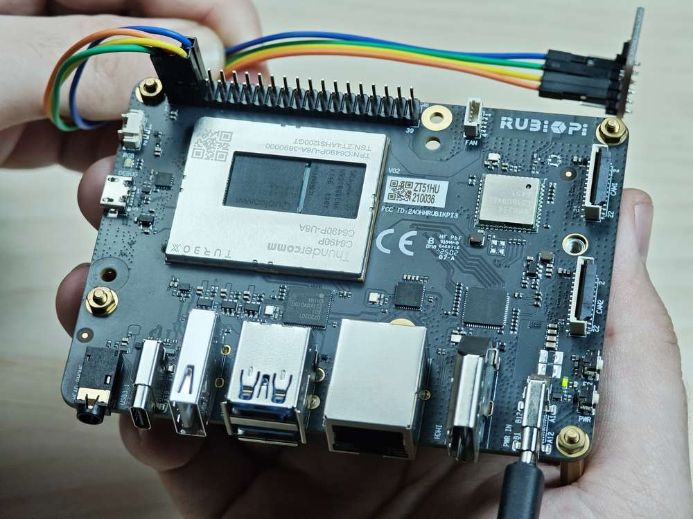

  Run the following commands:

  ```shell
  cd /opt
  ./i2c
  ```

  The program execution result is as follows:

  

### SPI

Serial Peripheral Interface (SPI) is a synchronous serial data link that operates in full-duplex mode. SPI is also known as a 4-wire serial bus.

RUBIK Pi 3 is compatible with WiringRP (based on the high-performance GPIO programming library WiringPi). It is recommended to use WiringRP for controlling and programming SPI. For more details about WiringRP, visit [https://github.com/rubikpi-ai/WiringRP.](https://github.com/rubikpi-ai/WiringRP)

#### Pinout

The figure below shows the default functions of the RUBIK Pi 3 40-pin LS connector, most of which are compatible with the default functions of the 40-pin connector of open-source development boards.


:::note

> Pins 19, 21, 23, and 24 are set to SPI by default.
:::

The following table lists all functions of the 40-pin LS connector. Blue bold functions are default functions.


#### SPI communication using WiringRP (C)

The WiringRP library provides a set of API functions that enable control with minimal logic.

* The following code snippet uses the SPI bus to send and receive data.

  ```c
  #include <wiringPi.h>
  #include <wiringPiSPI.h>
  #include <stdio.h>
  #include <stdlib.h>

  int main(void)
  {
      int fd;
      unsigned char send_data[64] =  "hello world!";
      unsigned char read_data[64];

      if(wiringPiSetup() == -1)
          exit(1);

      fd = wiringPiSPISetup(0, 1000000);
      if(fd < 0)
          exit(2);

          printf("\rtx_buffer: \n %s\n ", send_data);
      // Send and receive data
      if(wiringPiSPIDataRW(0, send_data, sizeof(send_data)) < 0)
          exit(3);
          printf("\rtx_buffer: \n %s\n ", send_data);


      return 0;
  }
  ```
* Compile programs

  * Compile on RUBIK Pi 3

    ```shell
    adb push spi.c /opt
    adb shell
    su
    cd /opt
    gcc spi.c -o spi -lwiringPi
    ```

   :::note

   > If the gcc command is not available, run `apt install gcc` to install the gcc compiler.
   :::

* Short pin 19 and pin 21 with a Dupont wire to test the SPI bus communication, as shown in the following figure:

  :::warning

  > Pay attention to the pin order. Do not short the power and ground pins, as this may cause damage to the board.
  :::
  >

  

  Run the following commands:

  ```shell
  cd /opt
  ./spi
  ```

  The execution result is as follows:

  

#### SPI communication using WiringRP-Python

The WiringRP library provides a set of API functions that enable control with minimal logic.

* The following code snippet uses the SPI bus to send and receive data:

  ```bash
  import wiringpi as wpi                                                        

  wpi.wiringPiSetup()                                                           

  wpi.wiringPiSPISetup(0, 8000000)                                              

  tx_buffer = bytes([72, 101, 108, 108, 111])                                   
  print("tx_buffer:\n\r ", tx_buffer)                                           
  retlen, rx_buffer = wpi.wiringPiSPIDataRW(0, tx_buffer)                       
  print("rx_buffer:\n\r ", rx_buffer)                                           

  ```
* Transfer *spi.py&#x20;*&#x74;o RUBIK Pi 3. For example, use the ADB method.

  ```shell
  adb push spi.py /opt
  ```
* Short pin 19 and pin 21 with a Dupont wire to test the SPI bus communication, as shown in the following figure:

  :::warning

  > Pay attention to the pin order. Do not short the power and ground pins, as this may cause damage to the board.
  :::
  >

  

  Run the following command:&#x20;

  ```shell
   python3 spi.py 
  ```

  The execution result is as follows:

  

#### SPI communication using Python programs

* SPI communication can be implemented by using the spidev library for Python. Run the following command to install spidev on RUBIK Pi 3.

  ```shell
  apt install python3-spidev
  ```
* The following code snippet uses the SPI bus to send and receive data.

  ```python
  import spidev

  def main():
      tx_buffer = [ord(char) for char in "hello world!"]
      rx_buffer = [0] * len(tx_buffer)

      try:
          spi = spidev.SpiDev()
          spi.open(12, 0)
          spi.max_speed_hz = 1000000  

          rx_buffer = spi.xfer2(tx_buffer[:])
          print("tx_buffer:\n\r", ''.join(map(chr, tx_buffer)))
          print("rx_buffer:\n\r", ''.join(map(chr, rx_buffer)))

      except Exception as e:
          print(f"An error occurred: {e}")

      finally:
          if spi:
              spi.close()

  if __name__ == "__main__":
      main()
  ```
* Transfer *spi.py* to RUBIK Pi 3. For example, use the ADB method.

  ```shell
  adb push spi.py /opt
  ```
* Short pin 19 and pin 21 with a Dupont wire to test the SPI bus communication, as shown in the following figure.

  :::warning

  > Pay attention to the pin order. Do not short the power and ground pins, as this may cause damage to the board.
  :::
  >

  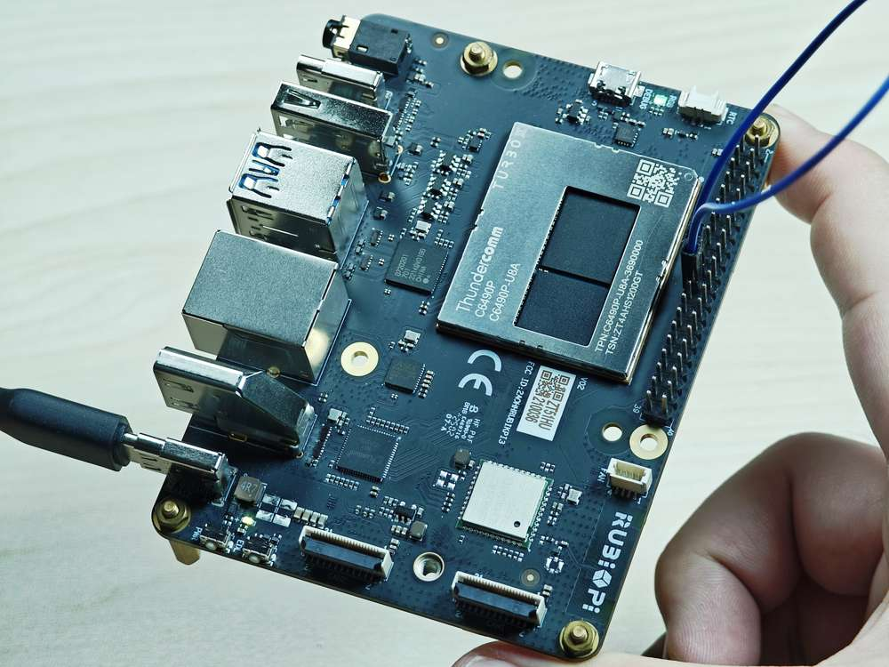

  Run the following command:

  ```shell
  python3 spi.py
  ```

  The program execution result is as follows:

  

#### SPI communication using C programs

* The following code snippet uses the SPI bus to send and receive data.

  ```c
  #include <stdio.h>
  #include <stdlib.h>
  #include <stdint.h>
  #include <fcntl.h>
  #include <unistd.h>
  #include <linux/spi/spidev.h>
  #include <sys/ioctl.h>

  #define SPI_DEVICE_PATH "/dev/spidev12.0"

  int main() {
      int spi_file;
      uint8_t tx_buffer[50] = "hello world!";
      uint8_t rx_buffer[50];

      // Open the SPI device
      if ((spi_file = open(SPI_DEVICE_PATH, O_RDWR)) < 0) {
          perror("Failed to open SPI device");
          return -1;
      }

      // Configure SPI mode and bits per word
      uint8_t mode = SPI_MODE_0;
      uint8_t bits = 8;
      if (ioctl(spi_file, SPI_IOC_WR_MODE, &mode) < 0) {
          perror("Failed to set SPI mode");
          close(spi_file);
          return -1;
      }
      if (ioctl(spi_file, SPI_IOC_WR_BITS_PER_WORD, &bits) < 0) {
          perror("Failed to set SPI bits per word");
          close(spi_file);
          return -1;
      }

      // Perform SPI transfer
      struct spi_ioc_transfer transfer = {
          .tx_buf = (unsigned long)tx_buffer,
          .rx_buf = (unsigned long)rx_buffer,
          .len = sizeof(tx_buffer),
          .delay_usecs = 0,
          .speed_hz = 1000000,  // SPI speed in Hz
          .bits_per_word = 8,
      };

      if (ioctl(spi_file, SPI_IOC_MESSAGE(1), &transfer) < 0) {
          perror("Failed to perform SPI transfer");
          close(spi_file);
          return -1;
      }

       /* Print tx_buffer and rx_buffer*/
      printf("\rtx_buffer: \n %s\n ", tx_buffer);
      printf("\rrx_buffer: \n %s\n ", rx_buffer);

      // Close the SPI device
      close(spi_file);

      return 0;
  }
  ```
* Compile programs:

  * Cross-compile the program.

    ```shell
    aarch64-qcom-linux-gcc spi.c -o spi --sysroot=/home/zhy/qcom_sdk_meta/sysroots/armv8-2a-qcom-linux/
    ```
  * Compile on RUBIK Pi 3

    ```c
    adb push spi.c /opt
    adb shell
    su
    cd /opt
    gcc spi.c -o spi
    ```

    :::note

    > If the gcc command is not available, run `apt install gcc` to install the gcc compiler.
    :::
  >

  * If you use cross-compilation, transfer *spi* to RUBIK Pi 3. For example, use the ADB method:

    ```shell
    adb push spi /opt
    ```
* Short pin 19 and pin 21 with a Dupont wire to test the SPI bus communication, as shown in the following figure.

  :::warning

  > Pay attention to the pin order. Do not short the power and ground pins, as this may cause damage to the board.
  :::
  >

  

  Run the following commands:

  ```shell
  cd /opt
  ./spi
  ```

  The program execution result is as follows:

  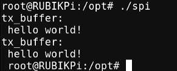

### UART
<a id="uart"></a>

RUBIK Pi 3 is compatible with WiringRP (based on the high-performance GPIO programming library WiringPi). It is recommended to use WiringRP for controlling and programming UART. For more details about WiringRP, visit [https://github.com/rubikpi-ai/WiringRP.](https://github.com/rubikpi-ai/WiringRP)

#### Pinout

The figure below shows the default functions of the RUBIK Pi 3 40-pin LS connector, most of which are compatible with the default functions of the 40-pin connector of open-source development boards.


:::note

> Pins 8 and 10 have been set to UART by default. The device node is */dev/ttyHS2*.
:::

The following table lists all functions of the 40-pin LS connector. Blue bold functions are default functions.


#### UART communication using shell commands

Run the following commands on RUBIK Pi 3 to control UART communication.

* Use the stty tool to configure UART. Run the following commands to set both the input rate and output rate of UART to 115200 and disable the echo.

  ```shell
  stty -F /dev/ttyHS2 ispeed 115200 ospeed 115200  
  stty -F /dev/ttyHS2 -echo
  ```
* Enable the two terminals on RUBIK Pi 3, short pin 8 and pin 10 with a Dupont wire, and run the following commands. The content sent by the transmitter will be displayed on the receiver.

  :::warning

  > Pay attention to the pin order. Do not short the power and ground pins, as this may cause damage to the board.
  :::
  >

  ```shell
  echo "hello world!" > /dev/ttyHS2 #Transmitter  
  cat /dev/ttyHS2 #Receiver
  ```

  

#### UART communication using WiringRP (C)

The WiringRP library provides a set of API functions that enable control with minimal logic.

* The following code snippet uses UART to send and receive data:

  ```c
  #include <stdio.h>
  #include <string.h>
  #include <errno.h>

  #include <wiringPi.h>
  #include <wiringSerial.h>

  int main ()
  {
    int fd ;
    int count ;
    unsigned int nextTime ;

    if ((fd = serialOpen ("/dev/ttyHS2", 115200)) < 0)
    {
      fprintf (stderr, "Unable to open serial device: %s\n", strerror (errno)) ;
      return 1 ;
    }

    if (wiringPiSetup () == -1)
    {
      fprintf (stdout, "Unable to start wiringPi: %s\n", strerror (errno)) ;
      return 1 ;
    }


    char tx_buffer[] = "hello world!\n";
    for (count = 0 ; count < sizeof(tx_buffer) ; count++)
    {
      serialPutchar (fd, tx_buffer[count]) ;
      delay (3) ;
      printf ("%c", serialGetchar (fd)) ;
    }
    printf ("\n") ;

    return 0 ;
  }


  ```
* Compile programs:

  * Compile on RUBIK Pi 3

    ```shell
    adb push uart.c /opt
    adb shell
    su
    cd /opt
    gcc uart.c -o uart -lwiringPi
    ```

   :::note

   > If the gcc command is not available, run `apt install gcc` to install the gcc compiler.
   :::

* Short pin 8 and pin 10 with a Dupont wire and test the communication, as shown in the following figure:

  :::warning

  > Pay attention to the pin order. Do not short the power and ground pins, as this may cause damage to the board.
  :::
  >

  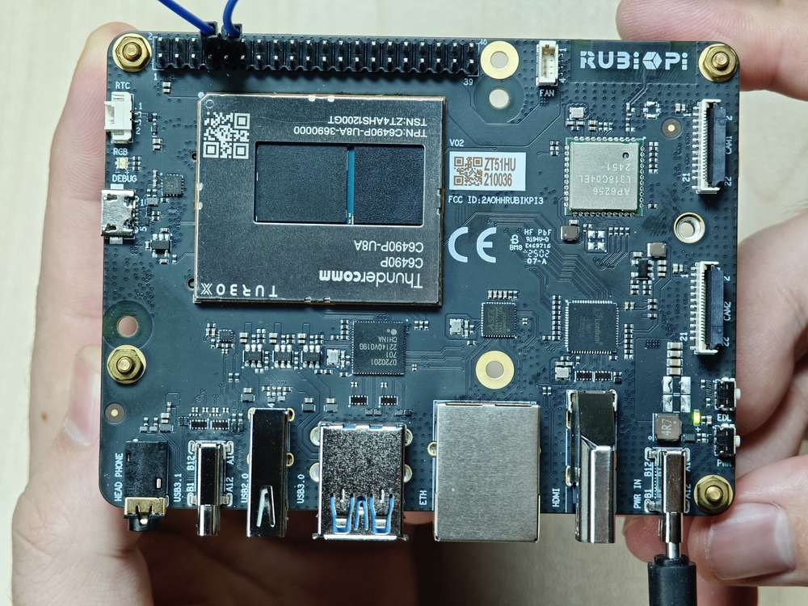

  Run the following commands:

  ```shell
  cd /opt
  ./uart
  ```

  The execution result is as follows:

  

#### UART communication using WiringRP-Python

The WiringRP library provides a set of API functions that enable control with minimal logic.

* The following code snippet uses UART to send and receive data.

  ```bash
  import wiringpi

  serial = wiringpi.serialOpen('/dev/ttyHS2', 115200)

  wiringpi.serialPuts(serial, "hello world")

  received_data = []
  c = wiringpi.serialGetchar(serial);
  received_data.append(chr(c))

  cnt = wiringpi.serialDataAvail(serial);
  for i in range(cnt):
      c = wiringpi.serialGetchar(serial);
      received_data.append(chr(c))

  print("Received:", received_data)

  wiringpi.serialClose(serial)

  ```
* Transfer *uart.py&#x20;*&#x74;o RUBIK Pi 3. For example, use the ADB method. The command is as follows:

  ```shell
  adb push uart.py /opt
  ```
* Short pin 8 and pin 10 with a Dupont wire to test UART communication, as shown in the following figure:

  :::warning

  > Pay attention to the pin order. Do not short the power and ground pins, as this may cause damage to the board.
  :::
  >

  

  Run the following commands:

  ```shell
  cd /opt
  python3 uart.py 
  ```

  The execution result is as follows:

  

#### UART communication using Python programs

* UART communication can be implemented by using the serial library for Python. Run the following command to install the serial library on RUBIK Pi 3.

  ```shell
  apt install python3-serial
  ```
* Use UART to send and receive data.

  ```python
  import serial
  import time

  with serial.Serial(
      "/dev/ttyHS2",
      baudrate=115200,
      bytesize=serial.EIGHTBITS,
      stopbits=serial.STOPBITS_ONE,
      parity=serial.PARITY_NONE,
      timeout=1,

  ) as uart3:
      uart3.write(b"Hello World!\n")
      buf = uart3.read(128)
      print("Raw data:\n", buf)
      data_strings = buf.decode("utf-8")
      print("Read {:d} bytes, printed as string:\n {:s}".format(len(buf), data_strings))
  ```
* Transfer *uart.py* to RUBIK Pi 3. For example, use the ADB method. The command is as follows:

  ```shell
  adb push uart.py /opt
  ```
* Short pin 8 and pin 10 with a Dupont wire to test the UART communication, as shown in the following figure.

  :::warning

  > Pay attention to the pin order. Do not short the power and ground pins, as this may cause damage to the board.
  :::
  >

  

  Run the following command:

  ```shell
  python3 uart.py
  ```

  The program execution result is as follows:

  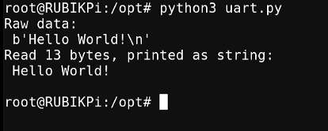

#### UART communication using C programs

* Use UART to send and receive data.

  ```c
  #include <stdio.h>
  #include <stdlib.h>
  #include <string.h>
  #include <fcntl.h>
  #include <termios.h>
  #include <unistd.h>

  int main() {
      int serial_port_num = 2;
      char serial_port[15];

      sprintf(serial_port,"/dev/ttyHS%d",serial_port_num);
      int serial_fd;

      serial_fd = open(serial_port, O_RDWR | O_NOCTTY);
      if (serial_fd == -1) {
          perror("Failed to open serial port");
          return 1;
      }

      struct termios tty;
      memset(&tty, 0, sizeof(tty));

      if (tcgetattr(serial_fd, &tty) != 0) {
          perror("Error from tcgetattr");
          return 1;
      }

      cfsetospeed(&tty, B9600);
      cfsetispeed(&tty, B9600);

      tty.c_cflag &= ~PARENB;
      tty.c_cflag &= ~CSTOPB;
      tty.c_cflag &= ~CSIZE;
      tty.c_cflag |= CS8;

      if (tcsetattr(serial_fd, TCSANOW, &tty) != 0) {
          perror("Error from tcsetattr");
          return 1;
      }

      char tx_buffer[] = "hello world!\n";
      ssize_t bytes_written = write(serial_fd, tx_buffer, sizeof(tx_buffer));
      if (bytes_written < 0) {
          perror("Error writing to serial port");
          close(serial_fd);
          return 1;
      }
      printf("\rtx_buffer: \n %s ", tx_buffer);

      char rx_buffer[256];
      int bytes_read = read(serial_fd, rx_buffer, sizeof(rx_buffer));
      if (bytes_read > 0) {
          rx_buffer[bytes_read] = '\0';
          printf("\rrx_buffer: \n %s ", rx_buffer);
      } else {
          printf("No data received.\n");
      }

      close(serial_fd);

      return 0;
  }

  ```
* Compile programs:

  * Cross-compile the program.

    ```shell
    aarch64-qcom-linux-gcc uart.c -o uart --sysroot=/home/zhy/qcom_sdk_meta/sysroots/armv8-2a-qcom-linux/
    ```
  * Compile on RUBIK Pi 3

    ```shell
    adb push uart.c /opt
    adb shell
    su
    cd /opt
    gcc uart.c -o uart
    ```

    :::note

    > If the gcc command is not available, run `apt install gcc` to install the gcc compiler.
    :::
    >

    If you use cross-compilation, transfer *uart* to RUBIK Pi 3. For example, use the ADB method. The command is as follows:

    ```shell
    adb push uart /opt
    ```
* Short pin 8 and pin 10 with a Dupont wire and test the UART communication, as shown in the following figure.

  :::warning

  > Pay attention to the pin order. Do not short the power and ground pins, as this may cause damage to the board.
  :::
  >

  

  Run the following commands:

  ```shell
  cd /opt
  ./uart
  ```

  The program execution result is as follows:

  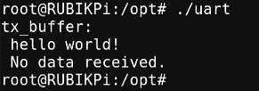

## USB

RUBIK Pi 3 provides four USB ports:

* 2 x USB 3.0, host mode only (No.7 in the following figure)
* 1 x USB 2.0, host or device mode (No. 6 in the following figure)
* 1 x USB 3.1 Gen 1, host or device mode (ADB), Type-C with DisplayPort v1.4 (No. 5 in the following figure)


### USB 2.0 Type-A

:::note

> The following commands require root privileges. Run the `su root` command to switch to the root user:
>
> * Username: root

> * Password: root
:::

The USB 2.0 port operates in host mode by default. In host mode, insert a USB flash drive, click the upper-left corner of the screen, then double-click the **Files** application at the bottom of the pop-up interface to open the file browser.

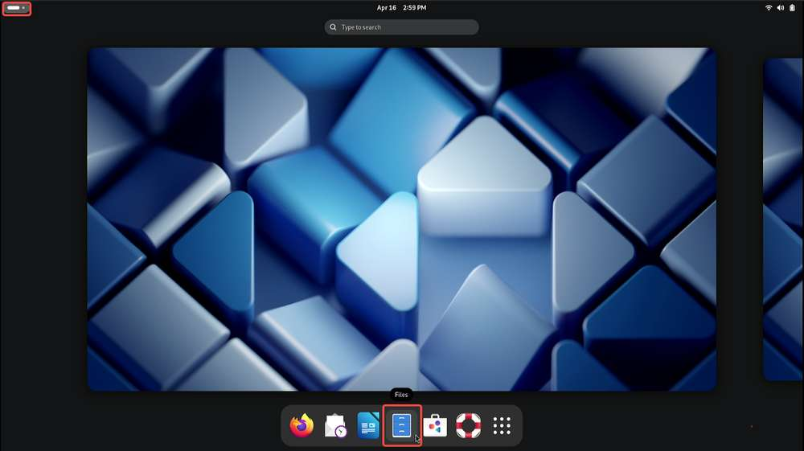

In the file browser, click the USB drive listed on the left panel to display its contents. You can then perform operations such as copying and writing files to the USB drive.

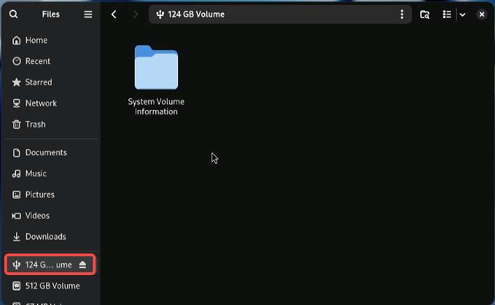

To switch the USB 2.0 port to device mode, you need to run commands manually. The following command is a switching method. Run the following commands in the RUBIK Pi 3 terminal to simulate RUBIK Pi 3 as a USB flash drive.

```shell
cd /sys/kernel/config/usb_gadget/ #Log in from the serial port or open the PC terminal and run the following commands
mkdir g1
cd g1
mkdir functions/mass_storage.0
dd if=/dev/zero of=/tmp/test.iso bs=1M count=2048 #Create a 2 GB USB drive space
mkfs.ext4 /tmp/test.iso
echo "/tmp/test.iso" > functions/mass_storage.0/lun.0/file
mkdir configs/c.1
ln -s functions/mass_storage.0/ configs/c.1/f3
mount -t debugfs none /sys/kernel/debug/

echo device > /sys/kernel/debug/usb/8c00000.usb/qcom_usb2_0_mode #Switch USB to device mode
echo 8c00000.usb > UDC #Connect the USB cable. The USB drive is identified and can be written to and read from


echo host > /sys/kernel/debug/usb/8c00000.usb/qcom_usb2_0_mode #Remove the USB cable and switch to host mode
```

### USB 3.1 Type-C

The Type-C port can automatically switch between host and device modes.

* Automatically switches to device mode when connected to PC
* Automatically switches to host mode when an OTG cable is connected
* Automatically outputs DP video signals when connected to a DP monitor

### USB debugging

This section provides the methods for obtaining debug logs. The debug methods include `regdumps`, debug `ftraces`, and `configfs` nodes. When debugging issues related to entering or exiting low-power modes, system memory management unit (SMMU), and unclocked accesses, you can check the event and controller status details through the logs obtained by using the above methods.

:::note

> The following commands require root privileges. Run the `su root` command to switch to the root user:
>
> * Username: root

> * Password: root
:::

* USB 2.0 Type-A device path:*&#x20;/sys/devices/platform/soc@0/**8c00000**.usb/xhci-hcd.0.auto/usb1*
* USB 3.0 Type-A device path:

  * */sys/devices/platform/soc@0/**1c00000**.pci/pci0000:00/0000:00:00.0/0000:**01:00.0**/usb2*
  * */sys/devices/platform/soc@0/**1c00000**.pci/pci0000:00/0000:00:00.0/0000:**01:00.0**/usb3*
* USB 3.1 Type-C device path: */sys/devices/platform/soc@0/**a600000**.usb*

#### USB tracing

Use `debugfs` to deeply trace each transaction over the USB line. To view the trace list, run the following command.

:::note

> Before running the command, ensure that `debugfs` has been mounted. If not mounted, run the following command to mount `debugfs`:&#x20;
>
> `mount -t debugfs none /sys/kernel/debug`
:::

```shell
ls /sys/kernel/debug/tracing/events/dwc3
```

The following traces can be used to verify data transmission in the xHCI, gadget stack, or USB Type-C Connector System Software Interface (UCSI).

```shell
dwc3_alloc_request  dwc3_event              dwc3_gadget_generic_cmd  enable
dwc3_complete_trb   dwc3_free_request       dwc3_gadget_giveback     filter
dwc3_ctrl_req       dwc3_gadget_ep_cmd      dwc3_prepare_trb
dwc3_ep_dequeue     dwc3_gadget_ep_disable  dwc3_readl
dwc3_ep_queue       dwc3_gadget_ep_enable   dwc3_writel
```

To list the traces in the xHCI/Host Controller Driver (HCD), run the following command:

```shell
ls /sys/kernel/debug/tracing/events/xhci-hcd
```

The following traces can be used to verify data transmission in the xHCI/HCD.

```shell
enable                            xhci_handle_cmd_config_ep
filter                            xhci_handle_cmd_disable_slot
  xhci_add_endpoint                 xhci_handle_cmd_reset_dev
  xhci_address_ctrl_ctx             xhci_handle_cmd_reset_ep
  xhci_address_ctx                  xhci_handle_cmd_set_deq
  xhci_alloc_dev                    xhci_handle_cmd_set_deq_ep
  xhci_alloc_virt_device            xhci_handle_cmd_stop_ep
  xhci_configure_endpoint           xhci_handle_command
  xhci_configure_endpoint_ctrl_ctx  xhci_handle_event
  xhci_dbc_alloc_request            xhci_handle_port_status
  xhci_dbc_free_request             xhci_handle_transfer
  xhci_dbc_gadget_ep_queue          xhci_hub_status_data
  xhci_dbc_giveback_request         xhci_inc_deq
  xhci_dbc_handle_event             xhci_inc_enq
  xhci_dbc_handle_transfer          xhci_queue_trb
  xhci_dbc_queue_request            xhci_ring_alloc
  xhci_dbg_address                  xhci_ring_ep_doorbell
  xhci_dbg_cancel_urb               xhci_ring_expansion
  xhci_dbg_context_change           xhci_ring_free
  xhci_dbg_init                     xhci_ring_host_doorbell
  xhci_dbg_quirks                   xhci_setup_addressable_virt_device
  xhci_dbg_reset_ep                 xhci_setup_device
  xhci_dbg_ring_expansion           xhci_setup_device_slot
  xhci_discover_or_reset_device     xhci_stop_device
  xhci_free_dev                     xhci_urb_dequeue
  xhci_free_virt_device             xhci_urb_enqueue
  xhci_get_port_status              xhci_urb_giveback
  xhci_handle_cmd_addr_dev
```

To list the available events for the USB Video Class (UVC) gadget driver, run the following command:

```shell
ls /sys/kernel/debug/tracing/events/gadget
```

The output is as follows.

```shell
enable                      usb_gadget_activate
  filter                      usb_gadget_clear_selfpowered
  usb_ep_alloc_request        usb_gadget_connect
  usb_ep_clear_halt           usb_gadget_deactivate
  usb_ep_dequeue              usb_gadget_disconnect
  usb_ep_disable              usb_gadget_frame_number
  usb_ep_enable               usb_gadget_giveback_request
  usb_ep_fifo_flush           usb_gadget_set_remote_wakeup
  usb_ep_fifo_status          usb_gadget_set_selfpowered
  usb_ep_free_request         usb_gadget_vbus_connect
  usb_ep_queue                usb_gadget_vbus_disconnect
  usb_ep_set_halt             usb_gadget_vbus_draw
  usb_ep_set_maxpacket_limit  usb_gadget_wakeup
  usb_ep_set_wedge
```

To list the available events in the UCS&#x49;**&#x20;**&#x64;river, run the following command:

```shell
ls /sys/kernel/debug/tracing/events/ucsi
```

The output is as follows.

```shell
enable  ucsi_connector_change  ucsi_register_port  ucsi_run_command
filter  ucsi_register_altmode  ucsi_reset_ppm
```

#### USB regdump

The USB `debugfs` provides the following information (using the Type-C interface as an example)

* Operating mode

  ```shell
  cat /sys/kernel/debug/usb/a600000.usb/mode # Type-C interface
  ```

  :::note

  > Operating mode of USB 2.0 Type-A `cat /sys/kernel/debug/usb/8c00000.usb/qcom_usb2_0_mode`
  :::
  >

  Sample output:

  ```shell
  device
  ```
* State and transfer ring buffer (TRB) queues to all endpoints in device mode.
* Current link status.

  ```shell
  cat /sys/kernel/debug/usb/a600000.usb/link_state
  ```

  Sample output:

  ```shell
  Sleep
  ```
* Display processor (LSP) dump

  ```shell
  cat /sys/kernel/debug/usb/a600000.usb/lsp_dump
  ```

  Sample output:

  ```shell
  GDBGLSP[0] = 0x40000000
  GDBGLSP[1] = 0x00003a80
  GDBGLSP[2] = 0x38200000
  GDBGLSP[3] = 0x00802000
  GDBGLSP[4] = 0x126f1000
  GDBGLSP[5] = 0x3a800018
  GDBGLSP[6] = 0x00000a80
  GDBGLSP[7] = 0xfc03f14a
  GDBGLSP[8] = 0x0b803fff
  GDBGLSP[9] = 0x00000000
  GDBGLSP[10] = 0x000000f8
  GDBGLSP[11] = 0x000000f8
  GDBGLSP[12] = 0x000000f8
  GDBGLSP[13] = 0x000000f8
  GDBGLSP[14] = 0x000000f8
  GDBGLSP[15] = 0x000000f8
  ```

```shell
ls /sys/kernel/debug/usb/a600000.usb
```

Sample output:

```shell
ep0in    ep11out  ep14in   ep1out  ep4in   ep6out  ep9in       regdump
ep0out   ep12in   ep14out  ep2in   ep4out  ep7in   ep9out      testmode
ep10in   ep12out  ep15in   ep2out  ep5in   ep7out  link_state
ep10out  ep13in   ep15out  ep3in   ep5out  ep8in   lsp_dump
ep11in   ep13out  ep1in    ep3out  ep6in   ep8out  mode
```

Run the `regdump` command to obtain the current status of the register space for the following registers:

* Device mode registers, such as DCTL, DSTS, and DCFG
* Global registers, such as GCTL and GSTS

```shell
cd /sys/kernel/debug/usb/a600000.usb
cat regdump
```

Sample output:

```shell
GSBUSCFG0 = 0x2222000e
GSBUSCFG1 = 0x00001700
GTXTHRCFG = 0x00000000
GRXTHRCFG = 0x00000000
GCTL = 0x00102000
GEVTEN = 0x00000000
GSTS = 0x7e800000
GUCTL1 = 0x810c1802
GSNPSID = 0x5533330a
GGPIO = 0x00000000
GUID = 0x00060500
GUCTL = 0x0d00c010
GBUSERRADDR0 = 0x00000000
GBUSERRADDR1 = 0x00000000
GPRTBIMAP0 = 0x00000000
GPRTBIMAP1 = 0x00000000
GHWPARAMS0 = 0x4020400a
GDBGFIFOSPACE = 0x00420000
GDBGLTSSM = 0x41090658
GDBGBMU = 0x20300000
GPRTBIMAP_HS0 = 0x00000000
GPRTBIMAP_HS1 = 0x00000000
GPRTBIMAP_FS0 = 0x00000000
GPRTBIMAP_FS1 = 0x00000000
GUCTL2 = 0x0198440d
VER_NUMBER = 0x00000000
VER_TYPE = 0x00000000
GUSB2PHYCFG(0) = 0x00002400
GUSB2I2CCTL(0) = 0x00000000
GUSB2PHYACC(0) = 0x00000000
GUSB3PIPECTL(0) = 0x030e0002
GTXFIFOSIZ(0) = 0x00000042
GRXFIFOSIZ(0) = 0x00000305
GEVNTADRLO(0) = 0xfffff000
GEVNTADRHI(0) = 0x0000000f
GEVNTSIZ(0) = 0x00001000
GEVNTCOUNT(0) = 0x00000000
GHWPARAMS8 = 0x000007ea
GUCTL3 = 0x00010000
GFLADJ = 0x8c80c8a0
DCFG = 0x00cc08b4
DCTL = 0x8cf00a00
DEVTEN = 0x00000257
DSTS = 0x008a5200
DGCMDPAR = 0x00000000
DGCMD = 0x00000000
DALEPENA = 0x0000000f
DEPCMDPAR2(0) = 0x00000000
DEPCMDPAR1(0) = 0xffffe000
DEPCMDPAR0(0) = 0x0000000f
DEPCMD(0) = 0x00000006
OCFG = 0x00000000
OCTL = 0x00000000
OEVT = 0x00000000
OEVTEN = 0x00000000
OSTS = 0x00000000
```

#### Host mode sysfs lookup

To view the bus detailed information, run the following command:

```shell
lsub
```

Sample output:

```shell
Bus 002 Device 001: ID 1d6b:0003 Linux Foundation 3.0 root hub
Bus 001 Device 002: ID 03f0:134a HP, Inc Optical Mouse
Bus 001 Device 001: ID 1d6b:0002 Linux Foundation 2.0 root hub
```

To view the contents of the current directory, run the following commands:

```shell
cd /sys/bus/usb/devices/
ls
```

Sample output:

```shell
1-0:1.0  1-1  1-1:1.0  2-0:1.0  usb1  usb2
```

To view detailed information about USB devices, run the following command:

```shell
cat /sys/kernel/debug/usb/devices
```

Sample output:

```shell
T:  Bus=01 Lev=00 Prnt=00 Port=00 Cnt=00 Dev#=  1 Spd=480  MxCh= 1
B:  Alloc=  0/800 us ( 0%), #Int=  0, #Iso=  0
D:  Ver= 2.00 Cls=09(hub  ) Sub=00 Prot=01 MxPS=64 #Cfgs=  1
P:  Vendor=1d6b ProdID=0002 Rev= 6.05
S:  Manufacturer=Linux 6.5.0-rc4 xhci-hcd
S:  Product=xHCI Host Controller
S:  SerialNumber=xhci-hcd.0.auto
C:* #Ifs= 1 Cfg#= 1 Atr=e0 MxPwr=  0mA
I:* If#= 0 Alt= 0 #EPs= 1 Cls=09(hub  ) Sub=00 Prot=00 Driver=hub
E:  Ad=81(I) Atr=03(Int.) MxPS=   4 Ivl=256ms

T:  Bus=01 Lev=01 Prnt=01 Port=00 Cnt=01 Dev#=  2 Spd=1.5  MxCh= 0
D:  Ver= 2.00 Cls=00(>ifc ) Sub=00 Prot=00 MxPS= 8 #Cfgs=  1
P:  Vendor=03f0 ProdID=134a Rev= 1.00
S:  Manufacturer=PixArt
S:  Product=HP USB Optical Mouse
C:* #Ifs= 1 Cfg#= 1 Atr=a0 MxPwr=100mA
I:* If#= 0 Alt= 0 #EPs= 1 Cls=03(HID  ) Sub=01 Prot=02 Driver=usbhid
E:  Ad=81(I) Atr=03(Int.) MxPS=   4 Ivl=10ms

T:  Bus=02 Lev=00 Prnt=00 Port=00 Cnt=00 Dev#=  1 Spd=5000 MxCh= 1
B:  Alloc=  0/800 us ( 0%), #Int=  0, #Iso=  0
D:  Ver= 3.00 Cls=09(hub  ) Sub=00 Prot=03 MxPS= 9 #Cfgs=  1
P:  Vendor=1d6b ProdID=0003 Rev= 6.05
S:  Manufacturer=Linux 6.5.0-rc4 xhci-hcd
S:  Product=xHCI Host Controller
S:  SerialNumber=xhci-hcd.0.auto
C:* #Ifs= 1 Cfg#= 1 Atr=e0 MxPwr=  0mA
I:* If#= 0 Alt= 0 #EPs= 1 Cls=09(hub  ) Sub=00 Prot=00 Driver=hub
E:  Ad=81(I) Atr=03(Int.) MxPS=   4 Ivl=256ms
```

## Camera Serial Interface (CSI)

Currently, RUBIK Pi 3 is compatible with the camera modules listed in [Peripheral Compatibility List](https://www.thundercomm.com/rubik-pi-3/en/docs/peripheral-compatibility-list). The following table lists the supported resolutions for each camera module.


| Resolution  | Aspect Ratio | IMX477 | IMX708 | IMX219 |
| ------------- | -------------- | -------- | -------- | -------- |
| 4056 x 3040 | 4:3          | Yes    | No     | No     |
| 4608 x 2592 | 16:9         | No     | Yes    | No     |
| 3280 x 2464 | 4:3          | No     | No     | Yes    |
| 1920 x 1080 | 16:9         | Yes    | No     | No     |
| 1632 x 1224 | 4:3          | No     | No     | Yes    |

* HQ Camera (IMX477/M12 Mount)  

  
* Camera Module 2 (IMX219) 

  :::note

  > Currently, RUBIK Pi 3 only supports the standard Camera Module 2 and does not support the wide-angle or NoIR versions.
  :::
  >
* Camera Module 3 (IMX708) 

  :::note

  > Currently, RUBIK Pi 3 only supports the standard Camera Module 3 and does not support the wide-angle or NoIR versions. The current software version does not support the autofocus (AF) function of the Module 3 camera.
  :::
  >

### Connect the camera cable
<a id="concam"></a>

RUBIK Pi 3 supports the 22-pin FPC with a 0.5mm pitch and a 0.3±0.05mm thickness. For the compatible accessory, refer to [Peripheral Compatibility List](https://www.thundercomm.com/rubik-pi-3/en/docs/peripheral-compatibility-list).

:::warning

> Never plug or unplug the camera module while the board is powered on, as this can easily damage the camera module.
:::


1. Pull up the lock of the connector.

   
2. Insert the FPC. Ensure that the contacts are toward the center of RUBIK Pi 3.

   

3) Press the lock down to ensure that the FPC is properly connected.

   

### Use cameras

Connect cameras to connectors 13 and 14 in the following figure.


The following picture shows the physical connection:


:::note

> Currently, running two IMX708 at 4608 x 2592 simultaneously is not supported.
:::

* Recording videos

  Log in to your RUBIK Pi 3 via ADB.

  ```shell
  adb shell
  su # Switch to the root user and enable command completion
  ```

  Run the following commands on RUBIK Pi 3 to record videos.

  ```bash
  export GST_PLUGIN_PATH=/usr/lib/gstreamer-1.0/:$GST_PLUGIN_PATH
  export LD_LIBRARY_PATH=/usr/lib
  gst-launch-1.0 -e qtiqmmfsrc camera=0 name=camsrc video_0::type=preview ! video/x-raw\(memory:GBM\),format=NV12,width=1920,height=1080,framerate=30/1,compression=ubwc,interlace-mode=progressive,colorimetry=bt601 ! queue ! v4l2h264enc capture-io-mode=5 output-io-mode=5 ! queue ! h264parse ! mp4mux ! queue ! filesink location="/opt/mux0.mp4"
  ```

  The recorded video is saved a&#x73;*&#x20;/opt/mux0.mp4:*
* Taking photos

  Log in to your RUBIK Pi 3 via ADB.

  ```shell
  adb shell
  su # Switch to the root user and enable command completion
  ```

  Run the following commands on RUBIK Pi 3 to take photos.

  ```javascript
  export GST_PLUGIN_PATH=/usr/lib/gstreamer-1.0/:$GST_PLUGIN_PATH
  export LD_LIBRARY_PATH=/usr/lib
  gst-launch-1.0 -e qtiqmmfsrc camera=0 name=qmmf ! image/jpeg,width=1920,height=1080,framerate=30/1 ! multifilesink location=/opt/frame%d.jpg sync=true async=false max-files=2
  ```

  The corresponding *frame%d.jpg&#x20;*&#x77;ill be generated in the */opt* directory.

### Troubleshoot camera issues

If the camera fails to display or capture images, check the following contents:

1. Check the camera module connection.

   For details, refer to [Connect the camera cable](#concam).
2. Run the single-stream preview test case.

   ```shell
   export XDG_RUNTIME_DIR=/dev/socket/weston
   export WAYLAND_DISPLAY=wayland-1
   setprop persist.overlay.use_c2d_blit 2
   gst-launch-1.0 -e qtiqmmfsrc camera=0 name=camsrc ! video/x-raw\(memory:GBM\),format=NV12,width=1920,height=1080,framerate=30/1,compression=ubwc ! queue ! waylandsink sync=false x=1000 y=1000 width=960 height=540 enable-last-sample=false
   ```
3. Run the following command to collect logs.

   ```shell
   journalctl -f > /opt/log.txt
   ```

   Search for "probe success" in the logs. "probe success" indicates that the camera module is powered on and responding to I2C control. If the sensor does not have the "probe success" log, the possible cause is the flex cable connection or camera module issue.

   The following log indicates that an IMX477 is detected:

   ```shell
   [   80.645992] CAM_INFO: CAM-SENSOR: cam_sensor_driver_cmd: 939: Probe success,slot:7,slave_addr:0x34,sensor_id:0x477, is always on: 0
   ```
4. Check the camera sensor driver command.

   Collect logs using the `journalctl -f > /opt/log.txt` command and search for "cam\_sensor\_driver\_cmd" in the logs. "CAM\_START\_DEV Success" indicates that the camera sensor streaming started. "CAM\_STOP\_DEV Success" indicates that the camera sensor streaming has stopped. For example:

   ```shell
   start:
   [   81.172814] CAM_INFO: CAM-SENSOR: cam_sensor_driver_cmd: 1129: CAM_START_DEV Success, sensor_id:0x477,sensor_slave_addr:0x34
   stop:
   [   88.905241] CAM_INFO: CAM-SENSOR: cam_sensor_driver_cmd: 1157: CAM_STOP_DEV Success, sensor_id:0x477,sensor_slave_addr:0x34
   ```
5. Check the sensor streaming.

   Enable the CSID SOF/EOF IRQ logs, then execute the camera streaming command.

   ```shell
   mount -o rw,remount /usr
   mount -t debugfs none /sys/kernel/debug/
   echo 0x8 > /sys/module/camera/parameters/debug_mdl
   echo 3 >/sys/kernel/debug/camera_ife/ife_csid_debug
   echo 1 > /sys/kernel/tracing/tracing_on
   echo 1 > /sys/kernel/tracing/events/camera/cam_log_debug/enable
   echo 2 > /sys/module/camera/parameters/debug_type
   cat /sys/kernel/tracing/trace_pipe > trace.txt
   ```

   The captured logs provide detailed information about the Start of Frame (SOF) and End of Frame (EOF). In the *trace.txt* log, search for "irq\_status\_ipp".

   * BIT12 (0x1000) represents the SOF packet.
   * BIT9 (0x200) represents the EOF packet.

   The log will appear as follows:

   ```shell
   <idle>-0       [000] d.h1. 19287.546764: cam_log_debug:
   CAM_DBG: CAM-ISP: cam_ife_csid_irq: 4996: irq_status_ipp = 0x1110 cam-server-25604     [000] dNH.. 19287.561705: cam_log_debug:
   CAM_DBG: CAM-ISP: cam_ife_csid_irq: 4996: irq_status_ipp = 0xee8
   ```

## HDMI OUT

The HDMI connector is component No.9 in the following figure.&#x20;

RUBIK Pi 3 HDMI specifications are as follows:

* HDMI 1.4
* 3840 x 2160@30 fps
* DSI 0 to HDMI (LT9611)
* Supports CEC
* Supports resolution auto-adjustment
* Supports hot swapping


:::note

> DP and HDMI can be connected to a monitor simultaneously for concurrent display.
:::

### CEC

HDMI Consumer Electronics Control (CEC) is a feature of HDMI designed to interconnect and control multiple connected devices via a single HDMI cable. CEC facilitates communication between connected devices through a dedicated CEC pin. For example, multiple devices can be controlled with a single remote control.

Run the following command to install cec-client.

```shell
sudo apt install cec-utils
```

After connecting the HDMI cable to a TV, run the following command to check whether the TV supports CEC.

```shell
echo 'scan' | cec-client -s -d 1
```

If the TV supports CEC, you will see the following output:

```plaintext
opening a connection to the CEC adapter...
requesting CEC bus information ...
CEC bus information
===================
device #0: TV
address:       0.0.0.0
active source: no
vendor:        Sony
osd string:    TV
CEC version:   1.4
power status:  standby
language:      eng
 
  
device #1: Recorder 1
address:       1.0.0.0
active source: no
vendor:        Pulse Eight
osd string:    CECTester
CEC version:   1.4
power status:  on
language:      eng
 
  
device #4: Playback 1
address:       3.0.0.0
active source: no
vendor:        Sony
osd string:    PlayStation 4
CEC version:   1.3a
power status:  standby
language:      ???
```

If the TV supports the CEC function, run the following commands on RUBIK Pi 3 to increase or decrease the TV volume.

```shell
echo 'volup' | cec-client -t p -s  
echo 'voldown' | cec-client -t p -s
```

For more information about how to use cec-client, use the `-h` parameter.

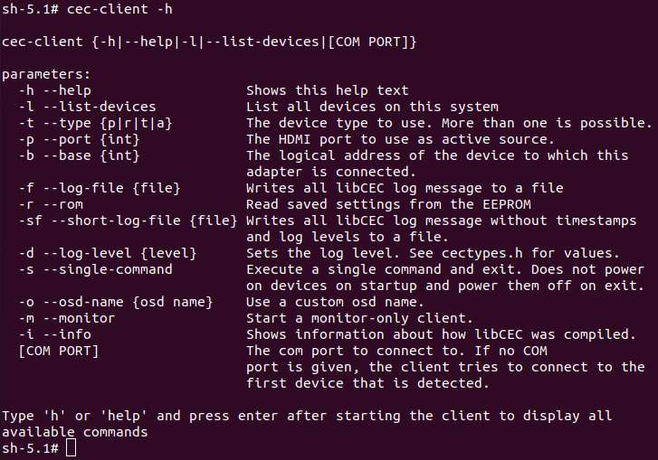

### HDMI OUT touchscreen

RUBIK Pi 3 supports HDMI OUT touchscreen with 1024 x 600P resolution by default:

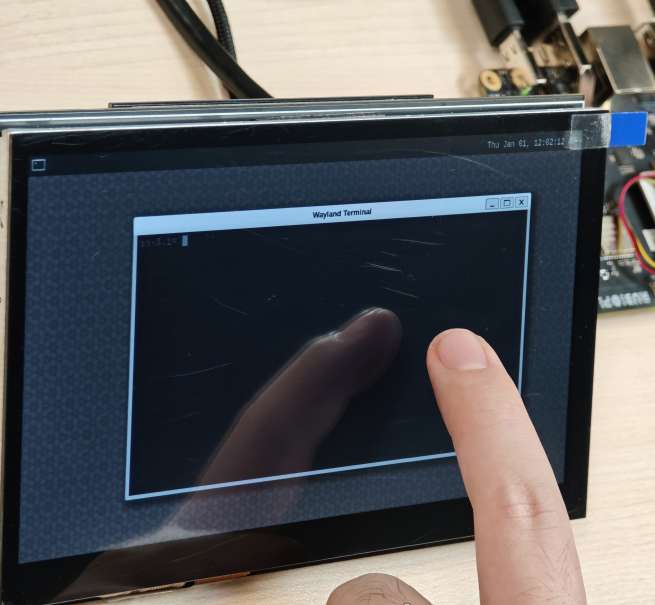

:::info

> The screen used in the picture above is a [7" IPS HD touch screen](https://a.co/d/cTl7rkN).
:::

### HDMI OUT debugging

RUBIK Pi 3 uses the LT9611 DSI-to-HDMI bridge chip.

The following table lists the configurations required for integrating the bridge.

| Description | DTSI Node |
|------------|-----------|
| Set the DSI-to-HDMI bridge panel as Primary | `&sde_dsi { qcom, dsi-default-panel = <&dsi_ext_bridge_1080p>;` |
| Configure reference power supply entries for the bridge chip | `&sde_dsi { vddio-supply = <&vreg_18c_ip62>; vdda-9p9-supply = <&vreg_11oc_9p88>; vdda-9p9-supply = <&vreg_11oc_9p88>;` |
| Configure panel reset GPIOs for the bridge chip | `lt9611: lt,lt9611 { reset-options = <&tlmm 21 0>;}` |
| Configure the DSI host driver in the external bridge mode to work with the third-party DSI-to-HDMI bridge chip | `qcom,mdss-dsi-ext-bridge-mode;` |

:::note

> The following commands require root privileges. Run the `su root` command to switch to the root user:
>
> * Username: root

> * Password: root
:::

#### Obtain LT9611 logs

Run the following command to obtain LT9611 logs:

```bash
dmesg | grep lt9611
```

Check the logs. The following message indicates that HDMI OUT is functioning properly.

This log records the initialization of the LT9611 chip and the HDMI connection process, from firmware version detection to CEC initialization, indicating that the chip has started normally.

1. The firmware version of the chip is 0xe2.17.02. This indicates that during initialization, the driver successfully reads the version information.
2. The Consumer Electronics Control (CEC) function adapter of the LT9611 has been successfully registered.
3. CEC initialization is complete, which means that the CEC module of LT9611 is functioning properly.
4. The chip successfully reads the Hot Plug Detection (HPD) status, and a value is returned, confirming the connection of the HDMI device.
5. The chip detects the video signal parameters: horizontal resolution 1920 pixels, vertical resolution 1080 pixels, and pixel clock frequency 148500 kHz (148.5 MHz). This is a typical 1080p resolution (Full HD) with a 60 Hz refresh rate configuration.

```bash
[    5.492765] lt9611 9-0039: LT9611 revision: 0xe2.17.02
[    5.570258] lt9611 9-0039: CEC adapter registered
[    5.582944] lt9611 9-0039: CEC init success

[    8.233028] lt9611 9-0039: success to read hpd status: 13
[    8.233044] lt9611_device_connect_status_notify: send msg[Hdmi Connection] ret[32]
[    8.345015] lt9611 9-0039: hdisplay=1920, vdisplay=1080, clock=148500 
[    8.836662] lt9611 9-0039: video check: hactive_a=1920, hactive_b=1920, vactive=1080, v_total=1125, h_total_sysclk=401, mipi_video_format=170
```

#### Obtain DSI logs

The output DSI information can also be used for debugging. DSI stands for Display Serial Interface, which is typically related to display drivers for mobile devices or embedded systems (such as MIPI DSI).&#x20;

The following command is used to view kernel logs related to DSI for debugging display drivers or hardware issues.

```bash
dmesg | grep dsi
```

Sample output:

```shell

[    4.811430] i2c 9-0039: Fixed dependency cycle(s) with /soc@0/qcom,dsi-display-primary
[    4.941131] dsi_phy ae94400.qcom,mdss_dsi_phy0: supply gdsc not found, using dummy regulator
[    4.941385] [drm:dsi_pll_init [msm_drm]] [msm-dsi-info]: DSI_PLL_0: DSI pll label = dsi_pll_5nm
[    4.941466] [drm:dsi_pll_init [msm_drm]] [msm-dsi-info]: DSI_PLL_0: PLL SSC enabled
[    4.941513] dsi_pll_init: PLL base=00000000625eaee4
[    4.941658] [drm:dsi_pll_clock_register_5nm [msm_drm]] [msm-dsi-info]: DSI_PLL_0: Registered clocks successfully
[    4.941700] [drm:dsi_phy_driver_probe [msm_drm]] [msm-dsi-info]: DSI_0: Probe successful
[    4.973185] [drm:dsi_ctrl_dev_probe [msm_drm]] [msm-dsi-info]: dsi-ctrl-0: Probe successful

[    5.585113] [drm:dsi_display_bind [msm_drm]] [msm-dsi-info]: Successfully bind display panel 'qcom,mdss_dsi_ext_bridge_1080p '
[    5.585154] msm_drm ae00000.qcom,mdss_mdp0: bound soc@0:qcom,dsi-display-primary (ops dsi_display_comp_ops [msm_drm])
[    8.345467] [drm:dsi_display_set_mode [msm_drm]] [msm-dsi-info]: mdp_transfer_time=0, hactive=1920, vactive=1080, fps=60, clk_rate=0
[    8.345740] [drm:dsi_ctrl_isr_configure [msm_drm]] [msm-dsi-info]: dsi-ctrl-0: IRQ 249 registered
```

#### View display panel information

Run the following command to view the information of the specified display panel.

```plain text
cat /sys/kernel/debug/qcom,mdss_dsi_ext_bridge_2k60/dump_info
```

Sample output:

```shell
name = qcom,mdss_dsi_ext_bridge_2k60
        Resolution = 2560(80|48|32|1)x1440(33|3|5|1)@60fps 0 Hz
        CTRL_0:
                ctrl = dsi-ctrl-0
                phy = dsi-phy-0
        Panel = ext video mode dsi bridge
        Clock master = dsi-ctrl-0
```

#### View DSI clock information

Run the following command to view DSI clock information.

```shell
cat /sys/kernel/debug/qcom,mdss_dsi_ext_bridge_2k60/dsi-ctrl-0/state_info
```

Sample output:

```shell
Current State:
        CTRL_ENGINE = ON
        VIDEO_ENGINE = ON
        COMMAND_ENGINE = OFF

Clock Info:
        BYTE_CLK = 181274400, PIXEL_CLK = 241699200, ESC_CLK = 19200000
```

#### View regulator information

Run the following command to view the regulator status and voltage.

```shell
cat /sys/kernel/debug/regulator/regulator_summary
```

#### View interface information

To retrieve the debug dump output (display interface number, VSync count, underload count, and interface mode), run the following command:

```shell
cat /sys/kernel/debug/dri/0/encoder*/status
```

Sample output:

```shell
intf:1    vsync:  359036     underrun:       0    mode: video
intf:0    vsync:       0     underrun:       0    mode: video
```

#### Common DPU debug information

The common Display Processing Unit (DPU) debug information is explained as follows:

Run the following command to check the DPU clock rate:

```shell
cat /sys/kernel/debug/clk/clk_summary | grep disp_cc
```

Set the DPU to performance mode.

```shell
cd /sys/kernel/debug/dri/0/debug/core_perf/
echo 1 > perf_mode
```

## DisplayPort

RUBIK Pi 3 provides a USB Type-C that supports DisplayPort (DP) over Single-Stream Transport (SST), labeled as No. 5 in the following figure.

The DP specifications are as follows:

* 3840 × 2160@60 fps
* Single-stream transport
* Simultaneous operation of DP and USB 3.0


:::note
DP and HDMI can be connected to a monitor simultaneously for concurrent display.
:::

### DP debugging

#### Obtain DP logs

:::note

> The following commands require root privileges. Run the `su root` command to switch to the root user:
>
> * Username: root
> * Password: root
:::

Run the following command to enable log printing.

```bash
echo 8 > /proc/sys/kernel/printk 
echo ‘file dsi* +p’ > /sys/kernel/debug/dynamic_debug/control
```

:::note

> `8` in the first command is the log level. In the Linux kernel, log levels are represented by numbers from 0 to 8. The smaller the number, the higher the priority. The levels are described as follows:
>
> * 0 (KERN\_EMERG): System emergency (e.g., crash).
> * 1 (KERN\_ALERT): Issues that require immediate attention.
> * 2 (KERN\_CRIT): Critical errors.
> * 3 (KERN\_ERR): General errors.
> * 4 (KERN\_WARNING): Warnings.
> * 5 (KERN\_NOTICE): Normal events that are noteworthy.
> * 6 (KERN\_INFO): Informational messages.
> * 7 (KERN\_DEBUG): Debugging information.
> * 8: A level lower than debugging, displaying all levels of logs.
:::

Running the second command `echo ‘file dsi* +p’ > /sys/kernel/debug/dynamic_debug/control` will display the debug information from all kernel source files whose filenames start with *dsi\** (usually related to DSI display driver code). This debug information will be output to the kernel log, which can be viewed by running `dmesg`. The following command output can be used for DP debugging:

```bash
mount -t debugfs none /sys/kernel/debug
echo 'file dp_display.c +p' > /sys/kernel/debug/dynamic_debug/control
echo 'file dp_aux.c +p' > /sys/kernel/debug/dynamic_debug/control
echo 'file dp_link.c +p' > /sys/kernel/debug/dynamic_debug/control
echo 'file dp_power.c +p' > /sys/kernel/debug/dynamic_debug/control
echo 'file dp_ctrl.c +p' > /sys/kernel/debug/dynamic_debug/control
echo 'file dp_parser.c +p' > /sys/kernel/debug/dynamic_debug/control
```

After printing all levels of logs, filter DP logs for further validation. The following output shows the logs for a successful DP startup.

```plain text
hub 4-0:1.0: USB hub found
hub 4-0:1.0: 1 port detected
usb usb5: We don't know the algorithms for LPM for this host, disabling LPM.
hub 5-0:1.0: USB hub found
hub 5-0:1.0: 1 port detected
[drm:dp_power_clk_enable][msm-dp-info][3216]core:on link:off strm0:off strm1:off
[drm:dp_display_host_init][msm-dp-info][3216][OK]
[drm:dp_display_host_ready][msm-dp-info][2912][OK]
[drm:dp_panel_read_sink_caps][msm-dp-info][2912]fec_en=0, dsc_en=0, widebus_en=0
[drm:dp_link_process_request][msm-dp-info][2912]event: DP_LINK_STATUS_UPDATED
[drm:dp_power_clk_enable][msm-dp-info][2912]core:on link:on strm0:off strm1:off
[drm:dp_catalog_ctrl_fec_config][msm-dp-err][2912]no link
[drm:dp_ctrl_link_train][msm-dp-info][2912]link training #1 successful
[drm:dp_ctrl_link_train][msm-dp-info][2912]link training #2 successful
[drm:dp_link_process_request][msm-dp-info][2912]event: DP_LINK_STATUS_UPDATED
[drm:dp_catalog_ctrl_fec_config][msm-dp-err][2912]no link
[drm:dp_ctrl_link_train][msm-dp-info][2912]link training #1 successful
[drm:dp_ctrl_link_train][msm-dp-info][2912]link training #2 successful
[drm:dp_display_send_hpd_event][msm-dp-info][2912][name=DP-1]:[status=connected] [bpp=0] [pattern=0]
[drm:dp_display_send_hpd_event][msm-dp-info][2912]uevent success: 0
lt9611 9-0039: success to read hpd status: 8
lt9611_device_connect_status_notify: send msg[Hdmi Disconnect] ret[32]
lt9611 9-0039: success to read hpd status: 8
lt9611_device_connect_status_notify: send msg[Hdmi Disconnect] ret[32]
[drm:dp_power_clk_enable][msm-dp-info][577 ]core:on link:on strm0:on strm1:off
[drm:dp_catalog_ctrl_fec_config][msm-dp-err][577 ]no link
[drm:dp_ctrl_link_train][msm-dp-info][577 ]link training #1 successful
[drm:dp_ctrl_link_train][msm-dp-info][577 ]link training #2 successful
[drm:dp_panel_resolution_info][msm-dp-info][577 ]DP RESOLUTION: active(back|front|width|low)
[drm:dp_panel_resolution_info][msm-dp-info][577 ]1920(148|88|44|0)x1080(36|4|5|0)@60fps 24bpp 148500Khz 10LR 2Ln
```

The above logs for a successful DP startup are summarized as follows:

1. USB initialization: The system detects two single-port USB hubs during startup and disables the LPM of USB 5.
2. DP preparation: The DP controller is initialized, the display capabilities are read, and preparations are made to establish a connection.
3. DP link training: Multiple link training attempts are made to establish a stable connection between the DP and the display.
4. DP connection confirmation: The system confirms that DP-1 is connected and notifies the user space.
5. HDMI disconnection: LT9611 detects HDMI disconnection, which may be due to user action or interface switching.
6. DP output: After HDMI disconnection, DP enables video streaming and outputs 1080p@60 Hz video.

## Wi-Fi and Bluetooth

RUBIK Pi 3 is equipped with the AP6256 Wi-Fi module and supports Wi-Fi 5 and Bluetooth 5.2.

### Wi-Fi

Wi-Fi is a wireless networking technology that uses the IEEE 802.11 protocol. It allows electronic devices like smartphones, wearables, laptops, desktops, and other consumer electronics to connect to the Internet without physical cables.

#### Operating bands

The AP6256 Wi-Fi chipset supports 2.4 GHz and 5 GHz operating bands.

#### Operating modes

The Wi-Fi software operates in the following modes.

| Mode          | Description |
|---------------|-------------|
| STA mode      | In STA mode, a device connects to an AP within a Wi-Fi network and communicates with other devices in the network. This mode is standard for wireless devices in a Wi-Fi connection. |
| Hotspot mode  | The hotspot mode enables a device to provide backhaul (Internet) connectivity to Wi-Fi clients using a cellular link (LTE). The device establishes this connection through its lightweight hotspot interface. In hotspot mode, the device can communicate with other Wi-Fi clients connected to the same hotspot, communicate with the hotspot device, and share the WAN connection of the device. |

##### STA mode

In Station (STA) mode, the device can be connected to an existing Wi-Fi network to access network resources or the Internet.&#x20;

**Using the user interface**

Connect your RUBIK Pi 3 to a monitor and click the icon in the top-right corner of the desktop. In the pop-up window, click the Wi-Fi icon and follow the prompts to connect to the appropriate Wi-Fi network. Once the connection is successful, a Wi-Fi icon will appear in the top-right corner, as shown below.

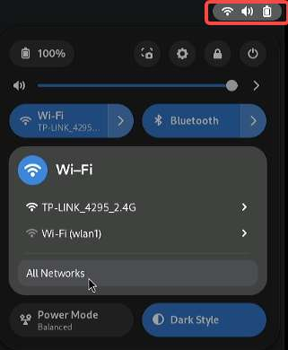

**Using the command line**

1. Scan for nearby Wi-Fi networks.

   ```shell
   nmcli dev wifi list 2>&1 | less 
   ```

   

   :::note

   > Type `q` to exit.
   :::
   >
2. Connect to a Wi-Fi network.

   ```shell
   sudo nmcli dev wifi connect <WiFi-SSID> password <WiFi-password>
   ```

   For example, run the following command, where `WiFi-SSID` is `rubikpiwifi` and `WiFi-password` is `123456789`:

   ```shell
   sudo nmcli dev wifi connect rubikpiwifi password 123456789
   ```

   Sample output:

   ```shell
   Device 'wlan0' successfully activated with 'e8b98f24-3f23-4742-8aa3-0d37c5ee6564'.
   ```

   :::note

   > If you see a network error message when running the command, run one of the following commands to trigger a Wi-Fi scan and verify the target access point (AP).
   >
   > * `nmcli dev wifi list`
   > * `iw dev wlan0 scan`
   :::
   >
3. Check the network status.

   ```shell
   nmcli general status
   ```

   Sample output

   ```shell
   STATE  CONNECTIVITY  WIFI-HW  WIFI    WWAN-HW  WWAN
   connected  full     enabled  enabled  enabled  enabled
   ```
4. Verify the network status.

   1. Run the following command to check the device status.

      ```shell
      nmcli dev status
      ```

      Sample output

      ```shell
      DEVICE  TYPE      STATE        CONNECTION
      wlan0   wifi      connected    RUbikpiWiFi
      eth0    ethernet  unavailable  --
      eth1    ethernet  unavailable  --
      can0    can       unmanaged    --
      lo      loopback  unmanaged    --
      ```
   2. Check the additional connection information.

      ```shell
      nmcli device show wlan0
      ```

      Sample output:

      ```yaml
      GENERAL.DEVICE:                         wlan0
      GENERAL.TYPE:                           wifi
      GENERAL.HWADDR:                         00:03:7F:12:F7:F7
      GENERAL.MTU:                            1500
      GENERAL.STATE:                          100 (connected)
      GENERAL.CONNECTION:                     QualcommWiFi
      GENERAL.CON-PATH:                       /org/freedesktop/NetworkManager/ActiveConnection/5
      IP4.ADDRESS[1]:                         192.168.117.130/24
      IP4.ADDRESS[2]:                         192.168.117.131/24
      IP4.GATEWAY:                            192.168.117.126
      ```
   3. Verify whether an IP address has been assigned to the `wlan0` interface by running the `ifconfig wlan0` command in the UART console.

      ```shell
      ifconfig wlan0
      ```
   4. Verify whether the AP or router is connected to the Internet by pinging the following public DNS IP address.

      ```shell
      ping 8.8.8.8
      ```

:::note

> * If you have connected to a network but want to connect to another one, switch the connection off by specifying the SSID and running the command `nmcli con down ssid/uuid`. If you have multiple connections with the same SSID, use the UUID.
> * To connect to another saved network, use the `up` option with the `nmcli` command-line tool by running the `nmcli con up ssid/uuid` command.
:::

:::note

> To exit the standard input shell, press **Ctrl**+**C**.&#x20;
:::

For more information about `nmcli`, refer to https://www.linux.org/docs/man1/nmcli.html and https://networkmanager.dev/docs/api/latest/nmcli.html.

##### Hotspot mode

In Access Point (AP) mode, namely, the wireless hotspot mode, the device becomes a gateway for other devices to connect to a network. The steps to create an AP are as follows:

* Enable the AP.

  1. Create or modify *hostapd.conf.*

     ```plain text
     ctrl_interface=/var/run/hostapd
     driver=nl80211
     ieee80211n=1
     interface=wlan1
     hw_mode=a
     channel=36
     beacon_int=100
     dtim_period=1
     ssid=RUBIKPi
     auth_algs=1
     ap_isolate=0
     ignore_broadcast_ssid=0
     wpa=2
     wpa_key_mgmt=WPA-PSK
     rsn_pairwise=CCMP
     wpa_passphrase=123456789
     ```
  2. Run the following commands to enable the AP:

     ```shell
     hostapd -B /opt/hostapd.conf # Set the software AP
     # Enable the DHCP server
     brctl addbr br0
     brctl addif br0 wlan1
     ifconfig br0 192.168.225.1 netmask 255.255.255.0 up
     killall dnsmasq
     dnsmasq --conf-file=/etc/dnsmasq.conf --dhcp-leasefile=/var/run/dnsmasq.leases --addn-hosts=/data/hosts --pid-file=/var/run/dnsmasq.pid -i br0 -I lo -z --dhcp-range=br0,192.168.225.20,192.168.225.60,255.255.255.0,43200 --dhcp-hostsfile=/data/dhcp_hosts --dhcp-option-force=6,192.168.225.1 --dhcp-script=/bin/dnsmasq_script.sh
     ```
  3. Run the following command to establish a connection with `hostapd_cli`.

     ```shell
     hostapd_cli -i wlan1 -p /var/run/hostapd
     ```

     Monitor Wi-Fi STA connection notifications in the `hostapd_cli` console, such as `AP-STA-CONNECTED` and `EAPOL-4WAY-HS-COMPLETED`.

     Sample output:

     ```shell
     root@rubikpi:~# hostapd_cli -i wlanl -p /var/run/hostapd
     hostapd_cli v2.11-devel
     Copyright (c) 2004-2022, Jouni Malinen <j@wl.fi> and contributors
     This software may be distributed under the terms of the BSD License. 
     See README for more details.

     Interactive mode
     > <3>AP-STA-CONNECTED aa: a4: fd: 8b: ec: 90
     <3>EAPOL-4WAY-HS-COMPLETED aa: a4: fd: 8b:ec:90

     > list_sta
     aa: a4: fd: 8b:ec:90
     ```

  Before the AP 5G mode is enabled, if there has never been a connection to a 5G Wi-Fi network using STA, use the following command to check the 5G channel configuration in the environment:

  ```yaml
  iw dev wlan0 scan
  ```

  In the command output, identify the currently active channel through the **primary channel** field. In the following example, the value of **primary** **channel** is **36**. Write **36** into the **channel** field in the */opt/hostapd.conf* file.

  ```yaml
  HT operation:
                   * primary channel: 36
                   * secondary channel offset: above
                   * STA channel width: any
                   * RIFS: 0
                   * HT protection: nonmember
                   * non-GF present: 0
                   * OBSS non-GF present: 0
                   * dual beacon: 0
                   * dual CTS protection: 0
                   * STBC beacon: 0
                   * L-SIG TXOP Prot: 0
                   * PCO active: 0
                   * PCO phase: 0
  ```
* Verify AP

  To test the connection, connect to AP from other devices.

  For example, perform the following steps to connect to AP from a mobile device:

  1. On the mobile device, go to Wi-Fi settings.
  2. Wait for the Wi-Fi STA to detect AP.
  3. Select AP and type the corresponding `wpa_passphrase` configured for AP on your RUBIK Pi 3 device for connection.

  ```shell
  > status
  state=ENABLED
  phy=phyR freq=2412
  num_sta_non_erp=0
  num_sta_no_short_slot_time=0
  num_sta_no_short_preamble=0
  olbc=0
  num_sta_ht_no_gf=0 num_sta_no_ht=0
  num_sta_ht_20_mhz=0
  num_sta_ht40_intolerant=0
  olbc_ht=0
  ht_op_mode=0x0
  hw_mode=g
  country_code=US
  country3=0x20
  cac_time_seconds=0
  cac_time_left_seconds=N/A
  channel=1
  edmg_enable=0 edmg_channel=0
  secondary_channel=0
  ieee80211n=1
  ieee80211ac=0
  ieee80211ax=0
  ieee80211be=0
  beacon_int=100
  dtim_period=2
  ht_caps_info=000c
  ht_mcs_bitmask=ffff0000000000000000
  supported_rates-02 04 0b 16 Oc 12 18 24 30 48 60 6c
  max_txpower=30
  bss[0]=wlan1
  bssid[0]=00:03:7f:95:8e:8e
  ssid [0]=QSoftAP
  num_sta[0]=1
  > |
  ```

  To verify the connection, ping the IP address of the mobile device from the RUBIK Pi 3 device in the `ssh shell`.

  The following output indicates that the Wi-Fi connection has been established successfully and the data transfer has begun:

  ```shell
  sh-5.1# ping 192.168.1.42
  PING 192.168.1.42 (192.168.1.42): 56 data bytes
  64 bytes from 192.168.1.42: seq=0 ttl=64 time-11.175 ms
  64 bytes from 192.168.1.42: seq=1 ttl=64 time=14.528 ms
  64 bytes from 192.168.1.42: seq=2 ttl=64 time=29.735 ms
  64 bytes from 192.168.1.42: seq=3 ttl=64 time=223.822 ms
  64 bytes from 192.168.1.42: seq-4 ttl=64 time-23.675 ms
  ^C
  192.168.1.42 ping statistics ---
  7 packets transmitted, 5 packets received, 28% packet loss
  round-trip min/avg/max = 11.175/60.587/223.822 ms
  sh-5.1#
  ```

  Alternatively, you can verify the Wi-Fi connection status in **Settings** of the connected device. For example, to get the IP address of a mobile device connected to RUBIK Pi 3 AP, perform the following steps:

  1. Go t&#x6F;**&#x20;Settings** >**&#x20;Wi-Fi**.
  2. Verify the SSID of the AP.
* Stop AP:

  Perform the following steps in SSH to disable AP:

  1. Stop the hostapd by performing the following steps:

     1. Run the following command to stop the hostapd process:

        ```plain text
        killall hostapd
        ```
     2. Run the following command to disable the interface:

        ```plain text
        ifconfig wlan1 down
        ```
  2. Run the following command to delete `ctrl_interface`:

     ```plain text
     rm -rf /var/run/hostapd/wlan1
     ```

     The Wi-Fi hotspot has stopped successfully.

### Bluetooth

The Bluetooth® wireless technology is a short-range communications system that facilitates wireless exchange of data between devices. The key advantages of Bluetooth technology are as follows:

* Replaces the cables connecting portable and fixed electronic devices.
* Provides robust, power-efficient, and cost-effective solutions.
* Facilitates flexibility of solutions and their applications.

Connect your RUBIK Pi 3 to a monitor and click the icon in the top-right corner of the desktop. In the pop-up window, click the Bluetooth icon and click **Bluetooth Settings**. Follow the prompts to connect to the appropriate device. Once the connection is successful, a Bluetooth icon will appear in the top-right corner, as shown below.

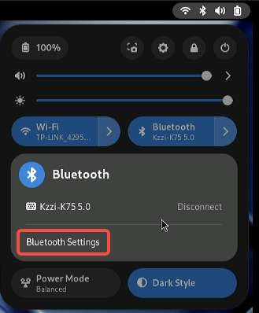

## Audio

RUBIK Pi 3 currently supports the following audio interfaces:

* 3.5mm headphone (No. 4 in the following figure)
* HDMI OUT (No. 9 in the following figure)
* Bluetooth


### View the sound card information

* Run the following command on RUBIK Pi 3 to view the mounted sound cards:

  ```shell
  cat /proc/asound/cards
  ```

  

* Run the following command on RUBIK Pi 3 to view the list of allocated Pulse-Code Modulation (PCM) streams:

  ```shell
  cat /proc/asound/pcm
  ```

  

### Set the audio output device

Run the following command in RUBIK Pi 3 to change the audio output source for the system and applications, including gstreamer, paplay, and other commands:

* Set the 3.5mm headset as the output interface:

  ```plain text
  rubikpi_config audio output headset
  ```

  Or

  ```shell
  pactl set-sink-port low-latency0 headset
  ```
* Set the HDMI OUT as the output interface:

  ```plain text
  rubikpi_config audio output hdmi
  ```

  Or

  ```shell
  pactl set-sink-port low-latency0 hdmi
  ```
* Alternatively, set the output device in **Settings**.

  

### Playback

* Run the following command on RUBIK Pi 3 to test headset playback.&#x20;

  :::note

  > Before running the following command, put the MP3 test file (*\<FileName>.mp3*) in the */opt* directory.
  :::
  >

  ```shell
  gst-launch-1.0 filesrc location=/opt/<FileName>.mp3 ! mpegaudioparse ! mpg123audiodec ! pulsesink
  ```
* Run the following command on RUBIK Pi 3 to test HDMI OUT playback.&#x20;

  :::note

  > Before running the following command, put the PCM test file (*\<FileName>.wav*) in the */opt* directory.
  :::
  >

  ```shell
  systemctl stop pulseaudio  
  agmplay /opt/<FileName>.wav -D 100 -d 100 -r 48000 -b 16 -c 2 -i MI2S-LPAIF_RXTX-RX-PRIMARY  
  systemctl start pulseaudio
  ```
* Test Bluetooth playback.&#x20;

  Connect your Bluetooth headset to RUBIK Pi 3. The system automatically switches the audio output to the Bluetooth headset, as shown below. Once switched, audio playback will be routed through the Bluetooth headset.

  

### Recording

Run the following commands on RUBIK Pi 3 to test the recording function.

* Test headset recording

  ```shell
  gst-launch-1.0 -v pulsesrc volume=10 ! audioconvert ! wavenc ! filesink location=/opt/test.wav
  ```
* Test Bluetooth headset recording.

  Connect your Bluetooth headset to RUBIK Pi 3. The system automatically switches the audio input to the Bluetooth headset, as shown below. Once switched, audio recording through apps will be captured via the Bluetooth headset.

  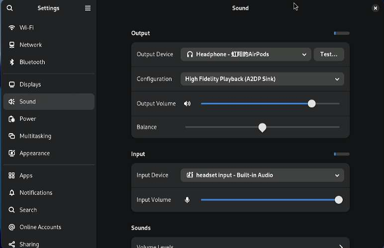

## Fan

For the fan compatible with RUBIK Pi 3, refer to [Peripheral Compatibility List](https://www.thundercomm.com/rubik-pi-3/en/docs/peripheral-compatibility-list).

:::warning

> When using RUBIK Pi 3 in high-load or high-performance scenarios, use cooling measures to ensure that the performance of the device is stable. Otherwise, performance may fluctuate due to high CPU temperatures.
:::

### Install the fan

1. **Remove all the thermal pads on the back of the cooler** and cut the following two pads in the shape of SoC and uMCP of RUBIK Pi 3.


The dimensions of the two pieces are about 14 x 12mm and 13 x 11.5mm.

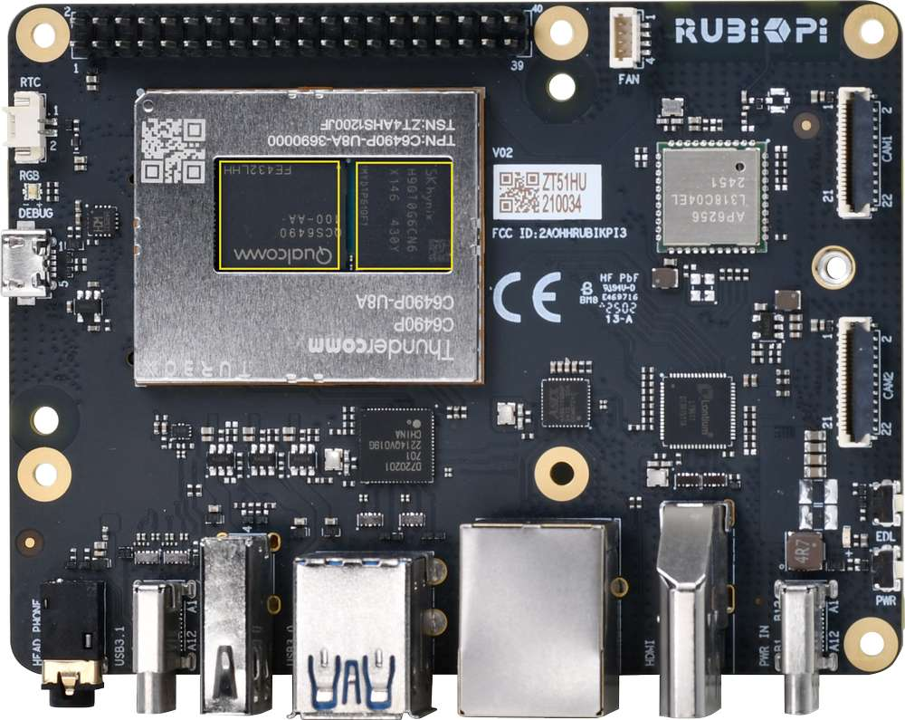

2. Paste the two thermal pads to the corresponding positions on RUBIK Pi 3.

   

3. Install the cooler and connect the fan cable.

   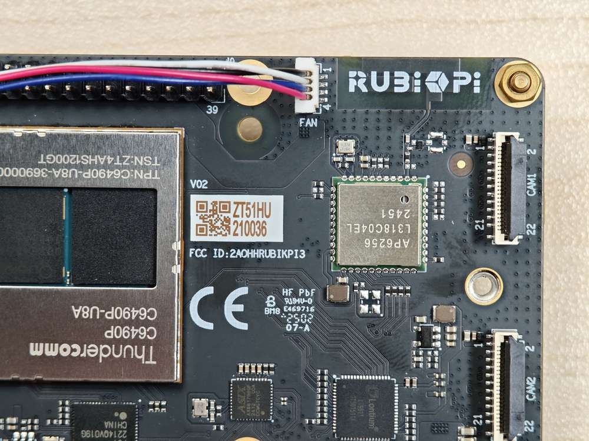

:::warning

> We recommend that you do not remove the fan after installing it on your RUBIK Pi 3. Removal will cause the fan's push pins and thermal pads to degrade and may result in product damage. If the push pins are damaged or deformed or if they do not clip securely, stop using the fan.
:::

### Control the fan

The fan of RUBIK Pi 3 controls the speed according to the CPU temperature. You can also run the following commands on RUBIK Pi 3 to control the fan speed. 0 and 255 indicate the maximum and minimum speed of the fan.

```plain text
rubikpi_config fan speed 100
rubikpi_config fan speed 255
rubikpi_config fan speed 0
```

Or

```shell
echo 100 > /sys/class/hwmon/hwmon29/pwm1
echo 255 > /sys/class/hwmon/hwmon29/pwm1
echo 0 > /sys/class/hwmon/hwmon29/pwm1
```

:::note

> Before setting the fan speed to a fixed value, you need to use the command `rubikpi_config thermal disable` to turn off CPU thermal management.
:::

## LED

RUBIK Pi 3 features an RGB tri-color LED driven by the PMIC. By default, the green LED is set as a heartbeat indicator to reflect the system's operation status and CPU load. When the CPU load is high, the heartbeat indicator blinks frequently.

LED indicator descriptions:

* Blue LED (solid on): fastboot mode
* Green LED (heartbeat blinking): normal operation
* Red LED (heartbeat blinking): low-power mode (power input is less than 12V 2.25A).
* Rapid heartbeat: high CPU load
* No heartbeat:

  * System crash
  * Sleep mode
  * Booting up

Use the following commands to operate the LED:

* Turn off the heartbeat LED

  ```shell
  rubikpi_config led heartbeat off
  ```

  Or

  ```shell
  echo none > /sys/class/leds/green/trigger 
  ```
* Turn on the heartbeat LED

  ```shell
  rubikpi_config led heartbeat on
  ```

  Or

  ```shell
  echo heartbeat > /sys/class/leds/green/trigger
  ```
* Set the brightness of the green LED (from 0 to 511. The following example sets it to 100)

  ```shell
  rubikpi_config led green 100
  ```

  Or

  ```shell
  echo 100 >  /sys/class/leds/green/brightness
  ```
* Set the brightness of the red LED (from 0 to 511. The following example sets it to 100)

  ```shell
  rubikpi_config led red 100
  ```

  Or

  ```shell
  echo 100 >  /sys/class/leds/red/brightness
  ```
* Set the brightness of the blue LED (from 0 to 511. The following example sets it to 100)

  ```shell
  rubikpi_config led blue 100
  ```

  Or

  ```shell
  echo 100 >  /sys/class/leds/blue/brightness
  ```

## Ethernet

Ethernet technology is designed to transmit data over a channel using wired technology at different link speeds. It uses cables to transmit data in network models, such as Local Area Network (LAN) and Wide Area Network (WAN) for a reliable, secure, and better network connectivity.

Ethernet connectivity is integrated into IoT devices and sensors, enabling them to transmit data to the network. It is defined under IEEE 802.3 standards and provides a standardized interface for these devices to communicate with gateways.

The Ethernet interface is port 8 in the following figure. RUBIK Pi 3 supports Gigabit Ethernet.


Connect the network cable, as shown in the following figure:


Run the following command on RUBIK Pi 3 to check the network connection. As shown in the following figure, the IP address has been successfully assigned, indicating that the network connection is successful:

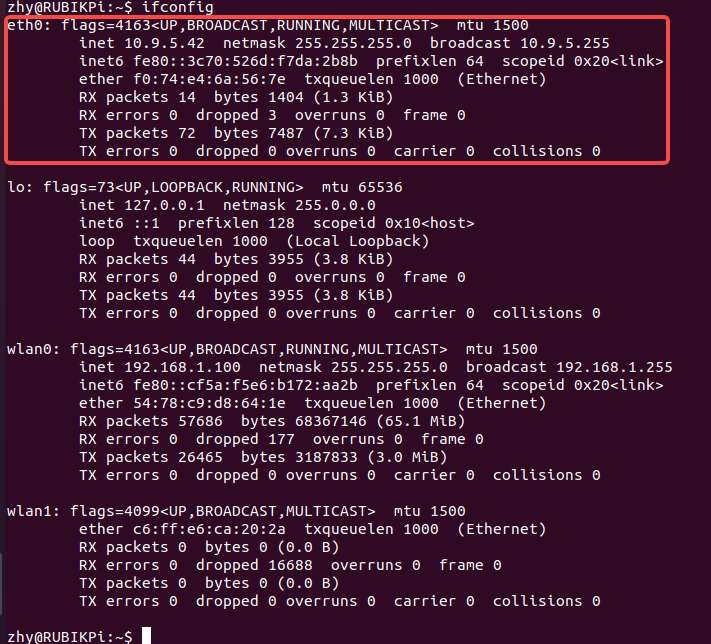

### Ethernet debugging

Use the following types of logs to record and debug Ethernet-related issues.

* `dmesg`: Debug issues related to kernel drivers.
* `tcpdump`: Verify packet transmission.

To debug potential issues that may occur during Ethernet setup, perform the following steps:

1. To collect `dmesg` logs and debug issues related to the kernel driver, run the following command:

   ```shell
   dmesg > /var/log/dmesg_logs.txt
   ```
2. To collect `tcpdump` logs and verify packet transmission, run the following command:

   ```shell
   tcpdump -i any -s 0 -w /var/log/tcpdump.pcap
   ```
3. Collect the output from the ethtool, ifconfig, netstat, and IP routing table for debugging.

## RTC battery connector

The real-time clock (RTC) battery connector is port 1 in the following figure.


Connect the RTC battery as shown in the following figure and write the time into the system hardware clock of RUBIK Pi 3. This way, the system time of RUBIK Pi 3 can be saved even if it is completely powered off.


Write the system time to the system hardware clock on RUBIK Pi 3 as follows:

```shell
date -s "08:00:00 20241201" # Set system time to 08:00, December 1, 2024
hwclock -w # Write system time to system hardware clock
```

## M.2 Key M connector

RUBIK Pi 3 provides an M.2 slot for NVMe storage, which can be used to install a 2280 (22 x 80mm) SSD hard drive. The M.2 Key M slot supports PCIe Gen3 x 2 and can deliver an output of up to 3.3V 2A. The switch of the M.2 connector can be individually controlled.

The M.2 Key M connector uses the PCIe1 bus of the QCS6490. The device path is: */sys/bus/pci/devices/0001:00:00.0*.&#x20;

The M.2 Key M connector is connector 18 in the following figure:


The M.2 Key M connector is compatible with the 2280 SSD, as shown in the following figures:

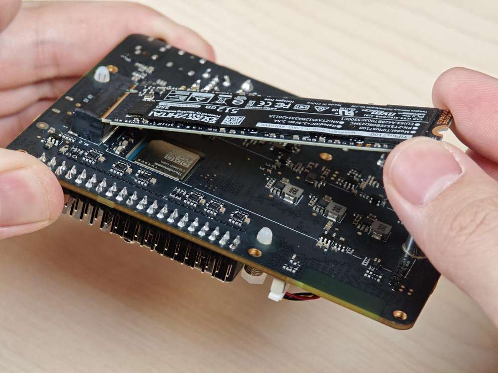

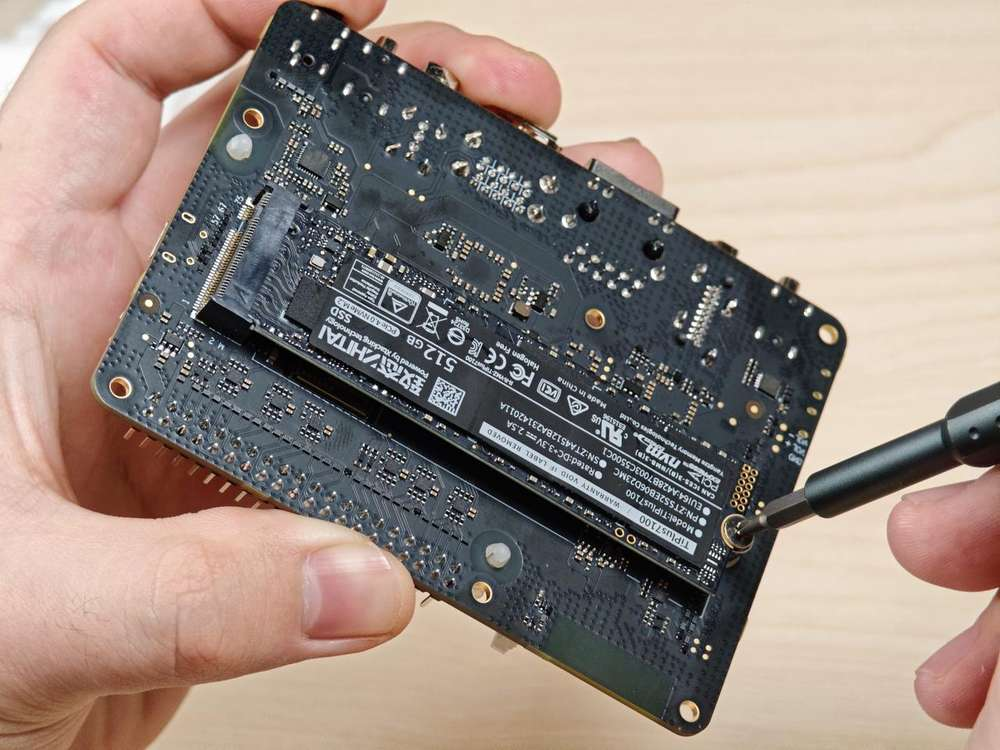

After connecting a monitor and powering on the device, the solid-state drive will appear in the file browser, as shown in the image below:

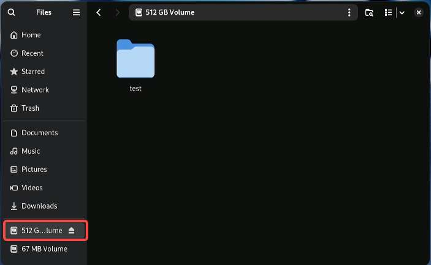

### PCIe power management

PCIe defines two types of power management methods:

* Software power management, which determines the power management features for each device and manages them individually.
* Systems that do not require software intervention, such as Active State Power Management (ASPM).

When no data packets are being transmitted on the PCIe link, the device puts the PCIe link into a low-power state.

#### PCIe L0 link states

PCIe power management defines the following L0 link states:

* L0: working state
* L0s: ASPM state with low-resume latency (energy saving standby state)&#x20;

#### PCIe device states

PCIe power management defines the following device states:

* D0 (mandatory): The device is fully ON. There are two sub-states.

  * D0(uninitialized): The function is in D0 (uninitialized) state when waiting for enumeration and configuration after exiting the reset state.
  * D0(active)

    * The function enters the D0(active) state once the enumeration and configuration process is completed.
    * The function enters the D0(active) state when the system software enables one or more (in any combination) function parameters, such as memory space enable, I/O space enable, or BME bits.
* D1 (optional): light sleep state

  * The function can only initiate the PME message and cannot initiate other TLPs.
  * The function can only serve as the target for configuration transactions, not for other transactions.
  * The function enters the D1 state via a software command that sets the PM control and status registers.
* D2 (optional): deep sleep state

  * The function can only issue PME messages and cannot issue other TLPs.
  * The function can only serve as the target for configuration transactions, not for other transactions.
  * The function enters the D2 state via software commands that set the PM control and status registers.
* D3 (mandatory): The device is in the lowest power state, and this function must support two types of D3 states:
* D3(hot)

  * The function can only issue PME messages and cannot issue other TLPs.
  * The function can only serve as the target for configuration transactions, not for other transactions.
  * The function enters D3(hot) state by issuing a software command that sets the power state field.
* D3(cold): The device enters the D3(cold) state and is powered off. When power is restored, the device enters the D0(uninitialized) state.

### PCIe debugging

The M.2 Key M connector uses the PCIe1 bus of the QCS6490. The device path is: */sys/bus/pci/devices/0001:00:00.0*.&#x20;

The `lspci` and `setpci` commands are native to Linux distributions. These two commands provide multiple levels of output and can also be used to view the capabilities and states of different components trained on the PCI bus at a given time. Most of these capabilities reflect the configuration space registers required by the PCIe basic specification. For more detailed information, visit https://pcisig.com/specifications. To view the usage instructions, run the following command:

```shell
lspci --help
```

The following features help in debugging PCIe issues:

* Display device information.

  ```shell
  lspci
  ```
  Sample output:

  ```shell
  0000:00:00.0 PCI bridge: Qualcomm Device 010b
  0000:01:00.0 USB controller: Renesas Technology Corp. uPD720201 USB 3.0 Host Controller (rev 03)
  0001:00:00.0 PCI bridge: Qualcomm Device 010b
  ```
* Show PCIe device and vendor IDs in the device control registers.

  ```shell
  lspci -nvmm
  ```
  Sample output

  ```shell
  Slot:        00:00.0
  Class:        0604
  Vendor:        17cb
  Device:        010b
  IOMMUGroup:        6

  Slot:        01:00.0
  Class:        0c03
  Vendor:        1912
  Device:        0014
  Rev:        03
  ProgIf:        30
  IOMMUGroup:        6

  Slot:        0001:00:00.0
  Class:        0604
  Vendor:        17cb
  Device:        010b
  DTNode:        /sys/firmware/devicetree/base/soc@0/pci@1c08000/pcie@1
  IOMMUGroup:        7

  ```
