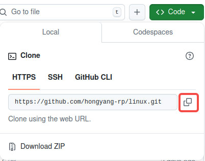
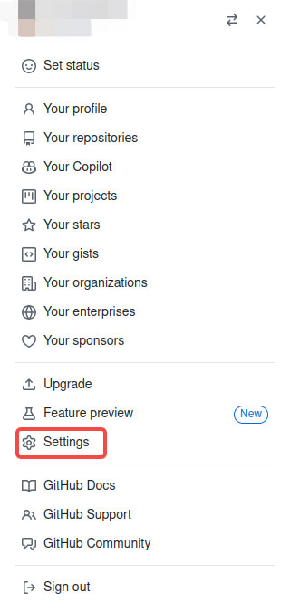
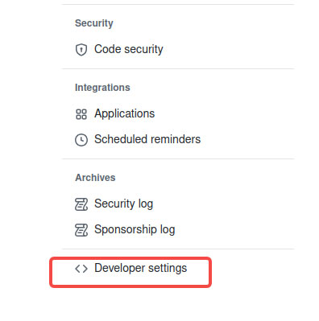
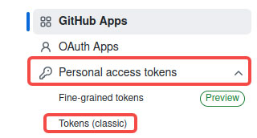
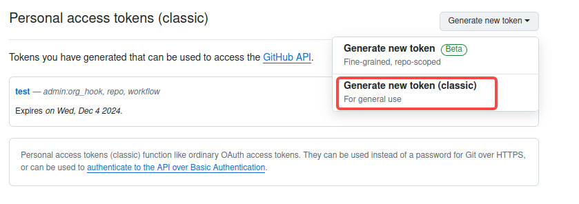
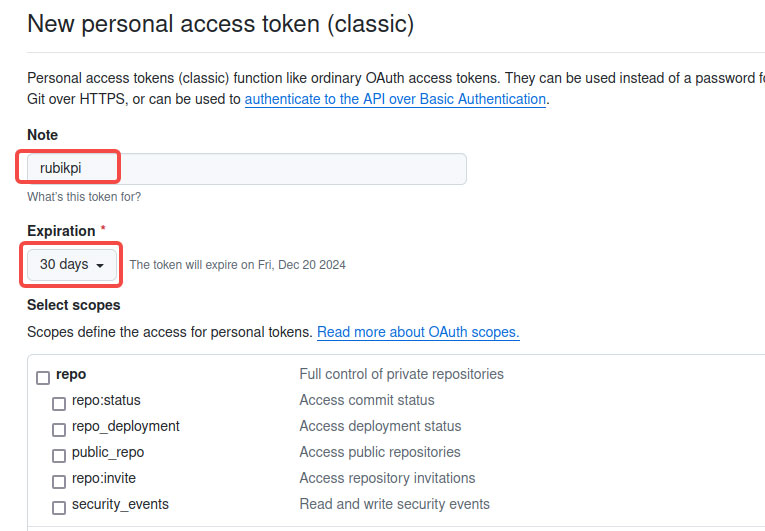
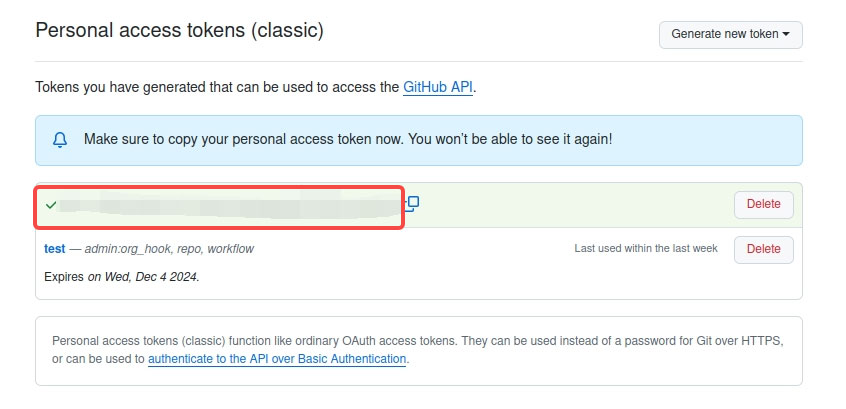
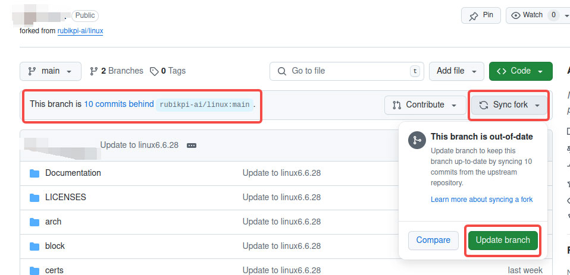
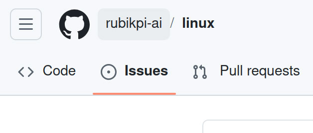

# 12. GitHub Operation Guide

## 12.1 Submit code to RUBIK Pi 3

Submit code to RUBIK Pi 3 by submitting a Pull Request (PR). After review, your code may be merged into the RUBIK Pi 3 main branch. The following example shows a method to submit PR to the main branch of RUBIK Pi 3 Linux:

1. Log in to GitHub and visit the RUBIK Pi 3 repository https://github.com/rubikpi-ai/linux.

2. Click the **Fork** button and follow the prompts to fork the repository to your own repository.


3. Clone the forked repository locally using the `git clone` command.

   

   :::note
   Use the URL of your own repository.
   :::

   ```shell showLineNumbers
   git clone https://github.com/hongyang-rp/linux.git
   ```

4. Enter the repository and create a new branch rpdev locally for development.

   ```shell showLineNumbers
   cd linux   
   git checkout -b rpdev
   ```

   

5. Modify and commit your code.

   ```shell showLineNumbers
   git add .   
   git commit -s
   ```

6. Run the `git push` command to push your local branch to your forked repository on GitHub.

   ```shell showLineNumbers
   git push --set-upstream origin rpdev
   ```

If the following error occurs when you commit code, a personal token is required.


Method to obtain a personal token:

1. Click your GitHub avatar and click **Settings**.



2. Click **Developer settings**.



3. Select **Personal access tokens** and click **Tokens (classic)**.



4. Select **Generate new token**.

   

5. Configure the token: set a name and choose an expiration time.

   

   It is recommended that you check all the boxes and then click **Generate token**.

6) The following token is generated. Save the token properly.

   

7) Run the `git remote set-url` command to configure the token.

   ```shell showLineNumbers
   git remote set-url origin https://<your_token>@github.com/<USERNAME>/<REPO>.git
   ```

   * Replace \<your\_token> with the token you obtained.

   * Replace \<USERNAME> with the GitHub user name.

   * Replace \<REPO> with the repository name.

   Perform the git push operation. The operation succeeds.

8. Open the browser to visit the repository you forked on GitHub. The following message is prompted. Click **Compare & pull request** to create a PR as prompted.

   

   Alternatively, click **Pull requests** and click **New pull request** to create a PR.

   

9. Wait for the administrator to view and reply to the PR, and finally merge the PR into the main branch. Click **Closed** to view PRs merged into the main branch.

   

:::warning
If the following message is prompted on the repository you forked, choose **Sync fork** > **Update branch** to update the GitHub repository. After the update succeeds, run the `git pull` command in the local repository to synchronize the update.
:::



## 12.2 Create an issue

If you encounter problems during development, find bugs, have comments about RUBIK Pi 3, or want to add features, you can create an issue.

1. Log in to GitHub and visit the RUBIK Pi 3 repository https://github.com/rubikpi-ai/linux.

2. Click **Issues** in the upper left corner.

   

   Before creating an issue, search the issue in the search box to find if someone has already created a similar one. Click **New issue** and follow the instructions to create an issue.

   

3. Wait for a reply from the community.


>


#