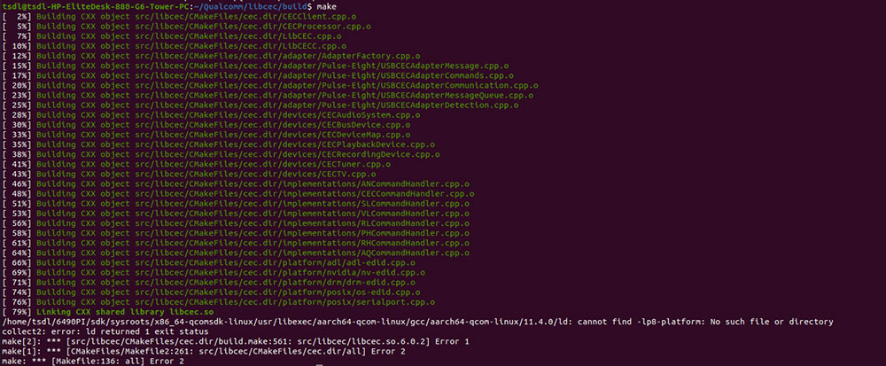

# 7. Tools and Libraries Porting Guide

RUBIK Pi 3 has integrated the tools and libraries commonly used in development. If the tools needed during development are not integrated, refer to the following method of cec-client porting:

## 7.1 cec-client porting

1. First, set up the cross-compilation environment. For detailed steps, refer to [1.11.2. Install cross-compilation tools](/rubik-pi-3/en/docs/rubik-pi-3-user-manual/1.1.0/quick-start#1112-install-cross-compilation-tools).

   ```shell showLineNumbers
   source <your toolchains directory>/environment-setup-armv8-2a-qcom-linux
   ```

2. Download libcec source code:

   ```shell showLineNumbers
   git clone https://github.com/Pulse-Eight/libcec
   ```

3) Go to the cec-client source directory and execute the code:

   ```shell showLineNumbers
   mkdir build  
   cmake .. -DCMAKE_INSTALL_PREFIX=../bin  
   make
   ```

   After the `make` command is run, the following error occurs, indicating that the p8-platform library is not available.

   

To solve the problem, cross-compile the p8-platform library.

1. Download p8-platform source code:

   ```shell showLineNumbers
   git clone https://github.com/Pulse-Eight/platform
   ```

2. Go to the platform folder and run the following commands:

   ```shell showLineNumbers
   mkdir build  
   cmake .. -DCMAKE_INSTALL_PREFIX=../bin  
   make
   ```

3. Go to the *bin* directory and copy the compilation artifact to the *sysroot* directory of the cross-compilation toolchain. As shown in the following code, */home/zhy/QCOM/sdk* is the installation path of the cross-compilation tool. For details, refer to [1.12.2. Compile code](/rubik-pi-3/en/docs/rubik-pi-3-user-manual/1.1.0/quick-start#1112-install-cross-compilation-tools).

   ```shell showLineNumbers
   cp libp8-platform.a /home/zhy/QCOM/sdk/sysroots/armv8-2a-qcom-linux/usr/lib/
   ```

4) Go back to the *libcec* directory and continue compilation:

   ```shell showLineNumbers
   cd libcec/build  
   make
   ```

5) After the compilation, run the following command to export the compilation artifact to the *bin* directory:

   ```shell showLineNumbers
   make install
   ```

6. Run the following commands to view the compilation artifact. The cec-client tool has been generated, and the libcec library has been integrated into RUBIK Pi 3. Transfer cec-client to RUBIK Pi 3 for execution.

   :::note
   Transfer files using the ADB or SCP method.
   :::

   ```shell showLineNumbers
       cd ../bin/bin  
       ls  
       
       file cec-client-6.0.2
   ```

   