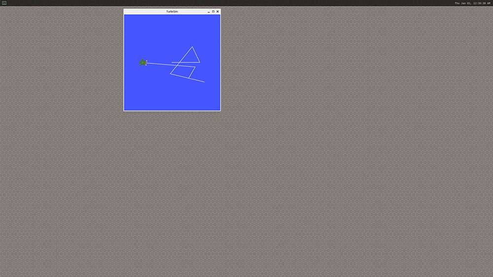

---
# Display h2 to h5 headings
toc_min_heading_level: 2
toc_max_heading_level: 4
---

# ROS User Guide

RUBIK Pi 3 has integrated the ROS2 humble environment. Before testing, copy the following content and paste it into the RUBIK Pi 3 terminal to set up the environment.

```shell
export AMENT_PREFIX_PATH="/usr"
export DBUS_SESSION_BUS_ADDRESS="unix:path=/run/user/0/bus"
export EDITOR="vi"
export HOME="/home/root"
export HUSHLOGIN="FALSE"
export LANG="C"
export LD_LIBRARY_PATH="/usr/lib"
export LOGNAME="root"
export MAIL="/var/spool/mail/root"
export MOTD_SHOWN="pam"
export OLDPWD
export OPIEDIR
export PATH="/usr/local/bin:/usr/bin:/bin:/usr/local/sbin:/usr/sbin:/sbin"
export PS1="\\u@\\h:\\w\\\$ "
export PWD="/home/root"
export PYTHONPATH="/usr/lib/python3.10/site-packages"
export QPEDIR
export QTDIR
export QT_QPA_PLATFORM="wayland"
export ROS_DISTRO="humble"
export ROS_LOCALHOST_ONLY="0"
export ROS_PYTHON_VERSION="3"
export ROS_VERSION="2"
export SHELL="/bin/sh"
export SHLVL="1"
export TERM="linux"
export USER="root"
export WAYLAND_DISPLAY="wayland-1"
export XDG_RUNTIME_DIR="/dev/socket/weston"
export XDG_SESSION_CLASS="user"
export XDG_SESSION_ID="c1"
export XDG_SESSION_TYPE="tty"
```

:::note

Configure the environment variable in each terminal.
:::

* Run `turtlesim`.

  1. Connect RUBIK Pi 3 to a screen.

  2. In terminal 1:

     ```shell
     ros2 run turtlesim turtlesim_node
     ```

  3. In terminal 2:

     ```shell
     ros2 run turtlesim turtle_teleop_key
     ```

  4. Press the arrow keys on the keyboard to control the turtle movement.

     