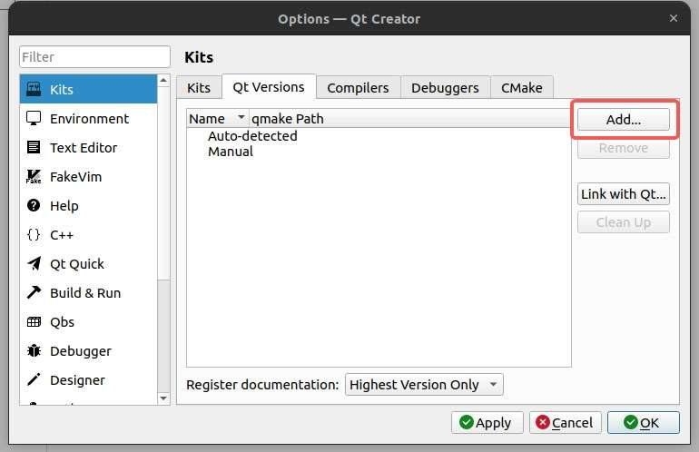
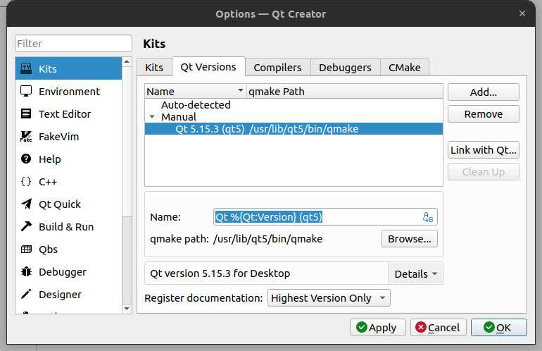
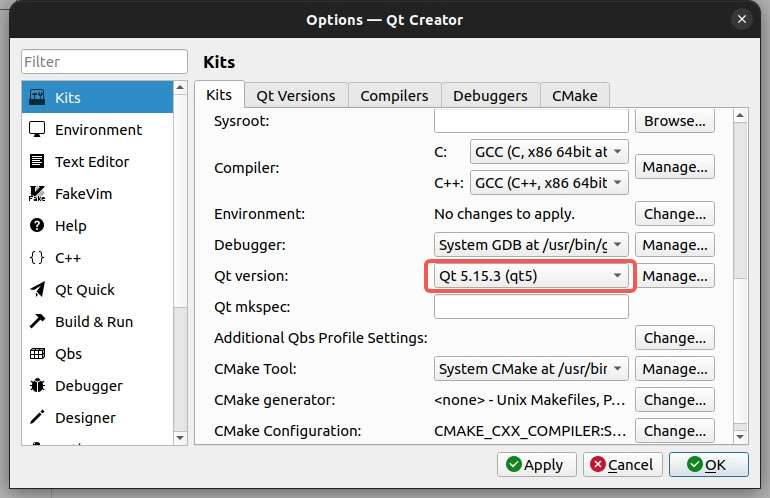
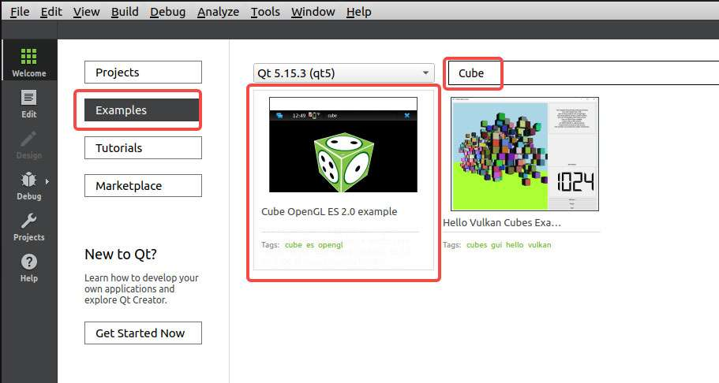
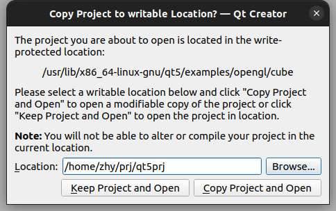
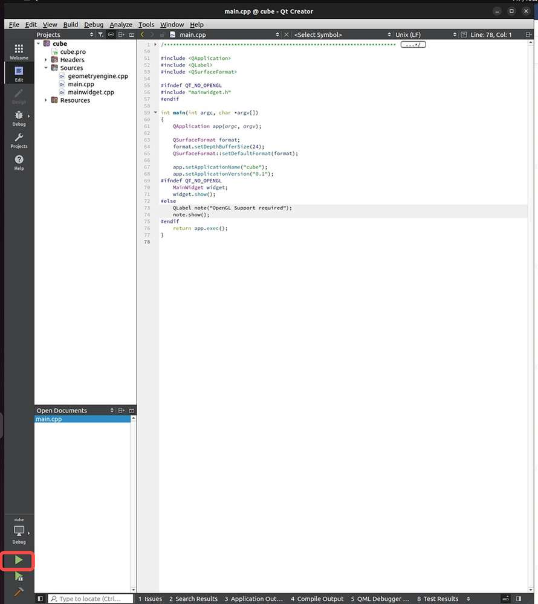
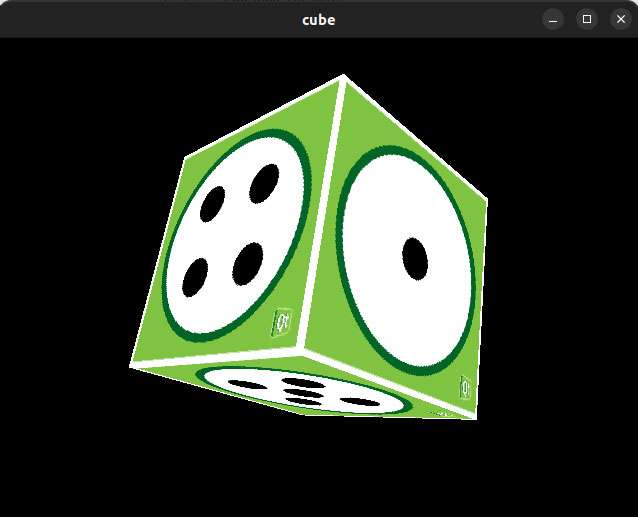
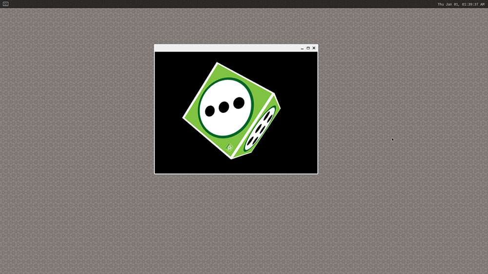
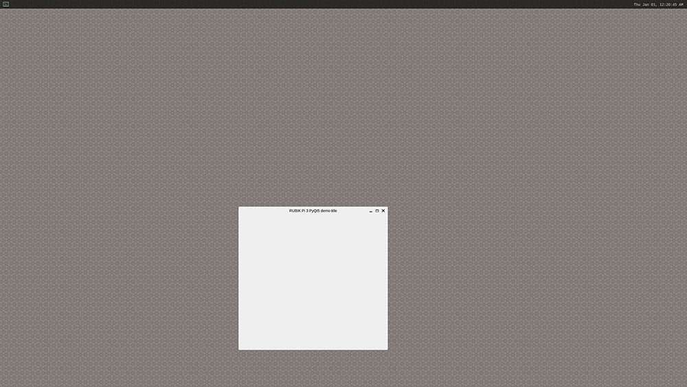

---
# Display h2 to h5 headings
toc_min_heading_level: 2
toc_max_heading_level: 4
---

# QT5 User Guide

## Install Qt Creator

The following example illustrates how to install Qt Creator on Ubuntu.

* Install the Build Essential package.

  ```shell
  sudo apt-get install build-essential
  ```

* Install Qt Creator.

  ```shell
  sudo apt-get install qtcreator
  ```

* Install the QT5-related environment.

  ```shell
  sudo apt-get install qtbase5-dev qtchooser qt5-qmake qtbase5-dev-tools qtbase5-examples qt5-doc qtbase5-doc-html
  ```

The following applications will be displayed.


## Compile Qt programs

1. Click the Qt Creator icon to enter the application.


2. Choose **Tools** > **Options**. In the pop-up window, click **Qt Versions** and click **Add**.



3. Select *qmake* under */usr/bin*.




4. Click **Kits**, scroll down, set the **Qt version** to **Qt5.15.3**, and click **OK**.



5. Click **Examples**, type "Cube" in the input field, and click **Cube OpenGL ES 2.0 example**.

   

6. In the pop-up window, click **Keep Project and Open** or **Copy Project and Open** as needed.

   

7. Click **Configure Project** to enter the project.

   

8. Click the play icon to run the project.

   

   The project is successfully run. The next step is cross-compilation.

   

1. Set up the cross-compilation environment. For details, refer to [Install cross-compilation tools](./1.get-started.md#Installcross-compilationtools).

   ```shell
   source <your toolchains directory>/environment-setup-armv8-2a-qcom-linux
   ```

2. Go to the project's source directory and execute `qmke` to generate the Makefile.

   ```shell
   qmake
   ```

   

3. Run the `qmake` and `make` commands for compilation.

   

4. Transfer the compilation artifact to RUBIK Pi 3:

   

## Configure the runtime environment

Qt chooses a default Qt Platform Abstraction (QPA) plug-in based on the platform. Alternatively, set the `QT_QPA_PLATFORM` environment variable or `-platform` command line parameter to select another platform plug-in. Commonly used platform plug-ins include LinuxFB, Wayland, and EGLFS.

* **LinuxFB**

  LinuxFB is displayed through Linux Framebuffer Device (FBDEV), which does not support hardware rendering, possibly resulting in poor display performance.

* **Wayland**

  Wayland is a display service protocol that does not rely on a client-server architecture and is intended to replace the X Window System with a modern and safe Linux or other Unix-like operating system. Weston is the implementation reference of the Wayland open-source display protocol.

* **EGLFS**

  EGLFS is a GUI system implemented by Qt, which does not support multiple windows. EGLFS uses OpenGL ES or EGL for GPU rendering and then sends signals directly to Direct Rendering Manager (DRM) for display.

  EGLFS is the recommended plug-in for Embedded Linux devices that include a GPU.

It is recommended to use Wayland on RUBIK Pi 3:

```shell
export XDG_RUNTIME_DIR=/dev/socket/weston  
export WAYLAND_DISPLAY=wayland-1  
export QT_QPA_PLATFORM='wayland'  
cd /opt  
./cube
```



## PyQt5

RUBIK Pi 3 supports PyQt5. The following is an example of PyQt5 demo.

```python
import sys
from PyQt5.QtWidgets import QApplication, QWidget

app = QApplication(sys.argv)

w = QWidget()
w.resize(550, 500)
w.move(600, 300)
w.setWindowTitle('RUBIK Pi 3 PyQt5 demo title')
w.show()
sys.exit(app.exec_())
```

Transfer *pyqt5.py* to RUBIK Pi 3. For example, use the ADB method.

```python
adb push pyqt5.py /opt
```

Run the following commands on RUBIK Pi 3 to run the demo.

```shell
export XDG_RUNTIME_DIR=/dev/socket/weston
export WAYLAND_DISPLAY=wayland-1
export QT_QPA_PLATFORM='wayland'
cd /opt
python3 pyqt5.py
```

The execution result is as follows:

